# 基础

## 	数据（data）

​		数据是数据库中存储的基本对象。数据的种类很多，例如：文本、图形、图像、音频、视频等，这些都是数据。

​		定义：描述事务的符号记录称为数据。

​		数据的表现形式还不能完全表达其内容，需要经过解释，数据和关于数据的解释是不可分的。数据的解释是指对数据含义的说明，数据的含义称为数据的语

义，数据与其语义是不可分的。

​		计算机将实体的表示其特征的信息组织在一起，构成一个记录，记录是计算机中表示和存储数据的一种格式或一种方法。

## 数据库(DB)

​		数据库：长期储存在计算机内、有组织、可共享的大量数据的集合。

​		数据库中的数据按一定的数据模型组织、描述和存储，具有较小的冗余度，较高的数据独立性和易扩展性，并可为各种用户共享。

​		特点：永久存储，有组织和可共享

## 数据库管理系统（DBMS）

​		数据库管理系统是位于用户与操作系统之间的一层数据管理软件。数据库管理系统和操作系统一样是计算机的基础软件，也是一个大型复杂的软件系统。

主要功能：

### 			1、数据定义

​		数据库管理系统提供定义语言，用户通过它可以方便地对数据库中的数据对象的组成与结构进行定义。

### 			2、数据组织、存储和管理

​		数据库管理系统要分类组织、存储和管理各种数据，包括数据字典、用户数据、数据的存取路径等。要确定以何种文件结构和存取方式在存储级上组织这些数

据，如何实现数据之间的联系。数据组织和存储的基本目标是提高存储空间利用率和方便存取，提供多种存取方法来提供存取效率。		

### 			3、数据操纵功能	

​		数据库管理系统还提供数据操纵语言，用户可以使用它操纵数据，实现对数据库的基本操作，如查询、插入、删除和修改等。

### 			4、数据库的事务管理和运行管理

​		数据库在建立、运用和维护时由数据库管理系统统一管理和控制，以保证事务的正确运行，保证数据的安全性、完整性、多用户对数据的并发使用及发生故障

后的系统恢复。

### 			5、数据库的建立和维护功能

​		数据库的建立和维护功能包括数据库初始数据的输入、转换功能，数据库的转储、恢复功能，数据库的重组织功能和性能监视、分析功能等。这些功能通常是

由一些实用程序或管理工具完成的。

### 			6、其他功能

​		其他功能包括数据库管理系统与网络中其他软件系统的通信功能，一个数据库管理系统与另一个数据库管理系统或文件系统的数据转换功能，异构数据库之间

的互访和互操作功能等。

## 数据库系统（DBS ）

​		数据库系统是由数据库、数据库管理系统（及其应用开发工具）、应用程序和数据库管理员（DBA）组成的存储、管理、处理和维护数据的系统。应当指出

的是，数据库的建立、使用和维护等工作只靠一个数据库管理系统远远不够，还要有专门的人员来完成，这些人被称为数据库管理员。

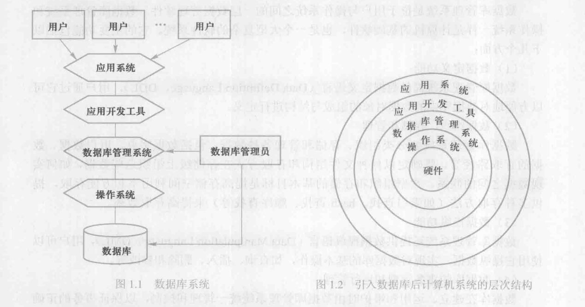

​		**数据库提供数据的存储功能，数据库管理系统提供数据的组织、存取、管理和维护等基础功能，数据库应用系统根据应用需求使用数据库，数据库管理员负责**

**全面管理数据库系统**。


## 数据技术的管理阶段

​		数据管理是指对数据进行分类、组织、编码、存储、检索和维护，它是数据处理的中心问题。

​		数据的处理是指对各种数据进行收集、存储、加工和传播的一系列活动的总和。

### 人工管理阶段

**特点**：

1、数据不保存

​		由于当时计算机主要用于科学计算，一般不需要将数据长期保存，只是在计算某一课题时将数据输入，用完就撤走。不仅对用户数据如此处置，对系统软件有

时也是这样。.

2、应用程序管理数据

​		数据需要由应用程序自己设计、说明(定义)和管理，没有相应的软件系统负责数据的管理工作。应用程序中不仅要规定数据的逻辑结构，而且要设计物理结

构，包括存储结构、存取方法、输入方式等。因此程序员负担很重。

3、数据不共享

​		数据是面向应用程序的，一组数据只能对应一一个程序。 当多个应用程序涉及某些相同的数据时必须各自定义，无法互相利用、互相参照，因此程序与程序

之间有大量的冗余数据。

4、数据不具有独立性

​		数据的逻辑结构或物理结构发生变化后，必须对应用程序做相应的修改，数据完全依赖于应用程序，称之为数据缺乏独立性，这就加重了程序员的负担。

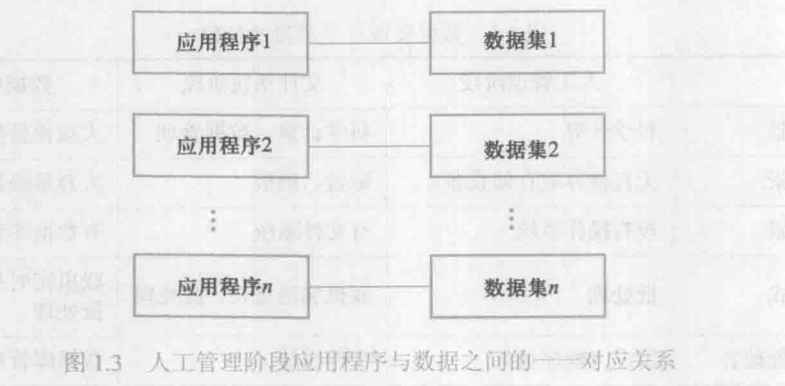


### 文件系统阶段

特点：

1、数据可以长期保存

​		由于计算机大量用于数据处理，数据需要长期保留在外存上反复进行查询、修改、插入和删除等操作。

2、由文件系统管理数据

​		由专门的软件即文件系统进行数据管理，文件系统把数据组织成相互独立的数据文件，利用`按文件名访问，按记录进行存取`的管理技术，提供了对文件进行

打开与关闭、对记录读取和写入等存取方式。文件系统实现了记录内的结构性


缺点:

1、数据共享性差，冗余度大

​		在文件系统中，一个（或一组）文件基本上对应于一个应用程序，即文件仍然是面向应用的。当不同的应用程序具有部分相同的数据时，也必须建立各自的文

件，而不能共享相同的数据，因此数据的冗余度大，浪费存储空间。同时由于相同数据的重复存储、各自管理，容易造成数据的不一致性，给数据的修改和维护带

来了困难。

2、数据独立性差

​		文件系统中的文件是为某一特定应用服务的，文件的逻辑结构是针对具体的应用来设计和优化的，因此要想对文件中的数据再增加一些新的应用会很困难。而

且，当数据的逻辑结构改变时，应用程序中文件结构的定义必须修改，应用程序中对数据的使用也要改变，因此数据依赖于应用程序，缺乏独立性。可见，文件系

统仍然是一个不具有弹性的无整体结构的数据集合，即文件之间是孤立的，不能反映现实世界事物之间的内在联系。

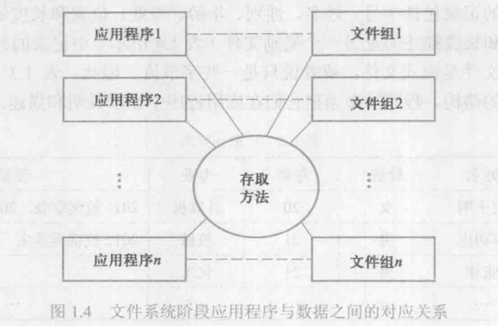

### 数据库系统阶段

特点：

1、数据结构化

​		**数据库系统实现整体数据的结构化**，这是数据库的主要特征之一，也是数据库系统与文件系统的本质区别。

​		所谓**整体结构化**是指数据库中的数据不再仅仅针对某一个应用，而是面向整个组织或企业；不仅数据内部是结构化的，而且整体是结构化的，数据之间是具有

联系的。也就是说，不仅要考虑某个应用的数据结构，还要考虑整个组织的数据结构。

​		在数据库系统中，不仅数据是整体结构化的，而且存取数据的方式也很灵活，可以存取数据库中的某一个或一组数据项、一个记录或一组记录；而在文件系

统中，数据的存取单位是记录，粒度不能细到数据项。

2、数据的共享性高、冗余度低且易扩充

​		数据库系统从整体角度看待和描述数据，数据不再面向某个应用而是面向整个系统，因此数据可以被多个用户、多个应用共享使用。数据共享可以大大减少数

据冗余，节约存储空间。数据共享还能够避免数据之间的不相容性与不一致性。

​		所谓**数据的不一致性**是指同一数据不同副本的值不一样。采用人工管理或文件系统管理时，由于数据被重复存储，当不同的应用使用和修改不同的副本时就很

容易造成数据的不一致。在数据库中数据共享减少了由于数据冗余造成的不一致现象。

3、数据独立性高

​		数据独立性是借助数据库管理数据的一个显著优点，它已成为数据库领域中一个常用术语和重要概念，包括数据的物理独立性和逻辑独立性。

​		物理独立性是指用户的应用程序与数据库中数据的物理存储是相互独立的。也就是说，数据在数据库中怎样存储是由数据库管理系统管理的，用户程序不需要

了解，应用程序要处理的只是数据的逻辑结构，这样当数据的物理存储改变时应用程序不用改变。

​		逻辑独立性是指用户的应用程序与数据库的逻辑结构是相互独立的。也就是说，数据库的逻辑结构改变时用户程序也可以不变。

​		数据独立性是由数据库管理系统提供的二级映像功能来保证的。

4、数据由数据库管理系统统一管理和控制

​		数据库的共享将会带来数据库的安全隐患，而数据库的共享是并发的共享，即多个用户可以同时存取数据库中的数据，甚至可以同时存取数据库中同一个数

据，这又会带来不同用户间相互干扰的隐患。

​		另外，数据库中数据的正确与一致也必须得到保障。为此，数据库管理系统还必须提供以下几方面的数据控制功能。

​				(1)、数据的安全性保护

​						数据的安全性是指保护数据以防止不合法使用造成的数据泄密和破坏。每个用户只能按规定对某些数据以某些方式进行使用和处理。

​				(2)、数据的完整性检查

​						数据的完整性指数据的正确性、有效性和相容性。完整性检查将数据控制在有效的范围内，并保证数据之间满足一定的关系。

​				(3)、并发控制

​						当多个用户的并发进程同时存取、修改数据库时，可能会发生相互干扰而得到错误的结果或使得数据库的完整性遭到破坏，因此必须对多用户的并

​				发操作加以控制和协调。

​				(4)、数据库恢复

​						计算机系统的硬件故障、软件故障、操作员的失误以及故意破坏也会影响数据库中数据的正确性，甚至造成数据库部分或全部数据的丢失。数据库

​				管理系统必须具有将数据库从错误状态恢复到某一已知的正确状态(亦称为完整状态或一致状态) 的功能，这就是数据库的恢复功能。

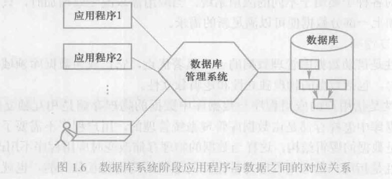


## 数据模型

​		模型是对现实世界中某个对象特征的模拟和抽象。

​		数据模型也是一种模型，它是对现实世界数据特征的抽象。也就是说数据模型是用来描述数据、组织数据和对数据进行操作的。

​		三方面要求：

​				一、是能比较真实地模拟现实世界。

​				二、是容易为人所理解。

​				三、是便于在计算机上实现。

​		概念模型：第一类概念模型。也称信息模型，它是按用户的观点来对数据和信息建模，主要用于数据库设计。

​		逻辑模型主要包括层次模型、网状模型、关系模型、面向对象数据模型和对象关系数据模型、半结构化数据模型等。它是按计算机系统的观点对数据建模，主

要用于数据库管理系统的实现。

​		物理模型是对数据最底层的抽象，它描述数据在系统内部的表示方式和存取方法，或在磁盘或磁带上的存储方式和存取方法，是面向计算机系统的。物理模型

的具体实现是数据库管理系统的任务，数据库设计人员要了解和选择物理模型，最终用户则不必考虑物理级的细节。


​		为了把现实世界中的具体事物抽象、组织为某一数据库管理系统支持的数据模型，人们常常首先将现实世界抽象为信息世界，然后将信息世界转换为机器世

界。也就是说，首先把现实世界中的客观对象抽象为某一种信息结构，这种信息结构并不依赖于具体的计算机系统，不是某一个数据库管理系统支持的数据模型，

而是概念级的模型；然后再把概念模型转换为计算机上某一数据库管理系统支持的数据模型。

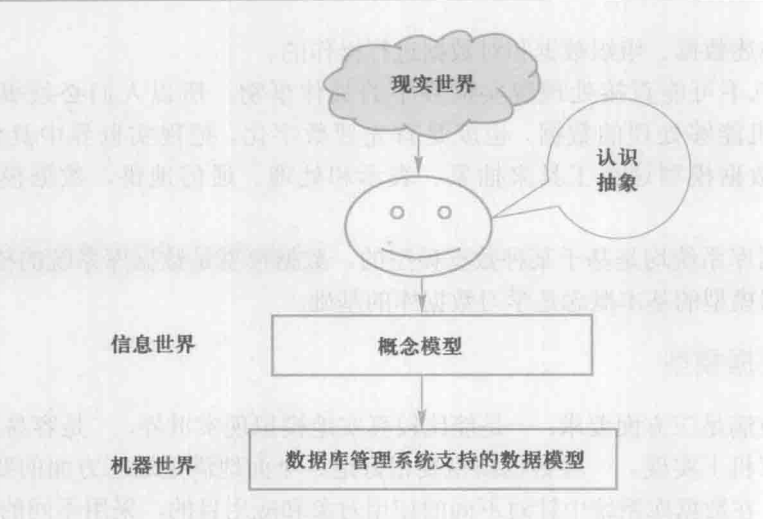


### 概念模型

​		实体：客观存在并可相互区别的事物称为实体。实体可以是具体的人、事、物，也可以是抽象的概念或联系。

​		属性：实体所具有的某一特性称为属性。一个实体可以由若干个属性来刻画。

​		码：唯一标识实体的属性集称为码。

​		实体型：具有相同属性的实体必然具有共同的特征和性质。用实体名及其属性名集合来抽象和刻画同类实体，称为实体型。

​		实体集：同一类型实体的集合称为实体集。

​		联系：在现实世界中，事物内部以及事物之间是有联系的，这些联系在信息世界中反映为实体(型)内部的联系和实体(型)之间的联系。实体内部的联系通常是

指组成实体的各属性之间的联系，实体之间的联系通常是指不同实体集之间的联系。


​		实体之间的联系有一对一、一对 多和多对多等多种类型。

​				一对一：如果对于实体集A中的每一个实体，实体集B中至多有一个(也可以没有)实体与之联系，反之亦然，则称实体集A与实体集B具有一对一联系。

​				一对多：如果对于实体集A中的每一个实体，实体集B中有n个实体(n≥0)与之联系，反之，对于实体集B中的每一个实体，实体集A中至多只有一个实体

​		与之联系，则称实体集A与实体集B有一对多联系。

​				多对多：如果对于实体集A中的每一个实体，实体集B中有n个实体(n≥0)与之联系，反之，对于实体集B中的每-一个实体，实体集A中也有m个实体(m≥0)

​		与之联系，则称实体集A与实体集B具有多对多联系。

​		

​		表示方法：实体——联系方法

​				概念模型是对信息世界建模，所以概念模型应该能够方便、准确地表示出上述信息世界中的常用概念。概念模型的表示方法很多，其中最为常用的是实

​		体——联系方法。该方法用 E-R 图来描述现实世界的概念模型，`E——R`方法也称为`E——R`模型。


### 组成要素

​		一般地讲， 数据模型是严格定义的一组概念的集合。 这些概念精确地描述了系统的静态特性、动态特性和完整性约束条件。

三部分：

1、数据结构

​		数据结构描述数据库的组成对象以及对象之间的联系。也就是说，数据结构描述的内容有两类：一类是与对象的类型、内容、性质有关的。一类是与数据之间

联系有关的对象，如网状模型中的系型。

​		数据结构是刻画一个数据模型性质最重要的方面。因此在数据库系统中，人们通常按照其数据结构的类型来命名数据模型。

​		总之，数据结构是所描述的对象类型的集合，是对系统静态特性的描述。

2、数据操作

​		数据操作是指对数据库中各种对象(型)的实例(值)允许执行的操作的集合，包括操作及有关的操作规则。

​		数据库主要有查询和更新(包括插入、删除、修改)两大类操作。数据模型必须定义这些操作的确切含义、操作符号、操作规则(如优先级)以及实现操作的语

言。

3、数据的完整性约束条件

​		数据的完整性约束条件是一组完整性规则。完整性规则是给定的数据模型中数据及其联系所具有的制约和依存规则，用以限定符合数据模型的数据库状态以及

状态的变化，以保证数据的正确、有效和相容。

​		数据模型应该反映和规定其必须遵守的基本的和通用的完整性约束条件。

​		此外，数据模型还应该提供定义完整性约束条件的机制，以反映具体应用所涉及的数据必须遵守的特定的语义约束条件。

### 常用数据模型

​		主要逻辑数据模型：

​				1、层次模型。

​				2、网状模型。

​				3、关系模型。

​				4、面向对象数据模型。

​				5、对象关系数据模型

​				6、半结构化数据模型

### 层次模型

​		层次模型是数据库系统中最早出现的数据模型，层次数据库系统采用层次模型作为数据的组织方式。

​		层次模型用树形结构来表示各类实体以及实体间的联系。现实世界中许多实体之间的联系本来就呈现出一种很自然的层次关系。

#### 数据结构

​		在数据库中定义满足下面两个条件的基本层次联系的集合为层次模型：

​				1、有且只有一个结点没有双亲结点，这个结点称为根结点。

​				2、根以外的其他结点有且只有一个双亲结点。

​		在层次模型中，每个结点表示一个记录类型，记录类型之间的联系用结点之间的连线(有向边)表示，这种联系是父子之间的一对多的联系。这就使得**层次数据**

**库系统只能处理一对多的实体联系**。

​		每个记录类型可包含若干个字段，这里记录类型描述的是实体，字段描述实体的属性。各个记录类型及其字段都必须命名。各个记录类型、同一记录类型中各

个字段不能同名。每个记录类型可以定义一个排序字段，也称为码字段，如果定义该排序字段的值是唯一的，则它能唯一地标识一个记录值。

​		在层次模型中，同一双亲的子女结点称为兄弟结点，没有子女结点的结点称为叶结点。

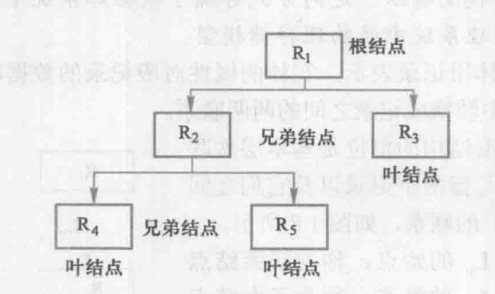

​		基本特点：任何一个给定的记录值只能按其层次路径查看，没有一个子女记录值能够脱离双亲记录值而独立存在。

#### 数据操纵与完整性约束

​		层次模型的数据操纵主要有查询、插入、删除和更新。 进行插入、删除、更新操作时要满足层次模型的完整性约束条件。

​		进行插入操作时，如果没有相应的双亲结点值就不能插入它的子女结点值。

​		进行删除操作时，如果删除双亲结点值，则相应的子女结点值也将被同时删除。

#### 优缺点

​		优点：
​				1、层次模型的数据结构比较简单清晰。

​				2、层次数据库的查询效率高。因为层次模型中记录之间的联系用有向边表示，这种联系在`DBMS`中常常用指针来实现。因此这种联系也就是记录之间的

​		存取路径。当要存取某个结点的记录值，`DBMS`就沿着这一条路径很快找到该记录值，所以层次数据库的性能优于关系数据库，不低于网状数据库。

​				3、层次数据模型提供了良好的完整性支持。

​		缺点：
​				1、现实世界中很多联系是非层次性的，如结点之间具有多对多联系，不适合用层次模型表示。

​				2、 如果一个结点具有多个双亲结点等，用层次模型表示这类联系就很笨拙，只能通过引入冗余数据(易产生不一致性)或创建非自然的数据结构(引入虚

​		拟结点)来解决。对插入和删除操作的限制比较多，因此应用程序的编写比较复杂。

​				3、查询子女结点必须通过双亲结点。

​				4、由于结构严密，层次命令趋于程序化。

### 网状模型

​		网状数据库系统采用网状模型作为数据的组织方式。

#### 数据结构

​		在数据库中，把满足以下两个条件的基本层次联系集合称为网状模型：

​				1、允许一个以上的结点无双亲。

​				2、一个结点可以有多于一个的双亲。

​		与层次模型一样，网状模型中每个结点表示一个记录类型(实体)，每个记录类型可包含若干个字段(实体的属性)，结点间的连线表示记录类型(实体)之间一对多

的父子联系。

​		从定义可以看出，层次模型中子女结点与双亲结点的联系是唯一的， 而在网状模型中这种联系可以不唯一。因此要为每个联系命名，并指出与该联系有关的

双亲记录和子女记录。

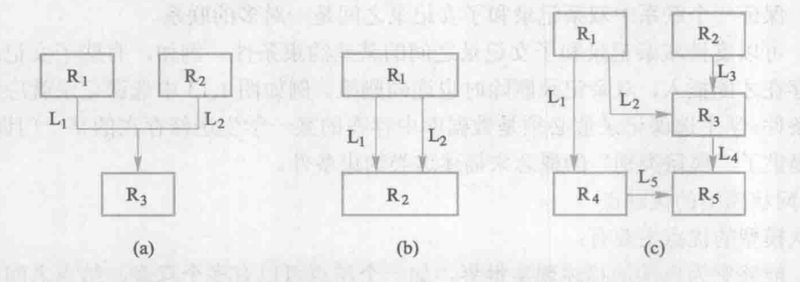

#### 数据操作与完整性约束

​		网状模型一般来说没有层次模型那样严格的完整性约束条件，但具体的网状数据库系统对数据操纵都加了一些限制，提供了一定的完整性约束。
​		主要有:

​				1、支持记录码的概念，码：即唯一标识记录的数据项的集合。

​				2、保证一个联系中双亲记录和子女记录之间是一对多的联系。

​				3、可以支持双亲记录和子女记录之间的某些约束条件。

#### 优缺点

​		优点：

​				1、能够更为直接地描述现实世界，如一个结点可以有多个双亲，结点之间可以有多种联系。

​				2、具有良好的性能，存取效率较高。

​		缺点：

​				1、结构比较复杂，而且随着应用环境的扩大，数据库的结构就变得越来越复杂，不利于最终用户掌握。

​				2、网状模型的`DDL`、`DML`复杂，并且要嵌入某一种高级语言(如`COBOL`、`C`)中。用户不容易掌握，不容易使用。

​				3、由于记录之间的联系是通过存取路径实现的，应用程序在访问数据时必须选择适当的存取路径，因此用户必须了解系统结构的细节，加重了编写应用

​		程序的负担。


### 关系模型

#### 数据结构

​		关系模型与以往的模型不同，它是建立在严格的数学概念的基础上的。关系模型由一组关系组成。每个关系的数据结构是一张规范化的二维表。

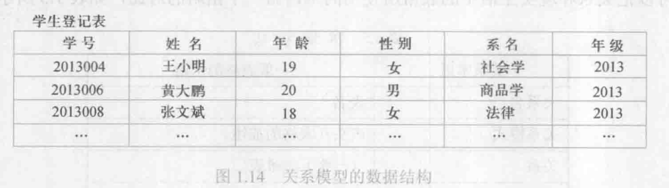

#### 术语

​		关系： 一个关系对应通常说的一张表。

​		元组：表中的一行即为一个元组。

​		属性：表中的一列即为一个属性，给每一个属性起一个名称即属性名。

​		码：也称为码键。表中的某个属性组，它可以唯一确定一个元组。

​		域：域是一组具有相同数据类型的值的集合。属性的取值范围来自某个域。

​		分量：元组中的一个属性值。

​		关系模式：对关系的描述，一般表示为：关系名(属性1，属性2， .... ，属性n)。

​		关系模型要求关系必须是规范化的，即要求关系必须满足一定的规范条件， 这些规范条件中最基本的一条就是，关系的每一个分量必须是一个不可分的数据

项，也就是说，不允许表中还有表。

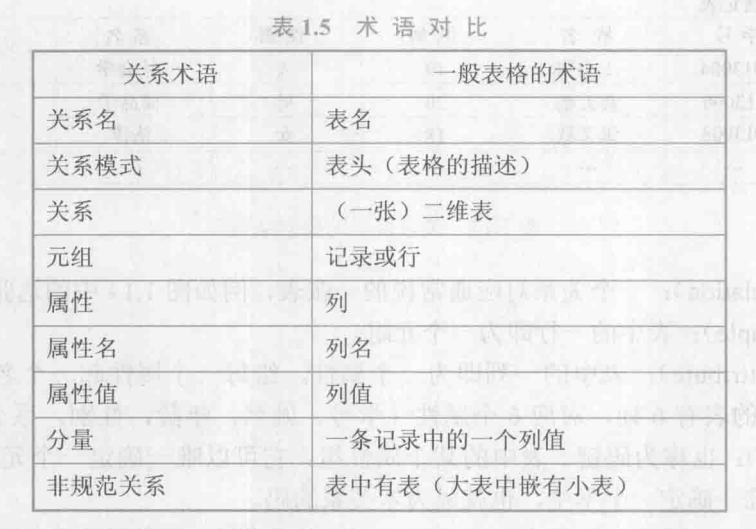

#### 数据操作与完整性约束

​		关系模型的数据操纵主要包括查询、插入、删除和更新数据。这些操作必须满足关系的完整性约束条件。关系的完整性约束条件包括三大类：**实体完整性、**

**参照完整性和用户定义的完整性**。

#### 优缺点

​		优点：
​				1、关系模型与格式化模型不同，它是建立在严格的数学概念的基础上的。

​				2、关系模型的概念单一。无论实体还是实体之间的联系都用关系来表示。对数据的检索和更新结果也是关系(即表)。所以其数据结构简单、清晰，用户

​		易懂易用。

​				3、关系模型的存取路径对用户透明，从而具有更高的数据独立性、更好的安全保密性，也简化了程序员的工作和数据库开发建立的工作。

​		缺点：

​				由于存取路径对用户是隐蔽的，查询效率往往不如格式化数据模型（层次，网状）。为了提高性能，数据库管理系统必须对用户的查询请求进行优化，

​		因此增加了开发数据库管理系统的难度。不过用户不必考虑这些系统内部的优化技术细节。


## 数据库系统的结构

### 数据库系统模式

​		在数据模型中有`"`型`"`和`"`值`"`的概念。型是指对某一类数据的结构和属性的说明，值是型的一个具体赋值。

​		模式是数据库中全体数据的逻辑结构和特征的描述，它仅仅涉及型的描述，不涉及具体的值。模式的一个具体值称为模式的一个实例。同一个模式可以有很

多实例。

​		模式是相对稳定的，而实例是相对变动的，因为数据库中的数据是在不断更新的。模式反映的是数据的结构及其联系，而实例反映的是数据库某一时刻的状

态。

​		虽然实际的数据库管理系统产品种类很多，它们支持不同的数据模型，使用不同的数据库语言，建立在不同的操作系统之上，数据的存储结构也各不相同，但

它们在体系结构上通常都具有相同的特征，即采用三级模式结构`(`早期微机上的小型数据库系统除外`)`并提供两级映像功能。


### 三级模式结构

数据库系统的三级模式结构是指数据库系统是由**外模式、模式和内模式**三级构成。

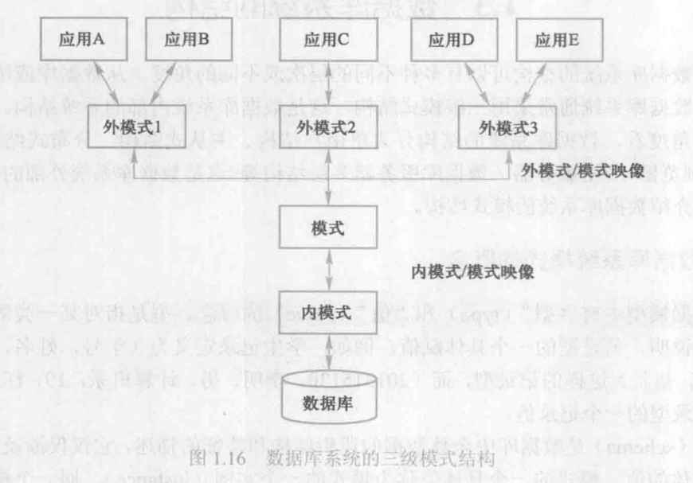

1、模式

​		模式也称逻辑模式，是数据库中全体数据的逻辑结构和特征的描述，是所有用户的公共数据视图。它是数据库系统模式结构的中间层，既不涉及数据的物理存

储细节和硬件环境，又与具体的应用程序、所使用的应用开发工具及高级程序设计语言无关。

​		模式实际上是数据库数据在逻辑级上的视图。一个数据库只有一个模式。数据库模式以某一种数据模型为基础，统一综合地考虑了所有用户的需求，并将这些

需求有机地结合成一个逻辑整体。定义模式时不仅要定义数据的逻辑结构，例如数据记录由哪些数据项构成，数据项的名字、类型、取值范围等;而且要定义数据

之间的联系，定义与数据有关的安全性、完整性要求。

2、外模式

​		外模式也称子模式或用户模式，它是数据库用户`(`包括应用程序员和最终用户`)`能够看见和使用的局部数据的逻辑结构和特征的描述，是数据库用户的数据

视图，是与某一应用有关的数据的逻辑表示。

​		外模式通常是模式的子集。一个数据库可以有多个外模式。由于它是各个用户的数据视图，如果不同的用户在应用需求、看待数据的方式、对数据保密的要求

等方面存在差异，则其外模式描述就是不同的。即使对模式中同一数据，在外模式中的结构、类型、长度、保密级别等都可以不同。另一方面，同一外模式也可

以为某一用户的多个应用系统所使用，但一个应用程序只能使用一个外模式。

​		外模式是保证数据库安全性的一个有力措施。每个用户只能看见和访问所对应的外模式中的数据，数据库中的其余数据是不可见的。

3、内模式

​		内模式也称存储模式，一个 数据库只有一个内模式。它是数据物理结构和存储方式的描述，是数据在数据库内部的组织方式。


### 二级映像功能与数据独立性

​		数据库系统的三级模式是数据的三个抽象级别，它把数据的具体组织留给数据库管理系统管理，使用户能逻辑地、抽象地处理数据，而不必关心数据在计算机

中的具体表示方式与存储方式。为了能够在系统内部实现这三个抽象层次的联系和转换，数据库管理系统在这三级模式之间提供了两层映像：**外模式/模式映像**和

**模式/内模式**映像。

​		正是这两层映像保证了数据库系统中的数据能够具有较高的**逻辑独立性和物理独立性**。


#### 外模式/模式映像

​		模式描述的是数据的全局逻辑结构，外模式描述的是数据的局部逻辑结构。对应于同一个模式可以有任意多个外模式。对于每一个外模式，数据库系统都有一

个外模式/模式映像，它定义了该外模式与模式之间的对应关系。这些映像定义通常包含在各自外模式的描述中。

​		当模式改变时`(`例如增加新的关系、新的属性、改变属性的数据类型等`)`，由数据库管理员对各个外模式/模式的映像作相应改变，可以使外模式保持不变。

应用程序是依据数据的外模式编写的，从而应用程序不必修改，保证了数据与程序的逻辑独立性，简称**数据的逻辑独立性**。


#### 模式/内模式映像

​		数据库中只有一个模式，也只有一个内模式，所以**模式/内模式映像是唯一**的，它定义了数据全局逻辑结构与存储结构之间的对应关系。该映像定义通常包含

在模式描述中。当数据库的存储结构改变时`(`例如选用了另一种存储结构`)`，由数据库管理员对模式/内模式映像作相应改变，可以使模式保持不变，从而应用程

序也不必改变。保证了数据与程序的物理独立性，简称**数据的物理独立性**。


​		在数据库的三级模式结构中，数据库模式即全局逻辑结构是数据库的中心与关键，它独立于数据库的其他层次。因此设计数据库模式结构时应首先确定数据库

的逻辑模式。

​		数据库的内模式依赖于它的全局逻辑结构，但独立于数据库的用户视图，即外模式，也独立于具体的存储设备。它是将全局逻辑结构中所定义的数据结构及其

联系按照一定的物理存储策略进行组织，以达到较好的时间与空间效率。

​		数据库的外模式面向具体的应用程序，它定义在逻辑模式之上，但独立于存储模式和存储设备。当应用需求发生较大变化，相应的外模式不能满足其视图要求

时，该外模式就得做相应改动，所以设计外模式时应充分考虑到应用的扩充性。

​		数据与程序之间的独立性使得数据的定义和描述可以从应用程序中分离出去。另外，由于数据的存取由数据库管理系统管理，从而简化了应用程序的编制，大

大减少了应用程序的维护和修改。

# 关系数据库

## 关系数据结构及形式化定义

### 关系

​		关系模型的数据结构非常简单，只包含单一的数据结构一关系。 在用户看来，关系模型中数据的逻辑结构是一张扁平的二维表。

​		关系模型的数据结构虽然简单却能够表达丰富的语义，描述出现实世界的实体以及实体间的各种联系。也就是说，在关系模型中，现实世界的实体以及实体间

的各种联系均用单一的结构类型，即关系来表示。

#### 域

​		域：一组具有相同数据类型的值的集合。

#### 笛卡尔积

​		给定一 组域`D1，D2，... ，Dn`，允许其中某些域是相同的`D1，D2，... ，Dn`的笛卡儿积为：


​		其中，每一个元素`（d1，d2，... ，dn）`叫作一个n元组，或简称元组。 元素中的每一个值` di`；叫做一个分量。

​		一个域允许的不同取值个数称为这个域的基数。

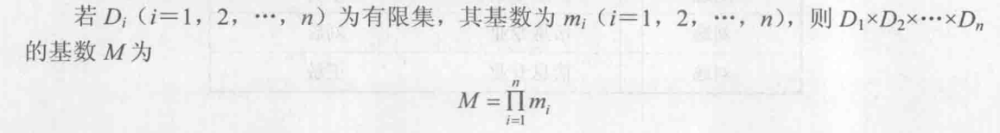


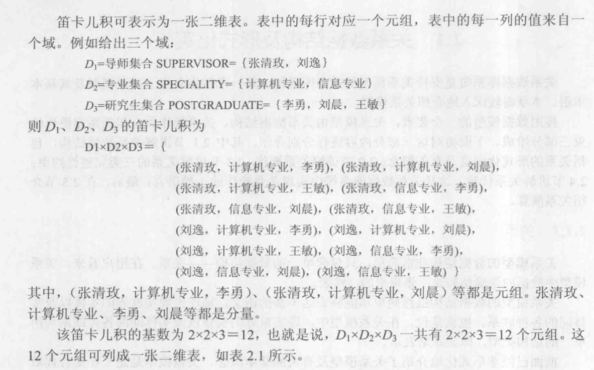


#### 关系

​		`D1x，D2x ... Dnx`的子集叫做在域`D1，D2，... ，Dn`上的关系，表示为`R(D1，D2，... ， Dn)`。这里`R`表示关系的名字，`n`是关系的目或度。

​		关系中的每个元素是关系中的元组，通常用`t`表示。

​				当`n=1`时，称该关系为单元关系，或一元关系。

​				当`n=2`时，称该关系为二元关系。

​		关系是笛卡儿积的有限子集，所以关系也是一张二维表，表的每行对应一个元组，表的每列对应一个域。由于域可以相同，为了加以区分，必须对每列起一个

名字，称为属性。`n`目关系必有`n`个属性。

​		若关系中的**某一属性组的值能唯地标识一个元组**，而其子集不能，则称该属性组为**候选码**。

​		若一个关系有多个候选码，则选定其中一个为主码。

​		候选码的诸属性称为主属性。不包含在任何候选码中的属性称为非主属性或非码属性。

​		在最简单的情况下，候选码只包含一个属性。在最极端的情况下，关系模式的所有属性是这个关系模式的候选码，称为全码。

​		关系可以有三种类型：

​				基本表：实际存在的表，它是实际存储数据的逻辑表示。

​				查询表：查询结果对应的表。

​				视图表：由基本表或其他视图表导出的表，是虚表，不对应实际存储的数据。

​		基本关系具有的性质：

​				1、列是同质的，即每一列中的分量是同一类型的数据，来自同一个域。

​				2、不同的列可出自同一个域，称其中的每一列为一个属性，不同的属性要给予不同的属性名。

​				3、列的顺序无所谓，即列的次序可以任意交换。由于列顺序是无关紧要的，因此在许多实际关系数据库产品中增加新属性时，永远是插至最后一列。

​				4、任意两个元组的候选码不能取相同的值。

​				5、行的顺序无所谓，即行的次序可以任意交换。

​				6、分量必须取原子值，即每一个分量都必须是不可分的数据项。

### 关系模式

​		关系是元组的集合，因此关系模式必须指出这个元组集合的结构，即它由哪些属性构成，这些属性来自哪些域，以及属性与域之间的映像关系。

​		关系模式描述：

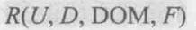

​		`R`为关系名，`U`为组成该关系的属性名集合，`D`为`U`中属性所来自的域，`DOM`为属性向域的映像集合，`F`为属性间数据的依赖关系集合。

## 关系操作

​		关系模型中常用的关系操作包括查询操作和插入、 删除、修改`(update)`操作两大部分。

​		关系的查询表达能力很强，是关系操作中最主要的部分。查询操作又可以分为选择、投影、连接、除、并、差、交、笛卡儿积等。其中选择、投影、并、差、

笛卡儿积是`5`种基本操作，其他操作可以用基本操作来定义和导出。

## 关系的完整性

### 实体完整性

​		关系数据库中每个元组应该是可区分的，是唯一的。这样的约束条件用实体完整性来保证。

​		实体完整性：若属性`(`指一个或一组属性`) A`是基本关系`R`的主属性，则`A`不能取空值`(null value)`。所谓空值就是`"`不知道`"`或`"`不存在`"`或`"`无意

义`"`的值。

​		按照实体完整性规则的规定，如果主码由若干属性组成，则所有这些主属性都不能取空值。

​		说明：

​				1、实体完整性规则是针对基本关系而言的。一个基本表通常对应现实世界的一个实体集。

​				2、现实世界中的实体是可区分的，即它们具有某种唯一性标识。

​				3、相应地，关系模型中以主码作为唯一性标识。

​				4、主码中的属性即主属性不能取空值。如果主属性取空值， 就说明存在某个不可标识的实体，即存在不可区分的实体，这与第`(2)`点相矛盾，因此这

个规则称为实体完整性。

### 参照完整性

​		设`F`是基本关系`R`的一个或一组属性，但不是关系`R`的码，`Ks`是基本关系`S`的主码。如果`F`与`Ks`相对应，则称`F`是`R`的外码，并称基本关系`R`为参照关

系，基本关系`S`为被参照关系或目标关系。

​		显然，目标关系`S`的主码`Ks`和参照关系`R`的外码`F`必须定义在同一个（或同一组）域上。

​		参照完整性：若属性（或属性组） `F`是基本关系`R`的外码，它与基本关系 S 的主码 Ks 相对应（基本关系`R`和`S`不一定是不同的关系），则对于`R`中每个元

组在`F`的值必须：

​				1、或者取空值（F 的每个属性均为空值）。

​				2、或者等于 S 中某个元组的主码值。

### 用户定义的完整性

​		用户定义的完整性：针对某一个具体关系数据库的约束条件，它反映某一具体应用所设计的数据必须满足的语义要求。


## 关系代数

​		关系代数的运算对象是关系，运算结果也是关系。关系代数用到的运算符包含两类：集合运算符和专门的关系运算符。

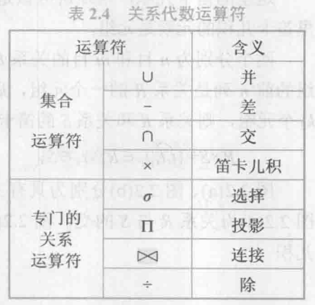

​		传统的集合运算符将关系看成元组的集合，其运算是从关系的`"`水平`"`方向，即行的角度来进行；而专门的关系运算不仅涉及行，而且设计列。比较运算符

和逻辑运算符是用来辅助专门的关系运算符进行操作的。

### 传统的集合运算


### 专门的关系运算

​		选择：在一个关系的所有元组中选出符合条件的元组。选择操作是从行的角度进行的运算。

​		投影：从一个关系中选择出若干属性组成新的关系。投影操作是从列的角度进行的运算。

​		连接：从两个关系的笛卡尔积中选取属性间满足一定条件的元组。

#### 等值连接

​		等值连接：从两个关系的笛卡尔积中选择两个关系对应的某些属性值相等的那些元组。

​		自然连接：特殊的等值连接。要求两个关系中进行比较的分量必须是同名的属性组，并且在结果中把重复的属性列去掉。

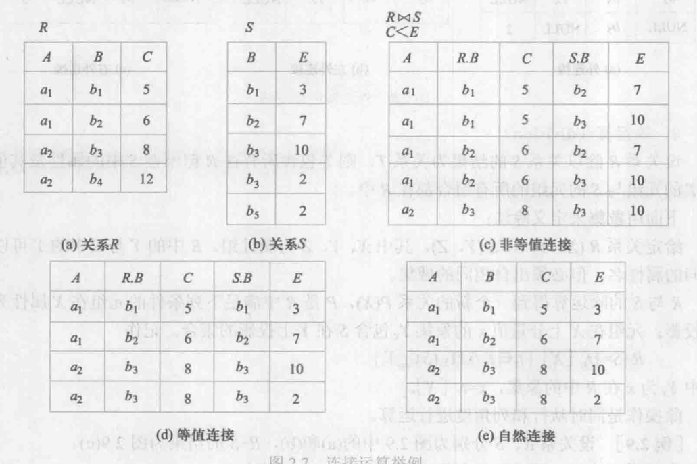

​		两个关系在做自然连接时，选择两个关系在公共属性上值相等的元组构成新的关系，此时，两个关系中都可能存在在另一个关系的公共属性上找不到相等的值

得元组，这些元组在操作时被舍弃，这些被舍弃的元组称为悬浮元组。

​		如果把悬浮元组也保存在结果中，而在其他属性上填空值，那么这种连接叫外连接。

​		如果只保留左边关系中的悬浮元组叫左外连接。

​		如果只保留右边关系中的悬浮元组叫右外连接。

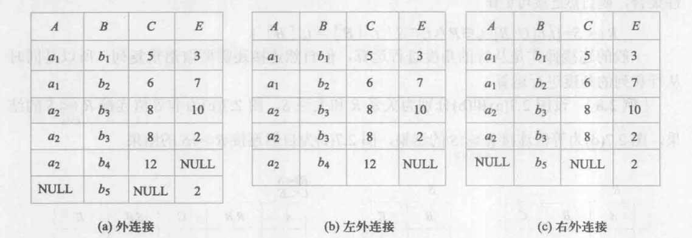

​		除运算：关系 R 除以关系 S 的结果为关系 T ，则 T 包含所有在 R 但不在 S 中的属性及其值，并且 T 的元组与 S 的元组的所有组合都在 R 中。

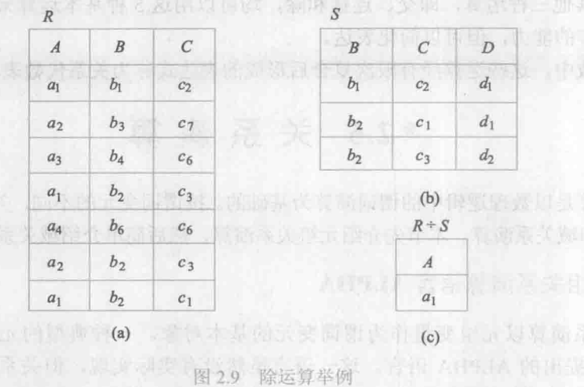

# 关系数据库标准语言SQL

​		结构化查询语言是关系数据库的标准语言，也是一个通用的、功能极强的关系数据库语言。其功能不仅仅是查询，而是包括数据库模式创建、数据库数据的插

入与修改、数据库安全性完整性定义与控制等一系列功能。

​		`SQL`之所以能够为用户和业界所接受并成为国际标准，是因为它是一个综合的、功能极强同时又简洁易学的语言。`SQL`集数据查询、数据操纵、数据定义和

数据控制功能于一体。

特点：

1、综合统一。

​		数据库系统的主要功能是通过数据库支持的数据语言来实现的。

​		`SQL` 集数据定义语言、数据操纵语言、数据控制语言的功能于一-体，语言风格统一，可以独立完成数据库生命周期中的全部活动。

​				（1）定义和修改、删除关系模式，定义和删除视图，插入数据，建立数据库。

​				（2）对数据库中的数据进行查询和更新。

​				（3）数据库重构和维护。

​				（4）数据库安全性、 完整性控制，以及事务控制。

​				（5）嵌入式`SQL`和动态`SQL`定义。

2、高度非过程化

​		非关系数据模型的数据操纵语言是`"`面向过程`"`的语言，用`"`过程化`"`语言完成某项请求必须指定存取路径。而用SQL进行数据操作时，只要提出`"`做什

么`"`，而无须指明“怎么做”，因此无须了解存取路径。存取路径的选择以及SQL的操作过程由系统自动完成。这不但大大减轻了用户负担，而且有利于提高数据独

立性。

3、面向集合的操作方式

​		非关系数据模型采用的是面向记录的操作方式，操作对象是一条记录。而`SQL`采用集合操作方式，不仅操作对象、查找结果可以是元组的集合，而且一次插

入、删除、更新操作的对象也可以是元组的集合。

4、以同一种语法结构提供多种使用方式

​		`SQL`既是独立的语言，又是嵌入式语言。作为独立的语言，它能够独立地用于联机交互的使用方式，用户可以在终端键盘上直接键入`SQL`命令对数据库进行

操作；作为嵌入式语言，`SQL`语句能够嵌入到高级语言程序中，供程序员设计程序时使用。而在两种不同的使用方式下，`SQL`的语法结构基本上是一致的。这种以

统一的语法结构提供多种不同使用方式的做法，提供了极大的灵活性与方便性。

5、语言简洁、易学易用


### 数据定义

​		`SQL`的数据定义功能包括模式定义、表定义、视图和索引的定义：

| 操作对象       | 创建            | 删除          | 修改        |
| -------------- | --------------- | ------------- | ----------- |
| 模式（数据库） | create database | drop database |             |
| 表             | create table    | drop table    | alter table |
| 视图           | create view     | drop view     |             |
| 索引           | create index    | drop index    | alter index |

​		`SQL`标准不提供修改模式定义和修改视图定义的操作。用户如果想修改这些对象，只能先将它们删除然后再重建。


#### 模式的定义域删除

​		定义模式：

```sql
create database <模式名> authorization <用户名>;
```

​		如果没有指定模式名，那么模式名隐含为用户名。

​		定义模式实际上定义了一个命名空间，在这个空间中可以进一步定义该模式所包含的数据库对象。

​		删除模式：

```sql
drop database <模式名> <cascade | restrict>
```

​		其中`cascade`和`restrict`两者必选其一。选择了`cascade`（级联），表示在删除模式的同时把该模式中所有的数据库对象全部删除；选择了`restrict`（限

制），表示如果该模式中已经定义了下属的数据库对象(如表、视图等)，则拒绝该删除语句的执行。只有当该模式中没有任何下属的对象时才能执行`drop`

`database`语句。


#### 表的定义、删除与修改

​		创建了一个模式就建立了一个数据库的命名空间（对应`MSQL`中的一个数据库），一个框架。在这个空间中首先要定义的是该模式包含的数据库基本表。

​		`SQL`语言定义基本表，其基本格式如下：


```sql
create table student
(
    sno int primary key,   	// 主码
    sname char(20) unique,	// 唯一性
    ssex char(2),
    sage smallint,
    sdept char(20)
);
```


​		建表的同时通常还可以定义与该表有关的完整性约束条件，这些完整性约束条件被存入系统的数据字典中，当用户操作表中数据时由关系数据库管理系统自动

检查该操作是否违背这些完整性约束条件。如果完整性约束条件涉及该表的多个属性列，则必须定义在表级上，否则既可以定义在列级也可以定义在表级。


##### 数据类型

​		关系模型中一个很重要的概念是域。每一个属性来自一个域，它的取值必须是域中的值。在`SQL`中域的概念用数据类型来实现。定义表的各个属性时需要指

明。

其数据类型及长度。


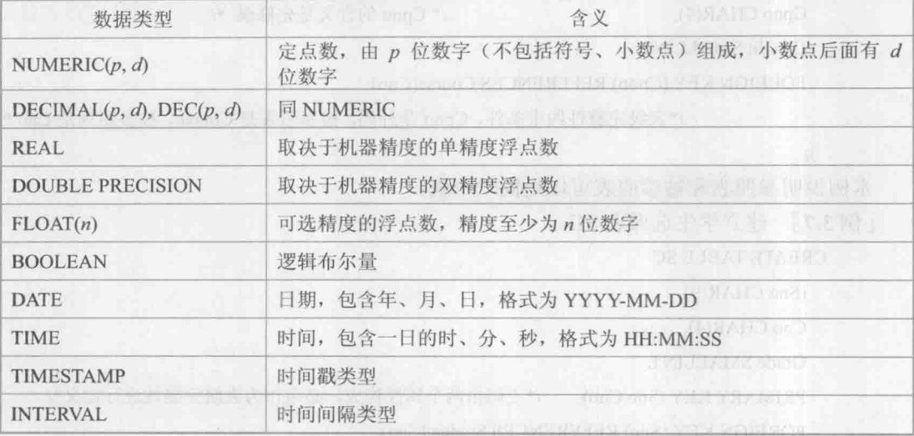

​		每一个基本表都属于某一个模式，一个模式包含多个基本表。当定义基本表时一般可以有三种方法定义它所属的模式。

​				1、在表明中显示地给出模式名。

​				2、在创建模式语句中同时创建表。

​				3、设置所属的模式，这样在创建表时表明中不必给出模式名。

修改表：

​		`SQL`语言修改表，格式为：

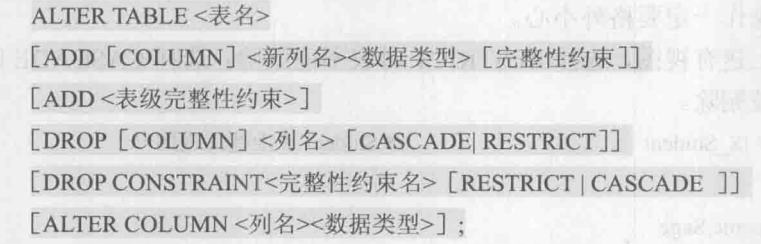

​		其中`<`表名`>`是要修改的基本表，`ADD`子句用于增加新列、新的列级完整性约束条件和新的表级完整性约束条件。`DROP COLUMN`子句用于删除表中的列，如

果指定了`CASCADE`短语，则自动删除引用了该列的其他对象。`DROP CONSTRAINT`子句用于删除指定的完整性约束条件。`ALTER COLUMN`子句用于修改原有的列定义，

包括修改列名和数据类型。


删除表：

​		`SQL`语言删除表，格式为：

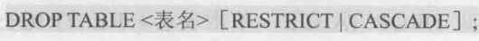

​		若选择`RESTRICT`，则该表的删除是有限制条件的。欲删除的基本表不能被其他表的约束所引用（如`CHECK, FOREIGN KEY`等约束)，不能有视图，不能有触

发器，不能有存储过程或函数等。如果存在这些依赖该表的对象，则此表不能被删除。

​		若选择`CASCADE`，则该表的删除没有限制条件。在删除基本表的同时，相关的依赖对象，例如视图，都将被一起删除。


#### 索引的建立与删除

​		当表的数据量比较大时，查询操作会比较耗时。建立索引是加快查询速度的有效手段。数据库索引类似于图书后面的索引，能快速定位到需要查询的内容。用

户可以根据应用环境的需要在基本表上建立一个或多个索引，以提供多种存取路径，加快查找速度。

​		数据库索引有多种类型，常见索引包括顺序文件上的索引、`B+`树索引、散列索引、位图索引等。顺序文件上的索引是针对按指定属性值升序或降序存储的关

系，在该属性上建立一个顺序索引文件，索引文件由属性值和相应的元组指针组成。`B+`树索引是将索引属性组织成`B+`树形式，`B+`树的叶结点为属性值和相应的

元组指针。`B+`树索引具有动态平衡的优点。散列索引是建立若干个桶，将索引属性按照其散列函数值映射到相应桶中，桶中存放索引属性值和相应的元组指针。

散列索引具有查找速度快的特点。位图索引是用位向量记录索引属性中可能出现的值，每个位向量对应一个可能值。


建立索引：

​		`SQL`语言建立索引，格式为：


​		其中，`<`表名`>`是要建索引的基本表的名字。索引可以建立在该表的一列或多列上，各列名之间用逗号分隔。每个`<`列名`>`后面还可以用`<`次序`>`指定索引

值的排列次序，可选`ASC`(升序)或`DESC` (降序)，默认值为`ASC`。

​		`UNIQUE`表明此索引的每个索引值只对应唯一的数据记录。

​		`CLUSTER`表示要建立的索引是聚簇索引。


修改索引：

​		对于已经建立的索引，如果需要对其重新命名：


删除索引：

​		`SQL`语言删除索引，格式为：


### 数据字典

​		数据字典是关系数据库管理系统内部的一组系统表，它记录了数据库中所有的定义信息，包括关系模式定义、视图定义、索引定义、完整性约束定义、各类

用户对数据库的操作权限、统计信息等。关系数据库管理系统在执行`SQL`的数据定义语句时，实际上就是在更新数据字典表中的相应信息。在进行查询优化和查询

处理时，数据字典中的信息是其重要依据。


### 数据查询

​		`SQL`提供了`select`语句进行数据查询：

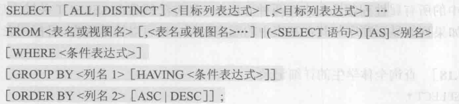

​		整个`select`语句的含义是，根据`where`子句的条件表达式从`from`子句指定的基本表、视图或派生表中找出满足条件的元组，再按`select`子句中的目标列表

达式选出元组中的属性值形成结果表。

​		如果有`group by`子句，则将结果按`<`列名1`>`的值进行分组，该属性列值相等的元组为一个组。通常会在每组中作用聚集函数。如果`GROUP BY`子句带

`HAVING`短语，则只有满足指定条件的组才予以输出。

​		如果有`order by`子句，则结果表还要按`<`列名2`>`的值的升序或降序排序。

​		`select`语句既可以完成简单的单表查询，也可以完成复杂的连接查询和嵌套查询。

#### 单表查询

​		单表查询是指仅涉及一个表的查询。

##### 选择表中的若干列：

​		通过在`select`子句的`<`目标列表达式`>`中指定要查询的属性列。`<`目标列表达式`>`中各个列的先后顺序可以与表中的顺序不一致。

选择表中的全部列：

​		将表中的所有属性列都选出来有两种方法：

​				1、在`select`关键字后列出所有列名。

​				2、如果列的显示顺序与其在基表中的顺序相同，也可以简单地将`<`目标列表达式`>`指定为`*`。

查询经过计算的值：

​		`select`子句的`<`目标列表达式`>`不仅可以是表中的属性列，也可以是表达式。`<`目标列表达式`>`不仅可以是算术表达式，还可以是字符串常量、函数等。

​		可以通过指定别名来改变查询结果的列标题，这对于含算术表达式、常量、函数名的目标列表达式尤为有用。

##### 选择表中的若干元组

消除取值重复的行：

​		两个本来并不完全相同的元组在投影到指定的某些列上后，可能会变成相同的行。可以用`distinct`消除它们。

```sql
select distinct ... from ...
```

查询满足条件的元组：

​		查询满足指定条件的元组可以通过`where`子句实现。`where`子句常用的查询条件：

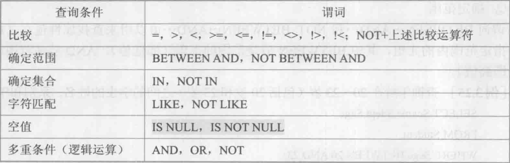

字符匹配：

​		谓词`like`可以用来进行字符串的匹配。语法格式：


​		其含义是查找指定的属性列值与`<`匹配串`>`相匹配的元组。`<`匹配串`>`可以是一个完整的字符串，也可以含有通配符`%`和`_`。 其中:

​				`%`（百分号）：代表任意长度`(`长度可以为`0 )`的字符串。
​				`_` （下横线）：代表任意单个字符。

​		如果用户要查询的字符串本身就含有通配符`%`或， 这时就要使用`escape` '`<`换码字符`>'`短语对通配符进行转义了。

多重条件查询

​		逻辑运算符`and`和`or`可用来连接多个查询条件。`and`的优先级高于`or`，但可以用括号改变优先级。

##### 聚集函数

​		为了增强检索功能，`SQL`提供了许多聚集函数：

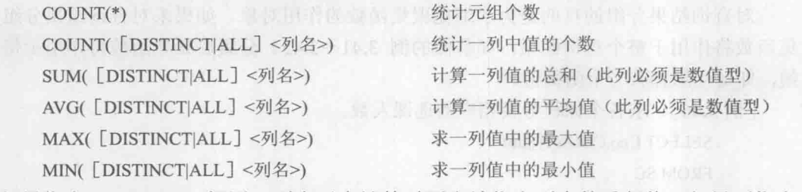

​		当聚集函数遇到空值时，除`count( all )`外，都跳过空值而只处理非空值。`count ( all )`是对元组进行计数，某个元组的一个或部分列取空值不影响

`COUNT`的统计结果。

​		`where`子句中是不能用聚集函数作为条件表达式的。聚集函数只能用于`select`子句和`group by`中的`having`子句。

分组：

​		`group by`子句将查询结果按某一列或多列的值分组，值相等的为一组。

​		对查询结果分组的目的是为了细化聚集函数的作用对象。如果未对查询结果分组，聚集函数将作用于整个查询结果。

​		如果分组后还要求按一定的条件对这些组进行筛选，最终只输出满足指定条件的组，则可以使用`having`短语指定筛选条件。

​		where 子句与 having 短语的区别在于作用对象不同。where 子句作用于基本表或视图，从中选择满足条件的元组。having 短语作用于组，从中选择满足条件

的组。

#### 连接查询

​		若一个查询同时涉及两个以上的表，则称之为连接查询。连接查询是关系数据库中最主要的查询，包括等值连接查询、自然连接查询、非等值连接查询、自身

连接查询、外连接查询和复合条件连接查询等。

##### 等值与非等值连接查询

​		连接查询的`where`子句中用来连接两个表的条件称为连接条件或连接谓词，其一般格式为：


​		其中比较运算符主要有`=、>、<、>=、、<=、!= (`或`<>)`等。

​		当连接运算符为`=`时，称为等值连接。使用其他运算符称为非等值连接。

​		连接谓词中的列名称为连接字段。连接条件中的各连接字段类型必须是可比的，但名字不必相同。

​		若在等值连接中把目标列中重复的属性列去掉则为自然连接。

#####  自身连接

​		连接操作不仅可以在两个表之间进行，也可以是一个表与其自己进行连接，称为表的自身连接。

##### 外连接

​		左外连接列出左边关系中所有的元组，右外连接列出右边关系中所有的元组。

#### 嵌套查询

​		在`SQL`语言中，一个`select - from - where`语句称为一个查询块。将一个查询块嵌套在另一个查询块的`where`子句或`having`短语的条件中的查询称为嵌套

查询。

​		`SQL`语言允许多层嵌套查询，即一个子查询中还可以嵌套其他子查询。需要特别指出的是，子查询的`select`语句中不能使用`order by`子句，`order by`子句

只能对最终查询结果排序。

​		子查询的查询条件不依赖于父查询，这类于查询称为不相关子查询。不相关子查询是较简单的一类子查询。

​		如果子查询的查询条件依赖于父查询，这类子查询称为相关子查询，整个查询语句称为相关嵌套查询语句。

​		带有比较运算符的子查询是指父查询与子查询之间用比较运算符进行连接。当确切知道内层查询返回的是**单个值**时，可以用`>、<、=、>=、<=、!=`或`<>`等比

较运算符。

​		子查询返回单值时可以用比较运算符，但返回多值时要用`any(`有的系统用`some)`或`all`谓词修饰符。而使用`any`或`all`谓词时则必须同时使用比较运算符。

其语义如：


#### 集合查询

​		`select`语句的查询结果是元组的集合，所以多个`select`语句的结果可进行集合操作。集合操作主要包括并操作`union`、交操作`intersect`和差操作

`except`。

​		子查询不仅可以出现在`where`子句中，还可以出现在`from`子句中，这时子查询生成的临时派生表成为主查询的查询对象。

​		需要说明的是，通过`from`子句生成派生表时，`as`关键字可以省略，但必须为派生关系指定一个别名。 而对于基本表，别名是可选择项。

### 数据更新

​		更新操作有三种：

​				1、向表中添加若干行数据。

​				2、修改表中的数据。

​				3、删除表中的若干行数据。

#### 插入数据

​		`SQL`的数据插入语句`insert`通常有两种形式，一种是插入一个元组， 另一种是插入子查询结果。后者可以一次插入多个元组。

##### 插入元组

​		插入元组的`insert`语句的格式为：

```sql
 insert into <表名>[(属性列)] values(常量值)
```

​		其功能是将新元组插入指定表中。其中新元组的属性列1的值为常量1，属性列2的值为常量2，一次类推。`into`子句中没有出现的属性列，新元组在这些列上

将取空值。但必须注意的是，在表定义时说明了`not null`的属性列不能取空值，否则会出错。

​		如果`into`子句中没有指明任何属性列名，则新插入的元组必须在每个属性列上均有值。并且插入值得顺序与属性的顺序一一对应。

##### 插入子查询结果

​		插入子查询结果的`insert`语句格式为


#### 修改数据

​		修改操作又称为更新操作，其语句的一般格式为：


​		其功能是修改指定表中满足`where`子句条件的元组。其中`set`子句给出`<`表达式`>`的值用于取代相应的属性列值。如果省略`where`子句，则表示要修改表中

的所有元组。

#### 删除数据

​		删除语句的一般格式为：


​		`delete`语句的功能是从指定表中删除满足`where`子句条件的所有元组。如果省略`where`子句则表示删除表中全部元组，但表的定义仍在字典中。也就是说，

`delete`语句删除的是表中的数据，而不是关于表的定义。

### 视图

​		视图是从一个或几个基本表（或视图）导出的表。它与基本表不同，是一个虚表。数据库中只存放视图的定义，而不存放视图对应的数据，这些数据仍存放在

原来的基本表中。所以一旦基本表中的数据发生变化，从视图中查询出的数据也就随之改变了。

#### 建立视图

​		SQL语言用`create view`命令建立视图，其一般格式为：


​		其中，子查询可以是任意的`select`语句，是否可以含有`order by`子句和`distinct`短语，则取决于具体系统的实现。

​		`with check option`表示对视图进行`update、insert`和`delete`操作时要保证更新、插入或删除的行满足视图定义中的谓词条件（即子查询中的条件表达

式）。

​		组成视图的属性列名或者全部省略或者全部指定，没有第三种选择。如果省略了视图的各个属性列名，则隐含该视图由子查询中`select`子句目标列中的诸字

段组成。

​		必须明确指定：

​				1、某个目标列不是单纯的属性名，而是聚集函数或列表达式。

​				2、多表连接时选出了几个同名列作为视图的字段。

​				3、需要在视图中为某个列启用新的更合适的名字。

​		若一个视图是从单个基本表导出的，并且只是去掉了基本表的某些行和某些列，但保留了主码，则称这类视图为行列子集视图。

​		视图不仅可以建立在单个基本表上，也可以建立在多个基本表上。还可以建立在一个或多个已定义好的视图上，或建立在基本表与视图上。

​		带有聚集函数和`group by`子句的查询来定义视图，这种视图称为分组视图。

#### 删除视图

​		语句的格式为：


​		视图删除后视图的定义将从数据字典中删除。如果该视图上还导出了其他视图，则使用`cascade`级联删除语句把该视图和由它导出的所有视图起删除。

​		基本表删除后，由该基本表导出的所有视图均无法使用了，但是视图的定义没有从字典中清除。删除这些视图定义需要显式地使用`drop view`语句。

#### 查询视图

​		关系数据库管理系统执行对视图的查询时，首先进行有效性检查，检查查询中涉及的表、视图等是否存在。如果存在，则从数据字典中取出视图的定义，把定

义中的子查询和用户的查询结合起来，转换成等价的对基本表的查询，然后再执行修正了的查询。这一转换过程称为视图消解。

#### 更新视图

​		更新视图是指通过视图来插入、删除和修改数据。

​		由于视图是不实际存储数据的虚表，因此对视图的更新最终要转换为对基本表的更新。像查询视图那样，对视图的更新操作也是通过视图消解，转换为对基本

表的更新操作。

​		为防止用户通过视图对数据进行增加、删除、修改时，有意无意地对不属于视图范围内的基本表数据进行操作，可在定义视图时加上`with check options`子

句。这样在视图上增、删、改数据时，关系数据库管理系统会检查视图定义中的条件，若不满足条件则拒绝执行该操作。

​		规定：

​				1、若视图是由两个以上基本表导出的，则此视图不允许更新。

​				2、若视图的字段来自字段表达式或常数，则不允许对此视图执行`insert`和`update`操作，但允许执行`delete`操作。

​				3、若视图的字段来自聚集函数，则此视图不允许更新。

​				4、若视图定义中含有`group by`子句，则此视图不允许更新。		

​				5、若视图定义中含有`distinct`短语，则此视图不允许更新。

​				6、若视图定义中有嵌套查询，并且内层查询的`from`子句中涉及的表也是导出该视图的基本表，则此视图不允许更新。

​				7、一个不允许更新的视图上定义的视图也不允许更新。

#### 视图的作用

​		1、视图能够简化用户的操作。

​		2、视图使用户能以多种角度看待同一数据。

​		3、视图对重构数据库提供了一定程度的逻辑独立性。

​		4、视图能够对机密数据提供安全保护。

​		5、适当利用视图可以更清晰地表达查询。

# 数据库安全性

​		数据库的安全性是指保护数据库以防止不合法使用所造成的数据泄露、更改或破坏。

​		不安全因素：

​				1、非授权用户对数据库的恶意存取和破坏。

​				2、数据库中重要或敏感的数据被泄露。

​				3、安全环境的脆弱性。

## 数据库安全性控制

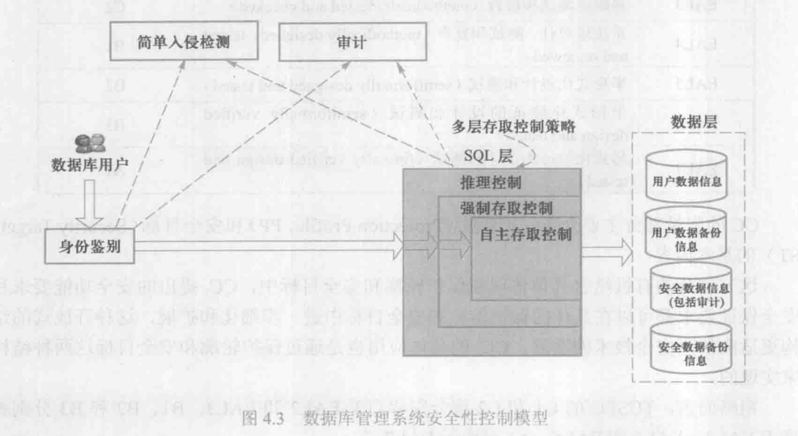


### 用户身份鉴别

​		用户身份鉴别是数据库管理系统提供的最外层安全保护措施。每个用户在系统中都有一个用户标识。每个用户标识由用户名和用户标识号（UID）两部分组

成。UID 在系统的整个生命周期内是唯一的。系统内部记录着所有合法用户的标识，系统鉴别是指由系统提供一定的方式让用户标识自己的名字或身份。每次用

户要求进入系统时，由系统进行核对，通过鉴定后才提供使用数据库管理系统的权限。

#### 方法

​		1、静态口令鉴别。

​		2、动态口令鉴别。

​		3、生物特征鉴别。

​		4、智能卡鉴别。

### 存取控制

​		数据库安全最重要的一点就是确保只授权给有资格的用户访问数据库的权限，同时令所有未被授权的人员无法接近数据，这主要通过数据库系统的存取控制机

制实现。

​		存取控制机制主要包括**定义用户权限**和**合法权限检查**两部分。

#### 自主存取控制

​		用户对于不同的数据库对象有不同的存取权限，不同的用户对同一对象也有不同的权限，而且用户还可将其拥有的存取权限转授给其他用户。因此自主存取控

制非常灵活。

​		用户权限是由两个要素组成的：数据库对象和操作类型。定义一个用户的存取权限就是要定义这个用户可以在哪些数据库对象上进行哪些类型的操作。在数据

库系统中，定义存取权限称为授权。

​		在非关系系统中，用户只能对数据进行操作，存取控制的数据库对象也仅限于数据本身。

​		在关系数据库系统中，存取控制的对象不仅有数据本身（基本表中的数据、属性列上的数据），还有数据库模式（包括数据库、基本表、视图和索引的创建

等）。


#### 强制存取控制

​		每一个数据库对象被标以一定的密级，每一个用户也被授予某一个级别的许可证。对于任意一个对象， 只有具有合法许可证的用户才可以存取。强制存取

控制因此相对比较严格。

​		在强制存取控制中，数据库管理系统所管理的全部实体被分为主体和客体两大类。

​		主体：系统中的活动实体，既包括数据库管理系统所管理的实际用户，也包括代表用户的各进程。

​		客体：系统中的被动实体，是受主体操纵的，包括文件、基本表、索引、视图等。对于主体和客体，数据库管理系统为它们每个实例(值)指派一个敏感度标

记。

​		强制存取控制机制就是通过对比主体的敏感度标记和客体的敏感度标记，最终确定主体是否能够存取客体。

​		强制存取控制是对数据本身进行密级标记，无论数据如何复制，标记与数据是一个不可分的整体，只有符合密级标记要求的用户才可以操纵数据，从而提供了

更高级别的安全性。

### 授权：授予与收回

​		`SQL`中使用`grant`和`revoke`语句向用户授予或收回对数据的操作权限。`grant`语句向用户授予权限，`revoke`语句收回已经授予用户的权限。

`grant`的格式：


​		将对指定操作对象的指定操作权限授予指定的用户。发出该`grant`语句的可以是数据库管理员，也可以是该数据库对象创建者，还可以是已经拥有该权限的

用户。接受权限的用户可以是一个或多个具体用户，也可以`public` ，即全体用户。

​		如果指定了`with grant option`子句，则获得某种权限的用户还可以把这种权限再授予其他的用户。如果没有指定`with grant option`子句，则获得某种权

限的用户只能使用该权限，不能传播该权限。

​		`SQL `标准允许具有`with grant option`的用户把相应权限或其子集传递授予其他用户，但不允许循环授权，即被授权者不能把权限再授回给授权者或其祖

先。

`revoke`的格式：


​		`SQL`提供了非常灵活的授权机制。数据库管理员拥有对数据库中所有对象的所有权限，并可以根据实际情况将不同的权限授予不同的用户。

​		用户对自己建立的基本表和视图拥有全部的操作权限，并且可以用`GRANT`语句把其中某些权限授予其他用户。被授权的用户如果有`"`继续授权`"`的许可，还

可以把获得的权限再授予其他用户。


​		对创建数据库模式一类的数据库对象的授权则由数据库管理员在创建用户时实现。

​		创建用户的格式：


​		只有系统的超级用户才有权创建一个新的数据库用户。

​		新创建的数据库用户有三种权限：`connect`、`resource`和`DBA`。

​		`create user`命令中如果没有指定创建的新用户的权限，默认该用户拥有`connect`权限。拥有`connect`权限的用户不能创建新用户，不能创建模式，也不能

创建基本表，只能登录数据库。由数据库管理员或其他用户授予他应有的权限，根据获得的授权情况他可以对数据库对象进行权限范围内的操作。

​		拥有`resource`权限的用户能创建基本表和视图，成为所创建对象的属主，但不能创建模式，不能创建新的用户。数据库对象的属主可以使用`grant`语句把该

对象上的存取权限授予其他用户。

​		拥有`DBA`权限的用户是系统中的超级用户，可以创建新的用户、创建模式、创建基本表和视图等；`DBA`拥有对所有数据库对象的存取权限，还可以把这些权

限授予一般用户。


### 数据库角色

​		数据库角色是被命名的一组与数据库操作相关的权限，角色是权限的集合。

创建角色

​		SQL 格式：


给角色授权

​		SQL 格式：


将一个角色授予其他的用户或角色

​		SQL 格式：


​		如果指定了`with admin option`子句，则获得某种权限的角色或用户还可以把这种权限再授予其他的角色。

​		一个角色包含的权限包括直接授予这个角色的全部权限加上其他角色授予这个角色的全部权限。

角色权限的收回

​		SQL 格式：


## 审计

​		审计功能：把用户对数据库的所有操作自动记录下来放入审计日志中。审计员可以利用审计日志监控数据库中的各种行为，重现导致数据库现有状况的一系列

事件，找出非法存取数据的人、时间和内容等。还可以通过对审计日志分析，对潜在的威胁提前采取措施加以防范。

### 审计事件

​		服务器事件：审计数据库服务器发生的事件，包含数据库服务器的启动、停止、数据库服务器配置文件的重新加载。

​		系统权限：对系统拥有的结构或模式对象进行操作的审计，要求该操作的权限是通过系统权限获得的。

​		语句事件：对 SQL 语句以及 DCL 语句的审计。

​		模式对象事件：对特定模式对象上进行的 select 或 DML 操作的审计。模式对象包括表、视图、存储过程、函数等。模式对象不包括依附于表的索引、约束、

触发器、分区表等。

### 审计功能

​		基本功能，提供多种审计查阅方式:基本的、可选的、有限的，等等。

​		提供多套审计规则，审计规则一般在数据库初始化时设定，以方便审计员管理。

​		提供审计分析和报表功能。

​		审计日志管理功能，包括为防止审计员误删审计记录，审计日志必须先转储后删除；对转储的审计记录文件提供完整性和保密性保护:只允许审计员查阅和转

储审计记录，不允许任何用户新增和修改审计记录:等等。

​		系统提供查询审计设置及审计记录信息的专门视图。对于系统权限级别、语句级别及模式对象级别的审计记录也可通过相关的系统表直接查看。

​		`audit`语句用来设置审计功能，`noaudit`语句则取消审计功能。

​		审计一般可以分为用户级审计和系统级审计。

​				用户级审计：任何用户可设置的审计，主要是用户针对自己创建的数据库表或视图进行审计，记录所有用户对这些表或视图的一切成功和(或)不成功的访

​		问要求以及各种类型的SQL操作。

​				系统级审计：只能由数据库管理员设置，用以监测成功或失败的登录要求、监测授权和收回操作以及其他数据库级权限下的操作。

## 数据加密

### 存储加密

​		透明存储加密是数据在写到磁盘时对数据进行加密，授权用户读取数据时再对其进行解密。由于数据加密对用户透明，数据库的应用程序不需要做任何修改，

只需在创建表语句中说明需加密的字段即可。当对加密数据进行增、删、改、查询操作时，数据库管理系统将自动对数据进行加、解密工作。基于数据库内核的数

据存储加密、解密方法性能较好，安全完备性较高。

### 传输加密

​		常用的传输加密方式：链路加密和端到端加密。

​		链路加密：对传输数据在链路层进行加密，它的传输信息由报头和报文两部分组成，前者是路由选择信息，而后者是传送的数据信息。这种方式对报文和报头

均加密。

​		端到端加密：对传输数据在发送端加密，接收端解密。它只加密报文，不加密报头。与链路加密相比，它只在发送端和接收端需要密码设备，而中间节点不需

要密码设备，因此它所需密码设备数量相对较少。但这种方式不加密报头，从而容易被非法监听者发现并从中获取敏感信息。

# 数据库完整性

​		数据库的完整性是指**数据的正确性和相容性**。

​		数据的正确性：指数据是符合现实世界语义、反映当前实际状况的。

​		数据的相容性：指数据库同一对象在不同关系表中的数据是符合逻辑的。

​		为维护数据库的完整性，数据库管理系统必须实现的功能：

​				1、提供定义完整性约束条件的机制。

​				2、提供完整性检查的方法。

​				3、进行违约处理。

## 实体完整性

​		关系模型的实体完整性在`create table`中用`primary key`定义。对单属性构成的码有两种说明方法，一种是定义为列级约束条件，另一种是定义为表级约束

条件。对多个属性构成的码只有一种说明方法，即定义为表级约束条件。

​		定义主码后，定义为主码的属性或属性组强制拥有**非空和唯一性**这两个约束，并且在插入数据时，由于要判断主码是否唯一，通常默认会在该属性或属性组上

加上聚集索引，来提高效率。

## 参照完整性

​		关系模型的参照完整性在`create table`中用`foreign key`短语定义哪些列为外码，用`references`短语指明这些外码参照哪些表的主码。


​		当出现上述情况时，解决策略：

​				1、拒绝执行。默认策略。

​				2、级联操作。当删除或修改被参照表的一个元组导致与参照表的不一致时，删除或修改参照表中的所有导致不一致的元组。

​				3、设置为空值。当删除或修改被参照表的一个元组时造成了不一致， 则将参照表中的所有造成不一致的元组的对应属性设置为空值。

​		一般地， 当对参照表和被参照表的操作违反了参照完整性时，系统选用默认策略，即拒绝执行。如果想让系统采用其他策略则必须在创建参照表时显式地加

以说明。


## 用户定义的完整性

### 属性上的约束条件

​		在`create table`中定义属性的同时，可以根据应用要求定义属性上的约束条件，即属性值限制，包括：

​				1、列值非空`（not null ）`。
​				2、列值唯一`（unique）`。
​				3、检查列值是否满足一个条件表达式`（check`短语`）`。

### 元组上的约束条件

​		在`create table`语句中可以用`check`短语定义元组上的约束条件，即元组级的限制。同属性值限制相比，元组级的限制可以设置不同属性之间的取值的相互

约束条件。

## 完整性约束命名子句

​		`SQL`格式：


​		`<`完整性约束条件`>`包括`not null `、`unique`、`primary key`、`foreign key`、`check`短语等。

### 修改表中的完整性限制

​		可以使用`alter table`语句修改表中的完整性限制。

​		如果要删除以命名的完整性约束：`alter table` 表名 `drop constraint`约束名。

## 域中的完整性限制

​		域是一组具有相同数据类型的值的集合。`SQL`支持域的概念，并可以用`create domain`语句建立一个域以及该域应该满足的完整性约束条件，然后就可以用

域来定义属性。这样定义的优点是，数据库中不同的属性可以来自同一个域，当域上的完整性约束条件改变时只要修改域的定义即可，而不必一修改域上的各个属

性。

## 断言

​		在`SQL`中可以使用数据定义语言中的`create assertion`语句，通过声明性断言来指定更具一般性的约束。可以定义涉及多个表或聚集操作的比较复杂的完整

性约束。

​		SQL 格式：


​		每个断言都被赋予一个名字，`< check` 子句`>`中的约束条件与`where`子句的条件表达式类似。

​		删除：


## 触发器

​		触发器是用户定义在关系表上的一类由事件驱动的特殊过程。一旦定义，触发器将被保存在数据库服务器中。任何用户对表的增、删、改操作均由服务器自动

激活相应的触发器，在关系数据库管理系统核心层进行集中的完整性控制。触发器类似于约束，但是比约束更加灵活，可以实施更为复杂的检查和操作，具有更精

细和更强大的数据控制能力。

​		触发器又叫做事件`-`条件`-`动作规则。当特定的系统事件(如对一个表的增、删、改操作，事务的结束等)发生时，对规则的条件进行检查，如果条件成立则执

行规则中的动作，否则不执行该动作。

​		`SQL`格式：


​		1、只有表的拥有者，即创建表的用户才可以在表上创建触发器，并且一个表上只能创建一定数量的触发器。触发器的具体数量由具体的关系数据库管理系统

在设计时确定。

​		2、触发器名可以包含模式名，也可以不包含模式名。同一模式下，触发器名必须是唯一的，并且触发器名和表名必须在同一模式下。

​		3、触发器只能定义在基本表上，不能定义在视图上。当基本表的数据发生变化时，将激活定义在该表上相应触发事件的触发器，因此该表也称为触发器的目

标表。

​		4、触发事件可以是`insert 、delete`或`update`,也可以是这几个事件的组合，如`insert or delete`等，还可以是`update of <`触发列，`...>`，即进一步指明

修改哪些列时激活触发器。`after / before`是触发的时机。`after`表示在触发事件的操作执行之后激活触发器；`before`表示在触发事件的操作执行之前激活触发

器。

​		5、触发器按照所触发动作的间隔尺寸可以分为行级触发器`（for each row ）`和语句级触发器`（for each statement）`。

​		6、触发器被激活时，只有当触发条件为真时触发动作体才执行，否则触发动作体不执行。如果省略`when`触发条件，则触发动作体在触发器激活后立即执

行。

​		7、触发动作体既可以是一个匿名`PL / SQL`过程块，也可以是对已创建存储过程的调用。如果是行级触发器，可以在过程体中使用`new`和`old`引用`update / `

`insert`事件之后的新值和`update / delete`事件之前的旧值；如果是语句级触发器，则不能在触发动作体中使用`new`或`old`进行引用。

​		如果触发动作体执行失败，激活触发器的事件(即对数据库的增、删、改操作)就会终止执行，触发器的目标表或触发器可能影响的其他对象不发生任何变化。

### 激活触发器

​		触发器的执行是由触发事件激活，并由数据库服务器自动执行的。定义了多个触发器激活时遵循如下的执行顺序：

​				1、执行该表上的`before`触发器。
​				2、激活触发器的`SQL`语句。
​				3、执行该表上的`alter`触发器。

​		对于同一个表上的多个`before（alter）`触发器，遵循`"`谁先创建谁先执行`"`的原则，即按照触发器创建的时间先后顺序执行。有些关系数据库管理系统是按

照触发器名称的字母排序顺序执行触发器。

### 删除

​		SQL 格式：


# 关系数据理论

​		数据依赖：一个关系内部属性与属性之间的一种约束关系。这种约束关系是通过属性间值的相等与否体现出来的数据间相关联系。它是现实世界属性间相互联

系的抽象，是数据内在的性质，是语义的体现。

​		最主要的数据依赖：函数依赖与多值依赖。

​		函数依赖：属性间的这种依赖关系类似于数学中的函数y=f(x)，自变量x确定之后，相应的函数值y也就唯一地确定了。设 R(U) 是属性集 U 上的关系模式，X, 

Y 是 U 的子集。若对于 R(U) 的任意一个可能的关系 r ， r 中不可能存在两个元组在 X 上的属性值相等，而在 Y 上的属性值不等，则称 X 函数确定 Y 或 Y 函数依

赖于 X ,记作X→Y。


​		范式：关系数据库中的关系是要满足要求的级别。

​		一个低一级范式的关系模式通过模式分解可以转换为若干个高级范式的关系模式的集合，这种过程就叫规范化。

​		1NF：即第一范式。作为一个二维表，关系要符合一个最基本的条件：每一个分量必须是不可分的数据项。

​		2NF：若一个关系满足 1NF，且每一个非主属性完全函数依赖于任何一个候选码，则称关系满足2NF。

​		3NF：若一个关系满足 2NF，并且每一个非主属性不传递依赖于码，，则称关系满足 3NF。

​		BCNF：所有非主属性对每一个码都是完全函数依赖。所有主属性对每一个不包含它的码也是完全函数依赖。没有任何属性完全函数依赖于非码的任何一组属

性。也被称为扩充的 3NF。

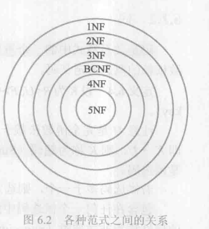


# 数据库设计

​		数据库设计是指对于一个给定的应用环境，构造(设计)优化的数据库逻辑模式和物理结构，并据此建立数据库及其应用系统，使之能够有效地存储和管理数

据，满足各种用户的应用需求，包括信息管理要求和数据操作要求。

## 基本步骤

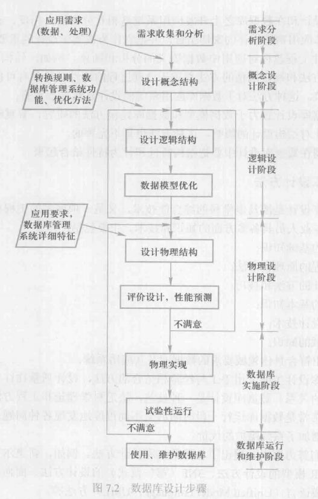

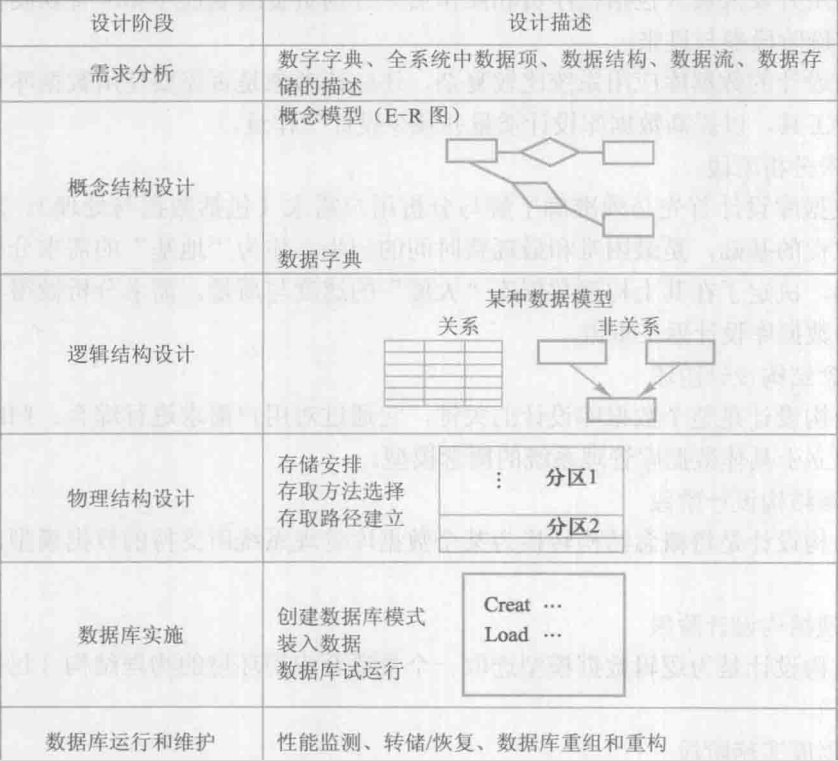

### 需求分析

​		需求分析简单地说就是分析用户的要求。

​		需求分析的任务是通过详细调查现实世界要处理的对象，充分了解原系统的工作概况，明确用户的各种需求，然后在此基础上确定新系统的功能。新系统必须

充分考虑今后可能的扩充和改变，不能仅仅按当前应用需求来设计数据库。

​		通过调查、收集与分析，获得用户对数据库的要求：

​				1、信息要求。指用户需要从数据库中获得信息的内容与性质。由信息要求可以导出数据要求，即在数据库中需要存储哪些数据。

​				2、处理要求。指用户要完成的数据处理功能，对处理性能的要求。

​				3、安全性与完整性要求。

#### 数据字典

​		数据字典是进行详细的数据收集和数据分析所获得的主要成果。它是关于数据库中数据的描述，即元数据，而不是数据本身。数据字典是在需求分析阶段建

立，在数据库设计过程中不断修改、充实、完善的。

​		数据字典通常包括数据项、数据结构、数据流、数据存储和处理过程几部分。其中数据项是数据的最小组成单位，若干个数据项可以组成一个数据结构。数据

字典通过对数据项和数据结构的定义来描述数据流、数据存储的逻辑内容。

##### 数据项

​		数据项是不可再分的数据单位。对数据项的描述通常包括以下内容：

​				数据项描述= {数据项名，数据项含义说明，别名，数据类型，长度，取值范围,取值含义，与其他数据项的逻辑关系，数据项之间的联系}

​		其中，"取值范围”、“与其他数据项的逻辑关系”(如该数据项等于其他几个数据项的和、该数据项值等于另一数据项的值等)定义了数据的完整性约束条件，是设

计数据检验功能的依据。

##### 数据结构

​		数据结构反映了数据之间的组合关系。一个数据结构可以由若干个数据项组成，也可以由若干个数据结构组成，或由若干个数据项和数据结构混合组成。

​		对数据结构的描述通常包括以下内容：

​				数据结构描述= {数据结构名，含义说明，组成: {数据项或数据结构}}

##### 数据流

​		数据流是数据结构在系统内传输的路径。对数据流的描述通常包括以下内容：

​				数据流描述= {数据流名，说明，数据流来源，数据流去向，组成: {数据结构}，平均流量，高峰期流量}。其中，“数据流来源"是说明该数据流来自哪个过

程；“数据流去向”是说明该数据流将到哪个过程去；“平均流量”是指在单位时间(每天、每周、每月等)里的传输次数；“高峰期流量”则是指在高峰时期的数据流量。

##### 数据存储

​		数据存储是数据结构停留或保存的地方，也是数据流的来源和去向之一。它可以是手工文档或手工凭单，也可以是计算机文档。

​		对数据存储的描述通常包括以下内容:：

​				数据存储描述={数据存储名，说明，编号，输入的数据流，输出的数据流，组成: {数据结构}，数据量，存取频度，存取方式}

​		其中，“存取频度”指每小时、每天或每周存取次数及每次存取的数据量等信息；“存取方式”指是批处理还是联机处理、是检索还是更新、是顺序检索还是随机

检索等；另外，“输入的数据流”要指出其来源；“输出的数据流”要指出其去向。，

##### 处理过程

​		处理过程的具体处理逻辑一般用判定表或判定树来描述。数据字典中只需要描述处理过程的说明性信息即可，通常包括以下内容：

​				处理过程描述= {处理过程名，说明，输入: {数据流}，输出: {数据流}，处理: {简要说明}}

​		其中，“简要说明”主要说明该处理过程的功能及处理要求。功能是指该处理过程用来做什么(而不是怎么做)，处理要求指处理频度要求，如单位时间里处理多

少事务、多少数据量、响应时间要求等。这些处理要求是后面物理设计的输入及性能评价的标准。

### 概念结构设计

#### 概念模型

​		主要特点是：

​				1、能真实、充分地反映现实世界，包括事物和事物之间的联系，能满足用户对数据的处理要求，是现实世界的一个真实模型。

​				2、易于理解，可以用它和不熟悉计算机的用户交换意见。用户的积极参与是数据库设计成功的关键。

​				3、 易于更改，当应用环境和应用要求改变时容易对概念模型修改和扩充。

​				4、易于向关系、网状、层次等各种数据模型转换。

​		概念模型是各种数据模型的共同基础，它比数据模型更独立于机器、更抽象，从而更加稳定。描述概念模型的有力工具是E-R模型。

#### E-R模型

​		E-R图提供了表示实体型、属性和联系的方法：

​				1、实体型用矩形表示，矩形框内写明实体名。

​				2、属性用椭圆形表示，并用无向边将其与相应的实体型连接起来。

​				3、联系用菱形表示，菱形框内写明联系名，并用无向边分别与有关实体型连接起来，同时在无向边旁标上联系的类型（1:1、 1:n 、m:n）。需要注意的

是，如果一个联系具有属性，则这些属性也要用无向边与该联系连接起来。

​		用E-R方法构建一个项目的模型时，经常会遇到某些实体型是某个实体型的子类型。这种父类-子类联系称为ISA联系，表示 “ is a ” 的语义。ISA联系用三角形

来表示。

​		ISA联系一个重要的性质是子类继承了父类的所有属性，当然子类也可以有自己的属性。

​		ISA联系描述了对一个实体型中实体的分类方法：

​				1、分类属性：根据分类属性的值把父实体型中的实体分派到子实体型中。

​				2、不相交约束与可重叠约束。不相交约束描述父类中的一个实体不能同时属于多个子类中的实体集，即一个父类中的实体最多属于一个子类实体集，用

​		ISA联系三角形符号内加一个叉号“X”来表示。如果父类中的一个实体能同时属于多个子类中的实体集，则称为可重叠约束，子类符号中没有叉号表示是可重叠

​		的。

​				3、完备性约束：描述父类中的一一个实体是否必须是某一个 子类中的实体， 如果是，则叫做完全特化， 否则叫做部分特化。完全特化用父类到子类的

​		双线连接来表示，单线连接则表示部分特化。

​		基数约束：对实体之间一-对一、一对多和多对多联系的细化。

​		Part-of 联系：即部分联系，它表明某个实体型是另外一个实体型的一部分 。两种情况，一种是整体实体如果被破坏，部分实体仍然可以独立存在，称为非独

占的 Part - of 联系。与非独占联系相反，还有一种Part-of 联系是独占联系。即整体实体如果被破坏，部分实体不能存在，在E-R图中用弱实体类型和识别联系来表

示独占联系。如果一个实体型的存在依赖于其他实体型的存在，则这个实体型叫做弱实体型，否则叫做强实体型。在E-R图中用双矩形表示弱实体型，用双菱形表

示识别联系。

#### UML

​		统一建模语言UML是对象管理组织的一个标准，它不是专门针对数据建模的，而是为软件开发的所有阶段提供模型化和可视化支持的规范语言，从需求规格

描述到系统完成后的测试和维护都可以用到UML。UML可以用于数据建模、业务建模、对象建模、组件建模等，它提供了多种类型的模型描述图， 借助这些图可

以使得计算机应用系统开发中的应用程序更易理解。

​		UML中的类大致对应E-R图中的实体：

​				实体型：用类表示，矩形框中实体名放在上部，下面列出属性名。

​				实体的码：在类图中在属性后面加 “ PK " 来表示码属性。

​				联系：用类图之间的“关联”来表示。用菱形框表示关联，框内写联系名，用无向边分别与关联的类连接起来。


​		概念结构设计的第t步就是对需求分析阶段收集到的数据进行分类、组织，确定实体、实体的属性、实体之间的联系类型，形成E-R图。

​		为了简化E-R图的处置，现实世界的事物能作为属性对待的尽量作为属性对待。

​				1、作为属性，不能再具有需要描述的性质，即属性必须是不可分的数据项，不能包含其他属性。

​				2、属性不能与其他实体具有联系，即E-R图中所表示的联系是实体之间的联系。

​		E-R图的集成一-般需要分两步走：

​				1、合并。解决各分E R图之间的冲突，将分E-R图合并起来生成初步E-R图。

​				2、修改和重构。消除不必要的冗余，生成基本E-R图。


​		冲突主要有三类：**属性冲突、命名冲突和结构冲突**。

​		属性冲突包含两类冲突：

​				1、属性域冲突，即属性值的类型、取值范围或取值集合不同。

​				2、属性取值单位冲突。

​		命名冲突包含两类冲突：

​				1、同名异义，即不同意义的对象在不同的局部应用中具有相同的名字。

​				2、异名同义(一义多名)，即同意义的对象在不同的局部应用中具有不同的名字。

​		命名冲突可能发生在实体、联系-级上，也可能发生在属性一-级上。其中属性的命名冲突更为常见。

​		结构冲突包含三类冲突：

​				1、同一对象在不同应用中具有不同的抽象。解决方法通常是把属性变换为实体或把实体变换为属性，使同一对象具有相同的抽象。

​				2、同一实体在不同子系统的E-R图中所包含的属性个数和属性排列次序不完全相同。解决方法是使该实体的属性取各子系统的E-R图中属性的并集，再

​		适当调整属性的次序。

​				3、实体间的联系在不同的 E-R 图中为不同的类型。


​		在初步E -R图中可能存在一些冗余的数据 和实体间冗余的联系。所谓冗余的数据是指可由基本数据导出的数据，冗余的联系是指可由其他联系导出的联系。

冗余数据和冗余联系容易破坏数据库的完整性，给数据库维护增加困难，应当予以消除。消除了冗余后的初步E-R图称为基本E-R图。


### 逻辑结构设计

​		逻辑结构设计的任务就是把概念结构设计阶段设计好的基本E-R图转换为与选用数据库管理系统产品所支持的数据模型相符合的逻辑结构。

​		一 个实体型转换为一个关系模式，关系的属性就是实体的属性，关系的码就是实体的码。

### 物理结构设计

​		为一个给定的逻辑数据模型选取一个最适合应用要求的物理结构的过程，就是数据库的物理设计。

​		两步：

​				1、确定数据库的物理结构，在关系数据库中主要指存取方法和存储结构。

​				2、对物理结构进行评价，评价的重点是时间和空间效率。

#### 存取方法选择

​		存取方法是快速存取数据库中数据的技术。数据库管理系统一般提供多 种存取方法。常用的存取方法为索引方法和聚簇方法（一个关系只能加入一个聚

簇）。


# 数据库编程

## 嵌入式SQL

​		嵌入式SQL是将SQL语句嵌入程序设计语言中，被嵌入的程序设计语言称为宿主语言，简称主语言。

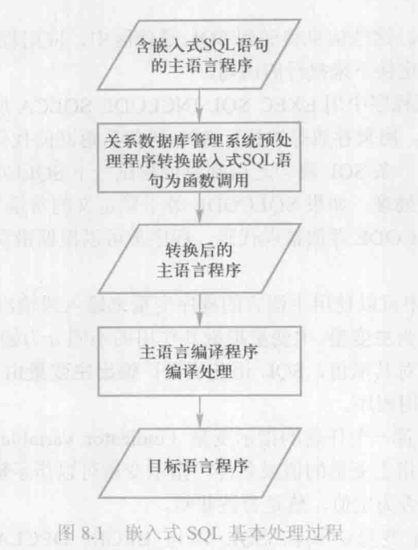


​		数据库工作单元与源程序工作单元之间的通信主要包括：

​				1、向主语言传递SQL语句的执行状态信息，使主语言能够据此信息控制程序流程，主要用SQL通信区实现。

​				2、 主语言向SQL语句提供参数，主要用主变量实现。

​				3、将SQL语句查询数据库的结果交主语言处理，主要用主变量和游标实现。

​		游标是系统为用户开设的一个数据缓冲区，存放SQL语句的执行结果，每个游标区都有一个名字。用户可以通过游标逐一获取记录并赋给变量。

## 过程化SQL

​		过程化SQL程序的基本结构是块。所有的过程化SQL程序都是由块组成的。这些块之间可以互相嵌套，每个块完成一个逻辑操作。

### 变量定义：


常量：


赋值语句：


### 条件控制语

​		三种：

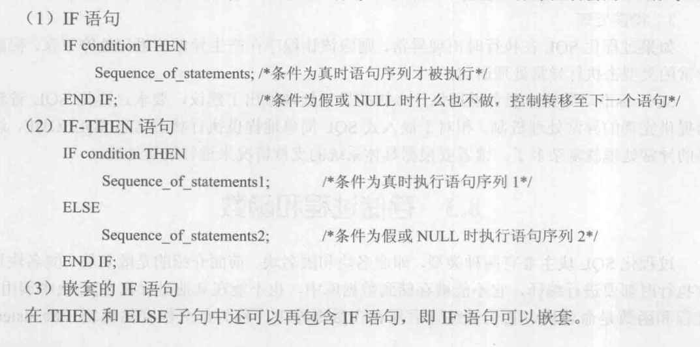


### 循环控制语句

​		三种：

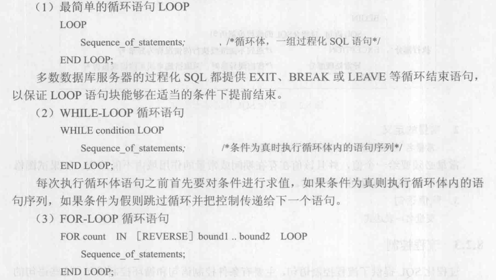


## 存储过程

​		存储过程是由过程化SQL语句书写的过程，这个过程经编译和优化后存储在数据库服务器中，因此称它为存储过程，使用时只要调用即可。

​		优点：

​				1、由于存储过程不像解释执行的SQL语句那样在提出操作请求时才进行语法分析和优化工作，因而运行效率高，它提供了在服务器端快速执行SQL语句

​		的有效途径。

​				2、存储过程降低了客户机和服务器之间的通信量。客户机上的应用程序只要通过网络向服务器发出调用存储过程的名字和参数，就可以让关系数据库管

​		理系统执行其中的多条SQL语句并进行数据处理。只有最终的处理结果才返回客户端。

​				3、方便实施企业规则。可以把企业规则的运算程序写成存储过程放入数据库服务器中，由关系数据库管理系统管理，既有利于集中控制，又能够方便地

​		进行维护。当企业规则发生变化时只要修改存储过程即可，无须修改其他应用程序。

### 创建

​		SQL 语法：


### 执行

​		SQL 语法：


### 修改

​		SQL 语法：

​				重命名：


​				重新编译：


### 删除

​		SQL 语法：


## 函数

​		此节的函数也称为自定义函数，因为是用户自已使用过程化SQL设计定义的。函数和存储过程类似，都是持久性存储模块。函数的定义和存储过程也类似，不

同之处是函数必须指定返回的类型。

### 创建


### 执行


### 修改

​		重命名：


​		重新编译：


# 关系查询处理和查询优化

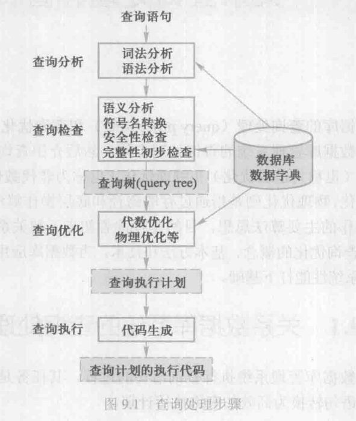

​		代数优化是指关系代数表达式的优化，即按照一定的规则， 通过对关系代数表达式进行等价变换，改变代数表达式中操作的次序和组合，使查询执行更高

效；

​		物理优化则是指存取路径和底层操作算法的选择。选择的依据可以是基于规则的，也可以是基于代价的，还可以是基于语义的。


​		代数优化规则：

​				1、选择运算应尽可能先做。在优化策略中这是最重要、最基本的一条。它常常可使执行代价节约几个数量级，因为选择运算一般使计算的中间结果大大

​		变小。

​				2、把投影运算和选择运算同时进行。如有若干投影和选择运算，并且它们都对同一个关系操作，则可以在扫描此关系的同时完成所有这些运算以避免重

​		复扫描关系。

​				3、把投影同其前或后的双目运算结合起来，没有必要为了去掉某些字段而扫描一遍关系。

​				4、把某些选择同在它前面要执行的笛卡儿积结合起来成为一个连接运算，连接(特别是等值连接)运算要比同样关系上的笛卡儿积省很多时间。

​				5、找出公共子表达式。如果这种重复出现的子表达式的结果不是很大的关系，并且从外存中读入这个关系比计算该子表达式的时间少得多，则先计算一

​		次公共子表达式并把结果写入中间文件是合算的。当查询的是视图时，定义视图的表达式就是公共子表达式的情况。


​		物理优化规则：

​				1、对于选择条件是“主码=值"的查询，查询结果最多是一个元组，可以选择主码索引。一般的关系数据库管理系统会自动建立主码索引。

​				2、对于选择条件是“非主属性=值”的查询，并且选择列上有索引，则要估算查询结果的元组数目，如果比例较小(<10%)可以使用索引扫描方法，否则还

​		是使用全表顺序扫描。

​				3、对于选择条件是属性上的非等值查询或者范围查询，并且选择列上有索引，同样要估算查询结果的元组数目，如果选择率<10%可以使用索引扫描方

​		法，否则还是使用全表顺序扫描。

​				4、对于用AND连接的合取选择条件，如果有涉及这些属性的组合索引，则优先采用组合索引扫描方法;如果某些属性上有一般索引，则可以用索引扫描

​		方法，否则使用全表顺序扫描。

​				6、对于用OR连接的析取选择条件，一般使用全表顺序扫描。

​				7、如果2个表都已经按照连接属性排序，则选用排序—合并算法。

​				8、如果-一个表在连接属性上有索引，则可以选用索引连接算法。

​				9、如果上面2个规则都不适用，其中-一个表较小，则可以选用hash join算法。

​				10、最后可以选用嵌套循环算法，并选择其中较小的表，确切地讲是占用的块数(B)较少的表，作为外表(外循环的表)。


# 数据库恢复技术

​		事务是用户定义的一个数据库操作序列，这些操作要么全做，要么全不做，是一个不可分割的工作单位。

​		事务的开始与结束可以由用户显式控制。如果用户没有显式地定义事务，则由数据库管理系统按默认规定自动划分事务。

​		在SQL中，定义事务的语句一般有三条：

```sql
begin transaction;
commit;
rollback;
```

​		事务通常是以 BEGIN TRANSACTION 开始，以 COMMIT 或 ROLLBACK 结束。COMMIT 表示提交，即提交事务的所有操作。具体地说就是将事务中所有对

数据库的更新写回到磁盘上的物理数据库中去，事务正常结束。

​		ROLLBACK 表示回滚，即在事务运行的过程中发生了某种故障，事务不能继续执行，系统将事务中对数据库的所有已完成的操作全部撤销，回滚到事务开始

时的状态。

​		四个特性：

​				1、原子性

​						事务是数据库的逻辑工作单位，事务中包括的诸操作要么都做，要么都不做。

​				2、一致性

​						事务执行的结果必须是使数据库从一个一致性状态变到另一个一致性状态。因此当数据库只包含成功事务提交的结果时，就说数据库处于一致性状

​				态 。如果数据库系统运行中发生故障，有些事务尚未完成就被迫中断，这些未完成的事务对数据库所做的修改有一部分已写入物理数据库，这时数据库

​				就处于一种不正确的状态，或者说是不一致的状态。

​				3、隔离性

​						一个事务的执行不能被其他事务干扰。即一个事务的内部操作及使用的数据对其他并发事务是隔离的，并发执行的各个事务之间不能互相干扰。

​				4、持续性

​						持续性也称永久性指一个事务一旦提交， 它对数据库中数据的改变就应该是永久性的。接下来的其他操作或故障不应该对其执行结果有任何影响。

​		数据转储：即数据库管理员定期地将整个数据库复制到磁带、磁盘或其他存储介质上保存起来的过程。这些备用的数据称为后备副本或后援副本。

​		静态转储：在系统中无运行事务时进行的转储操作。即转储操作开始的时刻数据库处于一致性状态，而转储期间不允许(或不存在)对数据库的任何存取、修改

活动。显然，静态转储得到的一定是一个数据一致性的副本。

​		动态转储：转储期间允许对数据库进行存取或修改。即转储和用户事务可以并发执行。

​		海量转储：每次转储全部数据库

​		增量转储：每次只转储上一次转储后更新过的数据。


# 并发控制

​		并发操作带来的数据不一致性问题：

​				1、丢失修改

​						两个事务 T1 和 T2 读入同一数据并修改，T2 提交的结果破坏了 T1 提交的结果，导致T1的修改被丢失。

​				2、不可重复读

​						不可重复读是指事务T读取数据后，事务 T2 执行更新操作，使 T1 无法再现前一次读取结果。

​						三种：

​								（1）、事务 T1 读取某一数据后，事务 T2 对其进行了修改，当事务 T1 再次读该数据时，得到与前一次不同的值。

​								（2）、事务 T1 按一定条件从数据库中读取了某些数据记录后，事务 T2 删除了其中部分记录，当 T1 再次按相同条件读取数据时，发现某些

​						记录神秘地消失了。

​								（3）、事务 T1 按一定条件从数据库中读取某些数据记录后，事务 T2 插入了一些记录，当 T1 再次按相同条件读取数据时，发现多了一些记

​						录。

​						后两种不可重复读有时也称为幻影现象。

​				3、脏读

​						读脏数据是指事务 T1 修改某一数据并将其写回磁盘，事务 T2 读取同一数据后，T1 由于某种原因被撤销，这时被 T1 修改过的数据恢复原值，T2 

​				读到的数据就与数据库中的数据不一致，则T2读到的数据就为“脏”数据，即不正确的数据。

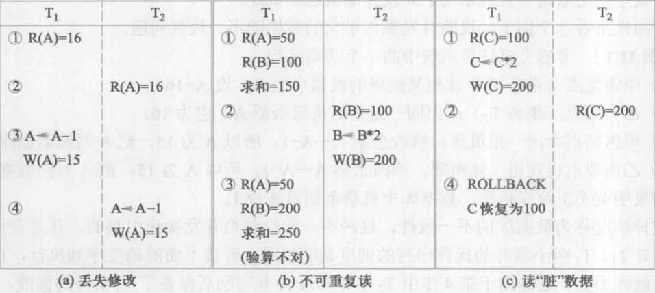

## 封锁

​		封锁就是事务T在对某个数据对象操作之前，先向系统发出请求，对其加锁。加锁后事务T就对该数据对象有了一定的控制，在事务T释放它的锁之前，其他事

务不能更新此数据对象。

### 排他锁（X锁）

​		排他锁又称为写锁。若事务T对数据对象A加上X锁，则只允许T读取和修改A，其他任何事务都不能再对A加任何类型的锁，直到T释放A上的锁为止。这就保

证了其他事务在T释放A上的锁之前不能再读取和修改A。

### 共享锁（S锁）

​		共享锁又称为读锁。若事务T对数据对象A加上S锁，则事务T可以读A但不能修改A，其他事务只能再对A加s锁，而不能加X锁，直到T释放A上的S锁为止。这

就保证了其他事务可以读A,但在T释放A上的S锁之前不能对A做任何修改。

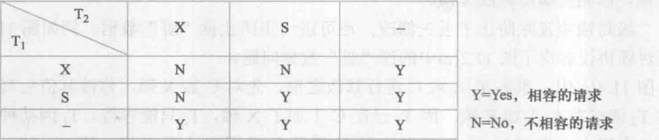

## 封锁协议

### 一级协议

​		一级封锁协议是指，事务T在修改数据 R 之前必须先对其加 X 锁，直到事务结束才释放。事务结束包括正常结束 ( COMMIT ) 和非正常结束 ( ROLLBACK )。

​		一级封锁协议可防止丢失修改，并保证事务T是可恢复的。

​		在一级封锁协议中，如果仅仅是读数据而不对其进行修改，是不需要加锁的，所以它不能保证可重复读和不读脏数据。

### 二级协议

​		二级封锁协议是指，在一级封锁协议基础上增加事务 T 在读取数据R之前必须先对其加 S 锁，读完后即可释放S锁。

​		二级封锁协议除防止了丢失修改，还可进一步防止读“脏”数据。

​		在二级封锁协议中，由于读完数据后即可释放S锁，所以它不能保证可重复读。

### 三级协议

​		三级封锁协议是指，在一级封锁协议的基础上增加事务T在读取数据R之前必须先对其加S锁，直到事务结束才释放。

​		三级封锁协议除了防止丢失修改和读“脏”数据外，还进一步防止了 不可重复读。


## 活锁

​		活锁：事务 T 在请求时可能会永久等待，此现象被称为活锁。

​		避免活锁的简单方法是采用先来先服务的策略。当多个事务请求封锁同一数据对象时，封锁子系统按请求封锁的先后次序对事务排队，数据对象上的锁一旦释

放就批准申请队列中第一个事务获得锁。

## 死锁

​		两个或多个事务出现交叉等待或循环等待的情况，此时这些事务永远不能结束，形成死锁。

### 死锁的预防

​		在数据库中，产生死锁的原因是两个或多个事务都已封锁了一些数据对象，然后又都请求对已被其他事务封锁的数据对象加锁，从而出现死等待。防止死锁的

发生其实就是要破坏产生死锁的条件。

#### 一次封锁法

​		一次封锁法要求每个事务必须一次将所有要使用的数据全部加锁，否则就不能继续执行。

#### 顺序封锁法

​		顺序封锁法是预先对数据对象规定-一个封锁顺序，所有事务都按这个顺序实施封锁。

### 死锁的诊断与解除

#### 超时法

​		如果一个事务的等待时间超过了规定的时限，就认为发生了死锁。

#### 等待图法

​		事务等待图是一个有向图 G = (T, U)，T为结点的集合，每个结点表示正运行的事务: U 为边的集合，每条边表示事务等待的情况。若 T1 等待 T2，则在 T1、

T2 之间画一条有向边，从 T1 指向 T2。

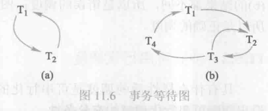

​		事务等待图动态地反映了所有事务的等待情况。并发控制子系统周期性地（比如每隔数秒）生成事务等待图，并进行检测。如果发现图中存在回路，则表示系

统中出现了死锁。

​		数据库管理系统的并发控制子系统旦检测到系统中存在死锁， 就要设法解除。 通常采用的方法是选择一个处理死锁代价最小的事务，将其撤销，释放此事务

持有的所有的锁，使其他事务得以继续运行下去。当然，对撤销的事务所执行的数据修改操作必须加以恢复。


​		可串行调度：多个事务的并发执行是正确的，当且仅当其结果与按某一次序串行地执行这些事务时的结果相同，称这种调度策略为可串行化调度。

​		可串行性是并发事务正确调度的准则。按这个准则规定，一个给定的并发调度，当且仅当它是可串行化的，才认为是正确调度。

​		冲突操作是指不同的事务对同一个数据的读写操作和写写操作。


## 两段锁协议

​		所有事务必须分两个阶段对数据项加锁和解锁：

​				1、在对任何数据进行读、写操作之前，首先要申请并获得对该数据的封锁。

​				2、在释放一个封锁之后，事务不再申请和获得任何其他封锁。

​		事务遵守两段锁协议是可串行化调度的充分条件，而不是必要条件。

## 封锁粒度

​		封锁对象的大小称为封锁粒度。封锁对象可以是逻辑单元，也可以是物理单元。

​		多粒度树的根结点是整个数据库，表示最大的数据粒度。叶结点表示最小的数据粒度。

​		多粒度封锁协议允许多粒度树中的每个结点被独立地加锁。对一个结点加锁意味着这个结点的所有后裔结点也被加以同样类型的锁。因此，在多粒度封锁中一

个数据对象可能以两种方式封锁，显式封锁和隐式封锁。

​		显式封锁是应事务的要求直接加到数据对象上的锁。

​		隐式封锁是该数据对象没有被独立加锁，是由于其上级结点加锁而使该数据对象加上了锁。

## 意向锁

​		意向锁的含义是如果对一个结点加意向锁，则说明该结点的下层结点正在被加锁。对任一结点加锁时，必须先对它的上层结点加意向锁。

### 意向共享锁（IS锁）

​		如果对一个数据对象加 IS 锁，表示它的后裔结点拟(意向)加S锁。

### 意向排他锁（IX锁）

​		如果对一个数据对象加IX锁，表示它的后裔结点拟(意向)加X锁。

### 共享意向排他锁（SIX锁）

​		如果对一个数据对象加SIX锁，表示对它加S锁，再加IX锁，即SIX=S+IX。


​		在具有意向锁的多粒度封锁方法中，任意事务T要对一个数据对象加锁，必须先对它的上层结点加意向锁。申请封锁时应该按自上而下的次序进行，释放封锁

时则应该按自下而_上的次序进行。


# 原理

​		启动的`MySQL`服务器进程的默认名称为`mysqld`，而我们常用的`MySQL`客户端进程的默认名称为`mysql`。

## 通信方式

### TCP/IP

​		真实环境中，数据库服务器进程和客户端进程可能运行在不同的主机中，它们之间必须通过网络来进行通讯。`MySQL`采用`TCP`作为服务器和客户端之间的网

络通信协议。如果不想用默认的`3306`作为服务端端口，那么可以在启动服务端程序时指定`-P`参数来指定服务端端口号。


### 命名管道和共享内存

​		`Windows`用户，那么客户端进程和服务器进程之间可以考虑使用命名管道或共享内存进行通信。

使用命名管道来进行进程间通信：

​		需要在启动服务器程序的命令中加上`--enable-named-pipe`参数，然后在启动客户端程序的命令中加入`--pipe`或者`--protocol=pipe`参数。

使用共享内存来进行进程间通信`(`服务器进程和客户端进程必须在同一台Windows 主机中`)`：

​		需要在启动服务器程序的命令中加上`--shared-memory`参数，在成功启动服务器后，共享内存便成为本地客户端程序的默认连接方式，不过我们也可以在启动

客户端程序的命令中加入`--protocol=memory`参数来显式的指定使用共享内存进行通信。


### Unix域套接字文件

​		服务器进程和客户端进程都运行在同一台操作系统为类`Unix`的机器上的话，我们可以使用`Unix`域套接字文件来进行进程间通信。如果我们在启动客户端程

序的时候指定的主机名为`localhost`，或者指定了`--protocol=socket`的启动参数，那服务器程序和客户端程序之间就可以通过`Unix`域套接字文件来进行通信

了。`MySQL`服务器程序默认监听的`Unix`域套接字文件路径为`/tmp/mysql.sock`，客户端程序也默认连接到这个`Unix`域套接字文件。


## 处理客户端请求

​		其实不论客户端进程和服务器进程是采用哪种方式进行通信，最后实现的效果都是：客户端进程向服务器进程发送一段文本`(MySQL`语句`)`，服务器进程处理

后再向客户端进程发送一段文本`(`处理结果`)`。

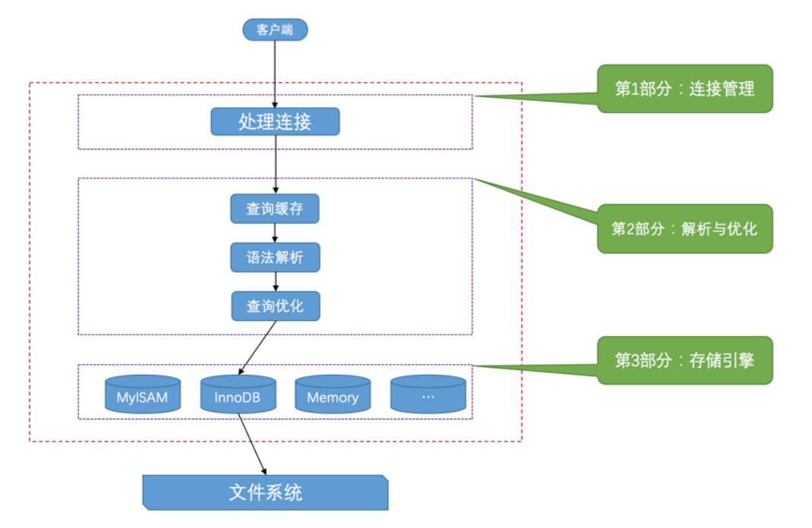

### 连接管理

​		客户端进程与服务器进程建立连接，每当有一个客户端进程连接到服务器进程时，服务器进程都会创建一个**线程**来专门处理与这个客户端的交互，当该客户端

退出时会与服务器断开连接，服务器并不会立即把与该客户端交互的线程销毁掉，而是把它缓存起来，在另一个新的客户端再进行连接时，把这个缓存的线程分配

给该新客户端。这样就起到了不频繁创建和销毁线程的效果，从而节省开销。


### 解析与优化

#### 查询缓存

​		MySQL服务器程序处理查询请求时，会把刚刚处理过的查询请求和结果缓存起来，如果下一次有一模一样的请求过来，直接从缓存中查找结果就好了，就不

用再去底层的表中查找了。这个查询缓存可以在不同客户端之间共享。

​		如果两个查询请求在任何字符上的不同，都会导致缓存不会命中。另外，如果查询请求中包含某些系统函数、用户自定义变量和函数、一些系统表，那这个请

求就不会被缓存。

​		`MySQL`的缓存系统会监测涉及到的每张表，只要该表的结构或者数据被修改，那使用该表的所有高速缓存查询都将变为无效并从高速缓存中删除。

​		虽然查询缓存有时可以提升系统性能，但也不得不因维护这块缓存而造成一些开销，比如每次都要去查询缓存中检索，查询请求处理完需要更新查询缓存，维

护该查询缓存对应的内存区域。从`MySQL 5.7.20`开始，不推荐使用查询缓存，并在`MySQL 8.0`中删除。


#### 语法解析

​		如果查询缓存没有命中，接下来就需要进入正式的查询阶段了。因为客户端程序发送过来的请求只是一段文本而已，所以`MySQL`服务器程序首先要对这段文

本做分析，判断请求的语法是否正确，然后从文本中将要查询的表各种查询条件都提取出来放到`MySQL`服务器内部使用的一些数据结构上来。


#### 查询优化

​		语法解析之后，服务器程序获得到了需要的信息，因为写的`MySQL`语句执行起来效率可能并不是很高，`MySQL`的优化程序会对我们的语句做一些优化，优化

的结果就是生成一个执行计划，这个执行计划表明了应该使用哪些索引进行查询，表之间的连接顺序是啥样的。可以使用`EXPLAIN`语句来查看某个语句的执行计

划。


### 存储引擎

​		`MySQL`服务器把数据的存储和提取操作都封装到了一个叫存储引擎的模块里。表是由一行一行的记录组成的，但这只是一个逻辑上的概念，物理上如何表示

记录，怎么从表中读取数据，怎么把数据写入具体的物理存储器上，这都是存储引擎负责的事情。为了实现不同的功能，`MySQL`提供了各式各样的存储引擎，不同

存储引擎管理的表具体的存储结构可能不同，采用的存取算法也可能不同。

​		为了管理方便，把连接管理、查询缓存、语法解析、查询优化这些并不涉及真实数据存储的功能划分为`MySQL server`的功能，把真实存取数据的功能划分为

存储引擎的功能。各种不同的存储引擎向上边的`MySQL server`层提供统一的调用接口`(`也就是存储引擎`API)`，包含了几十个底层函数。

​		查看存储引擎：

```shell
show engines; // 查看服务端默认的存储引擎
```

​		可以为不同的表设置不同的存储引擎，也就是说不同的表可以有不同的物理存储结构，不同的提取和写入方式：

```sql
create table table_name
(
    # 建表语句
)engines=engines_name;  #建表时指定该表的存储引擎

alter table table_name engines=engines_name; #修改表的存储引擎

show create table table_name\G #查看建表语句
```


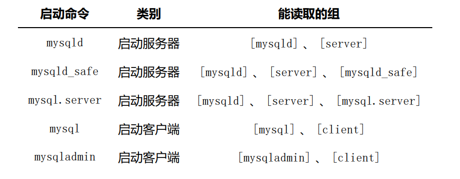


​		`MySQL`的启动选项若使用命令行的形式那么只对当次启动有效，如果使用配置文件的方式会按照固定的顺序扫描多个配置文件，相同的选项后面的会覆盖前

面的，并且如果同一个文件中不同组出现同样的选项，那么后面组中的值会覆盖前面。

​		系统变量的作用范围分为全局和会话，全局对所有的客户端有效，会话只对当前客户端有效。会话的初始值为当前全局变量的值。


# 字符集

​		字符集指的是某个字符范围的编码规则。

​		比较规则是针对某个字符集中的字符比较大小的一种规则。作用体现在比较字符串大小的表达式和某个字符串列进行排序中。

​		在`MySQL`中，一个字符集可以有若干种比较规则，其中有一个默认的比较规则，一个比较规则必须对应一个字符集。同一个字符集若采用不同的比较规则，

可能会出现不同的顺序。

​		在创建数据库，表和表中的列时都可以指定字符集和比较规则，如果不指定则采用上层的字符集和比较规则。

​		从发送请求到接收结果过程中发生的字符集转换：

​				1、客户端使用操作系统的字符集编码请求字符串，向服务器发送的是经过编码的一个字节串。

​				2、服务器将客户端发送来的字节串采用`character_set_client`代表的字符集进行解码，将解码后的字符串再按照`character_set_connection`代表的字

​		符集进行编码。

​				3、如果`character_set_connection`代表的字符集和具体操作的列使用的字符集一致，则直接进行相应操作，否则的话需要将请求中的字符串从

​		`character_set_connection`代表的字符集转换为具体操作的列使用的字符集之后再进行操作。

​				4、将从某个列获取到的字节串从该列使用的字符集转换为`character_set_results`代表的字符集后发送到客户端。

​				5、客户端使用操作系统的字符集解析收到的结果集字节串。

|           系统变量           |                             作用                             |
| :--------------------------: | :----------------------------------------------------------: |
|   **character_set_client**   |                 服务器解码请求时使用的字符集                 |
| **character_set_connection** | 服务器处理请求时会把请求字符串从**character_set_client**转为**character_set_connection** |
|  **character_set_results**   |             服务器向客户端返回数据时使用的字符集             |

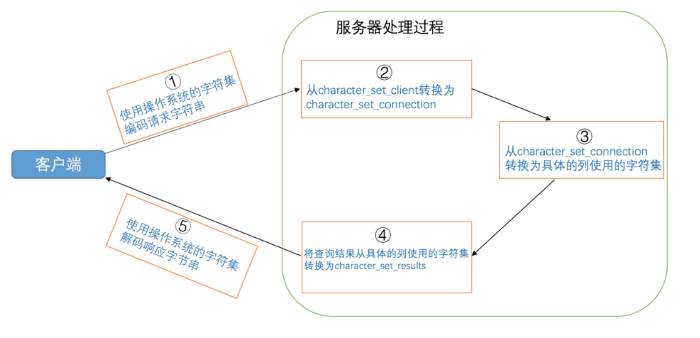

# InnoDB记录结构

​		`InnoDB`是一个将表中的数据存储到磁盘上的存储引擎，所以即使关机后重启我们的数据还是存在的。而真正处理数据的过程是发生在内存中的，所以需要把

磁盘中的数据加载到内存中，如果是处理写入或修改请求的话，还需要把内存中的内容刷新到磁盘上。`InnoDB`采取的方式是：将数据划分为若干个页，以页作为

磁盘和内存之间交互的基本单位，`InnoDB`中页的大小一般为`16KB`。也就是在一般情况下，一次最少从磁盘中读取`16KB`的内容到内存中，一次最少把内存中的

`16KB`内容刷新到磁盘中。

​		以记录为单位来向表中插入数据的，这些记录在磁盘上的存放方式也被称为行格式或者记录格式。`4`种不同类型的行格式，分别是`Compact` 、`Redundant、`

`Dynamic`和`Compressed`行格式。

## Compact

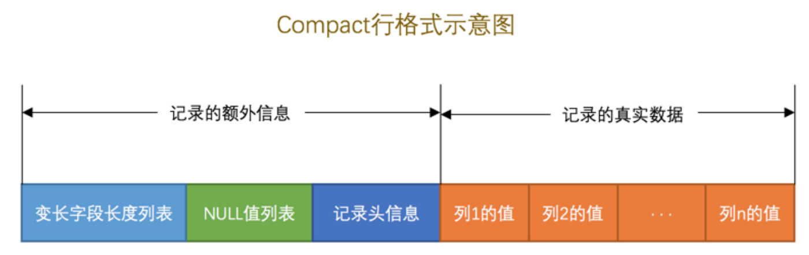

### 变长字段长度列表

​		`MySQL`支持一些变长的数据类型`(VARCHAR(M) 、 VARBINARY(M) 、`各种`TEXT`类型，各种`BLOB` 类`)`，把拥有这些数据类型的列称为变长字段`(`或者采用变长

字符集：UTF8等`)`，变长字段中存储多少字节的数据是不固定的，所以我们在存储真实数据的时候需要顺便把这些数据占用的字节数也存起来，所以这些变长字

段占用的存储空间分为两部分：

​				1、真正的数据内容。

​				2、占用的字节数。

​		在`Compact`行格式中，把所有变长字段的真实数据占用的字节长度都存放在记录的开头部位`(`如果表中没有变长数据类型则不会有该部分`)`，从而形成一个

变长字段长度列表，各变长字段数据占用的字节数按照列的顺序**逆序**存放。如果可变字段允许存储的最大字节数超过`255`字节并且真实存储的字节数超过`127`字

节，则使用`2`个字节，否则使用`1`个字节来表示真正字符串占用的字节数。变长字段长度列表中只存储值为非`NULL`的列内容占用的长度，值为`NULL`的列的长度

是不储存的。

​		对于一些占用字节数非常多的字段，那么如果该记录在单个页面中无法存储时，`InnoDB`会把一部分数据存放到所谓的溢出页中，在变长字段长度列表处只存

储留在本页面中的长度，所以使用两个字节也可以存放下来。


### NULL值列表

​		表中的某些列可能存储`NULL`值，所以`Compact`行格式把这些值为`NULL`的列统一管理起来，存储到`NULL`值列表中：

​				1、 首先统计表中允许存储`NULL`的列，如果表中没有允许存储`NULL`的列，则`NULL`值列表也不存在了，否则将每个允许存储`NULL的列对应一个二进制

​		位，二进制位按照列的顺序**逆序**排列。二进制位的值为`1`时，代表该列的值为`NULL`。 二进制位的值为`0`时，代表该列的值不为`NULL`。

​				2、`MySQL`规定`NULL`值列表必须用整数个字节的位表示，如果使用的二进制位个数不是整数个字节，则在字节的高位补`0` 。


### 记录头信息

​		记录头信息，它是由固定的`5`个字节组成。`5`个字节也就是`40`个二进制位，不同的位代表不同的意思：

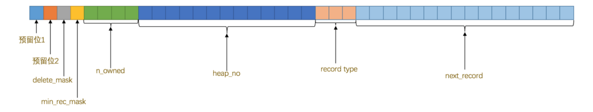

|     名称     | 大小（bit） |                             描述                             |
| :----------: | :---------: | :----------------------------------------------------------: |
|   预留位1    |      1      |                           没有使用                           |
|   预留位2    |      1      |                           没有使用                           |
| delete_mask  |      1      |                     标记该记录是否被删除                     |
| min_rec_mask |      1      |         B+树的每层非叶子节点中的最小记录都会添加标记         |
|   n_owned    |      4      |                   表示当前记录拥有的记录数                   |
|   heap_no    |     13      |                标识当前记录在记录堆的位置信息                |
| record_type  |      3      | 标识当前记录的类型，0：表示普通记录，1：表示B+数非叶子节点记录，2：表示最小记录，3：表示最大记录 |
| next_record  |     16      | 表示下一条记录的相对位置，从当前记录的真实数据到下一条记录的真实数据的地址偏移量。 |


### 记录的真实数据

​		对于一个表来说，除了创建表示定义的列，`MySQL`会为每个记录默认的添加一些列`(`也称为隐藏列`)`：

|    列名     | 是否必须 | 占用空间 |          描述          |
| :---------: | :------: | :------: | :--------------------: |
|  DB_ROW_ID  |    否    |  6字节   | 行ID，唯一标识一条记录 |
|  DB_TRX_ID  |    是    |  6字节   |         事务ID         |
| DB_ROLL_PTR |    是    |  7字节   |        回滚指针        |

​		`InnoDB`表对主键的生成策略：优先使用用户自定义主键作为主键，如果用户没有定义主键，则选取一个`Unique`键作为主键，如果表中连`Unique`键都没有定

义的话，则`InnoDB`会为表默认添加一个名为`row_id(DB_ROW_ID)`的隐藏列作为主键。即`InnoDB`存储引擎会为每条记录都添加`DB_TRX_ID`和`DB_ROLL_PTR`这两个

列，但是`row_id`是可选的`(`在没有自定义主键以及`Unique`键的情况下才会添加该列`)`。

​		对于定长数据类型`(`比如：`char(n))`，将数据存入后未用完的字节将用**空格字符**填充。

​		对于一个列数据所占用的字节数会随着采用的字符集而出现不同的情况，比如：`ascii`字符集中`char(10)`只占用`10`个字节，但是对于`utf8`而言，由于采用

变长编码，`char(10)`占用的字节数为`10~30`个字节，但只向里面存入空字符串依然会占用`10`个字节，这是怕将来更新该列的值的字节长度大于原有值的字节长度

而小于`10`个字节时，可以在该记录处直接更新，而不是在存储空间中重新分配一个新的记录空间，导致原有的记录空间成为所谓的碎片。


## Redundant

​		`Redundant`行格式是`MySQL5.0`之前用的一种行格式。

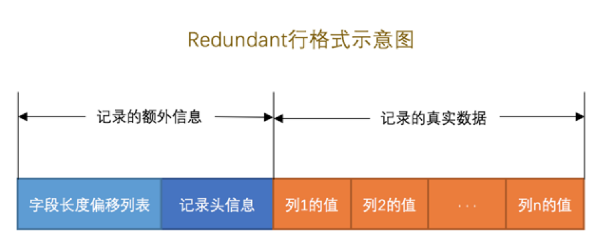

### 字段长度偏移列表

​		`Redundant`行格式会把该条记录中所有列`(`包括隐藏列`)`的长度信息都按照逆序存储到字段长度偏移列表。

​		计算列值长度的方式采用两个相邻数值的差值来计算各个列值的长度。


### 记录头信息

​		`Redundant`行格式的记录头信息占用`6`字节，`48`个二进制位：

|      名称       | 大小（bit） |                             描述                             |
| :-------------: | :---------: | :----------------------------------------------------------: |
|     预留位1     |      1      |                           没有使用                           |
|     预留位2     |      1      |                           没有使用                           |
|   delete_mask   |      1      |                     标记该记录是否被删除                     |
|  min_rec_mask   |      1      |        B+树的每层非叶子节点中的最小记录都会添加该标记        |
|     n_owned     |      4      |                   表示当前记录拥有的记录数                   |
|     heap_no     |     13      |                表示当前记录在页面堆的位置信息                |
|     n_field     |     10      |                      表示记录中列的数量                      |
| 1byte_offs_flag |      1      | 标记字段长度偏移列表中每个列对应的偏移量是使用1字节还是2字节表示的 |
|   next_record   |     16      |                   表示下一条记录的相对位置                   |

​		`1byte_offs_flag`的选择：

​				字段长度偏移列表实质上是存储每个列中的值占用的空间在记录的真实数据处结束的位置，当记录的真实数据总占用的字节数不大于`127`时，每个列对

​		应的偏移量占用`1`个字节，当记录的真实数据占用的字节数大于`127`，但不大于`32767`时，每个列对应的偏移量占用`2`个字节。当记录的真实数据大于

​		`32767`，此时的记录已经存放到了溢出页中，在本页中只保留前`768`个字节和`20`个字节的溢出页面地址`(`还记录了一些别的信息`)`。因为字段长度偏移列表

​		处只需要记录每个列在本页面中的偏移就好了，所以每个列使用`2`个字节来存储偏移量就够了。

​				当它的值为`1`时，表明使用`1`个字节存储。 当它的值为`0`时，表明使用`2`个字节存储。

​		`Redundant`行格式并没有`NULL`值列表 ，所以在字段长度偏移列表中的各个列对应的偏移量处做了一些特殊处理：将列对应的偏移量值的第一个比特位作为是

否为`NULL`的依据，该比特位也可以被称之为`NULL`比特位 。如果为`1`，那么该列的值就是`NULL`，否则不是`NULL`。

​		如果存储`NULL`值的字段是定长类型的，则`NULL`值也将占用记录的真实数据部分，并把该字段对应的数据使用`0x00`字节填充。如果该存储`NULL`值的字段是

变长数据类型的，则不在记录的真实数据处占用任何存储空间。


## 行数据溢出

​		`VARCHAR(M)`类型的列最多可以占用`65535`个字节`(`一个列中所有的行加起来的字节数`)`。其中的`M`代表该类型最多存储的字符数量：

​		为了存储一个`VARCHAR(M)`类型的列，其实需要占用`3`部分存储空间：

​				1、真实数据。

​				2、真实数据占用字节的长度。

​				3、`NULL`值标识，如果该列有`NOT NULL`属性则可以没有这部分存储空间。

​		因此`VARCHAR(M)`类型`M`的最大取值取决于该字符集表示一个字符最多需要的字节数。

​		在`Compact`和`Reduntant`行格式中，对于占用存储空间非常大的列，在记录的真实数据处只会存储该列的一部分数据，把剩余的数据分散存储在几个其他的页

中，然后记录的真实数据处用`20`个字节存储指向这些页的地址，从而可以找到剩余数据所在的页。

​		每个页除了存放我们的记录以外，也需要存储一些额外的信息，额外信息加起来需要`136`个字节的空间，其他的空间都可以被用来存储记录。 

​		每个记录需要的额外信息是`27`字节：

​				1、`2`个字节用于存储真实数据的长度。

​				2、`1`个字节用于存储列是否是`NULL`值。

​				3、`5`个字节大小的头信息。

​				4、`6`个字节的`row_id`列。

​				5、`6`个字节的`transaction_id`列。

​				6、`7`个字节的`roll_pointer`列。


## Dynamic和Compressed

​		`Dynamic`和`Compressed`行格式和`Compact`行格式挺像，只不过在处理行溢出数据，它们不会在记录的真实数据处存储字段真实数据的前768个字节，而是把

所有的字节都存储到其他页面中，只在记录的真实数据处存储其他页面的地址。

​		`Compressed`行格式和`Dynamic`不同的一点是，`Compressed`行格式会采用压缩算法对页面进行压缩，以节省空间。


# 数据页

​		页，它是`InnoDB`管理存储空间的基本单位，一个页的大小一般是`16KB`，其被被划分为多个部分，不同部分有不同的功能：

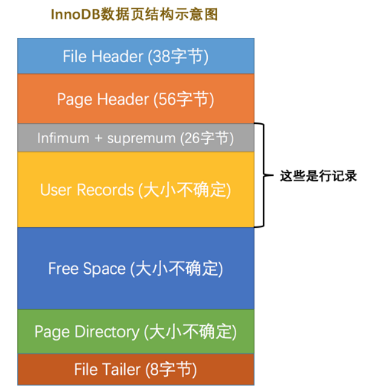

|        名称        |       中文名       | 占用空间 |          描述          |
| :----------------: | :----------------: | :------: | :--------------------: |
|    File Header     |       文件头       |  38字节  |    页的一些通用信息    |
|    Page Header     |       页面头       |  56字节  |  数据页专有的一些信息  |
| Infimum + Supremum | 最小记录和最大记录 | 26个字节 |    两个虚拟的行记录    |
|    User Records    |      用户记录      |  不确定  |  实际存储的行记录内容  |
|     Free Space     |      空闲空间      |  不确定  |   页中尚未使用的空间   |
|   Page Directory   |      页面目录      |  不确定  | 页中某些记录的相对位置 |
|    File Trailer    |       文件尾       |  8字节   |     校验页是否完整     |

​		存储的记录会按照指定的行格式存储到`User Records`部分。但是在一开始生成页的时候，其实并没有`User Records这个部分，每当我们插入一条记录，都会

从`Free Space`部分，也就 是尚未使用的存储空间中申请一个记录大小的空间划分到`User Records`部分，当`Free Space`部分的空间全部被`User Records`部分替代

掉之后，也就意味着这个页使用完了，如果还有新的记录插入的话，就需要去申请新的页了。

​		当数据页中存在多条被删除掉的记录时，这些记录的`next_record`属性将会把这些被删除掉的记录组成一个垃圾链表，以备之后重用这部分存储空间。

​		不论怎么对页中的记录做增删改操作，`InnoDB`始终会维护一条记录的单链表，链表中的各个节点是按照主键值由小到大的顺序连接起来的。

​		规定`Infimum`记录的下一条记录就是本页中主键值最小的用户记录，而本页中主键值最大的用户记录的下一条记录就是`Supremum`记录：

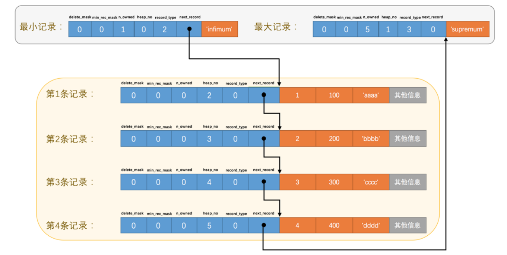


## 页目录

​		当使用主键进行查询时，由于`InnoDB`维护了一张单链表，并且表中的记录是按主键的大小由小到大递增，所以查询时会使用到页目录。页目录的制作过程：

​				1、将所有正常的记录`(`包括最大和最小记录，不包括标记为已删除的记录`)`划分为几个组。

​				2、每个组的最后一条记录`(`也就是组内最大的那条记录`)`的头信息中的`n_owned`属性表示该记录拥有多少条记 录，也就是该组内共有几条记录。

​				3、将每个组的最后一条记录的地址偏移量单独提取出来按顺序存储到靠近页的尾部的地方，这个地方也就是 页目录。页面目录中的这些地址偏移量被

​		称为槽，所以这个页面目录就是由槽组成的。

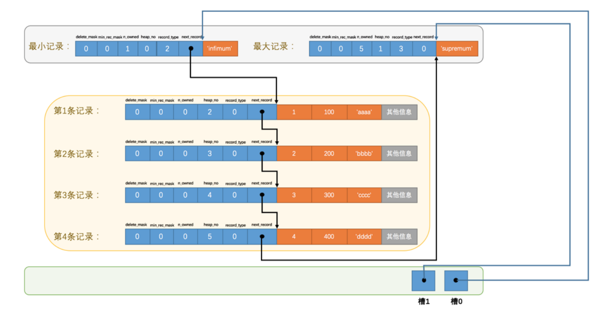

​		对于最小记录所在的分组只能有`1`条记录， 最大记录所在的分组拥有的记录条数只能在`1~8`条之间，剩下的分组中记录的条数范围只能在是`4~8`条之间。

​		分组的过程：

​				1、初始情况下一个数据页里只有最小记录和最大记录两条记录，它们分属于两个分组。 

​				2、之后每插入一条记录，都会从页目录中找到主键值比本记录的主键值大并且差值最小的槽，然后把该槽对应的记录的`n_owned`值加`1`，表示本组内又

​		添加了一条记录，直到该组中的记录数等于`8`个。

​				3、在一个组中的记录数等于`8`个后再插入一条记录时，会将组中的记录拆分成两个组，一个组中`4`条记录，另一个`5`条记录。这个过程会在页目录中

​		新增一个槽来记录这个新增分组中最大的那条记录的偏移量。

​		基于以上的特性，所以在利用主键查询时，可以在页目录中使用二分查找：

​				1、通过二分法确定该记录所在的槽，并找到该槽中主键值最小的那条记录`(`通过上一个槽中的最大记录的`next_record`属性`)`。

​				2、通过记录的`next_record`属性遍历该槽所在的组中的各个记录。


## 页面头

|       名称        | 占用空间 |                         描述                         |
| :---------------: | :------: | :--------------------------------------------------: |
| PAGE_N_DIR_SLOTS  |  2字节   |                   页目录中的槽数量                   |
|   PAGE_HEAP_TOP   |  2字节   | 还未使用的空间最小地址，即从该地址之后就是Free Space |
|    PAGE_N_HEAP    |  2字节   |   页中的记录数，包括最大，最下和被标记为删除的记录   |
|     PAGE_FREE     |  2字节   |             第一个被标记为删除的记录地址             |
|   PAGE_GARBAGE    |  2字节   |                已删除记录占用的字节数                |
| PAGE_LAST_INSERT  |  2字节   |                  最后插入记录的位置                  |
|  PAGE_DIRECTION   |  2字节   |                    记录插入的方向                    |
| PAGE_N_DIRECTION  |  2字节   |              一个方向连续插入的记录数量              |
|    PAGE_N_RECS    |  2字节   |  页中的记录数，不包括最大，最下和被标记为删除的记录  |
|  PAGE_MAX_TRX_ID  |  8字节   |    修改当前页的最大事务ID，该值仅在二级索引中定义    |
|    PAGE_LEVEL     |  2字节   |               当前页在B+树种所处的层级               |
|   PAGE_INDEX_ID   |  8字节   |            索引ID，标识当前页属于哪个索引            |
| PAGE_BTR_SEG_LEAF |  10字节  |      B+树叶子段的头部信息，仅在B+树的Root页定义      |
| PAGE_BTR_SEG_TOP  |  10字节  |     B+树非叶子段的头部信息，仅在B+树的Root页定义     |

​		`PAGE_DIRECTION`：假如新插入的一条记录的主键值比上一条记录的主键值大，我们说这条记录的插入方向是右边，反之则是左边。用来表示最后一条记录插

入方向的状态。

​		`PAGE_N_DIRECTION`：假设连续几次插入新记录的方向都是一致的，`InnoDB`会把沿着同一个方向插入记录的条数记下来，如果最后一条记录的插入方向改变了

的话，这个状态的值会被清零重新统计。


## 文件头

|               名称               | 占用空间 |                             描述                             |
| :------------------------------: | :------: | :----------------------------------------------------------: |
|     FIL_PAGE_SPACE_OR_CHKSUM     |  4字节   |                          页的校验和                          |
|         FIL_PAGE_OFFSET          |  4字节   |                             页号                             |
|          FIL_PAGE_PREV           |  4字节   |                        上一个页的页号                        |
|          FIL_PAGE_NEXT           |  4字节   |                        下一个页的页号                        |
|           FIL_PAGE_LSN           |  8字节   |              页面被最后修改时对应的日志序列位置              |
|          FIL_PAGE_TYPE           |  2字节   |                          该页的类型                          |
|     FIL_PAGE_FILE_FLUSH_LSN      |  8字节   | 仅在系统表空间的一个页中定义，代表文件至少被刷新到了对应的LSN值 |
| FIL_PAGE_ARCH_LOG_NO_OR_SPACE_ID |  4字节   |                       页属于哪个表空间                       |

​		`FIL_PAGE_TYPE`：`InnoDB`为了不同的目的而把页分为不同的类型，其中存储记录的数据页的类型是`FIL_PAGE_INDEX`，即索引页。

|          名称           | 十六进制 |              描述               |
| :---------------------: | :------: | :-----------------------------: |
| FIL_PAGE_TYPE_ALLOCATED |  0x0000  |       最新分配，还没使用        |
|    FIL_PAGE_UNDO_LOG    |  0x0002  |           Undo日志页            |
|     FIL_PAGE_INODE      |  0x0003  |           段信息节点            |
| FIL_PAGE_IBUF_FREE_LIST |  0x0004  |      Insert Buffer空闲列表      |
|  FIL_PAGE_IBUF_BITMAP   |  0x0005  |        Insert Buffer位图        |
|    FIL_PAGE_TYPE_SYS    |  0x0006  |             系统页              |
|  FIL_PAGE_TYPE_TRX_SYS  |  0x0007  |          事务系统数据           |
|  FIL_PAGE_TYPE_FSP_HDR  |  0x0008  |         表空间头部信息          |
|   FIL_PAGE_TYPE_XDES    |  0x0009  |           扩展描述页            |
|   FIL_PAGE_TYPE_BLOB    |  0x000A  |             BLOB页              |
|     FIL_PAGE_INDEX      |  0x45BF  | 索引页，也就是我们所说的 数据页 |


## 文件尾

​		`InnoDB`存储引擎会把数据存储到磁盘上，但是磁盘速度太慢，需要以页为单位把数据加载到内存中处理，如果该页中的数据在内存中被修改了，那么在修改

后的某个时间需要把数据同步到磁盘中。为了检测一个页是否完整`InnoDB`在每个页的尾部都加了一个`File Trailer`部分，这个部分由`8`个字 节组成，可以分成

`2`个小部分：

​		1、前`4`个字节代表页的校验和。

​				这个部分是和文件头中的校验和相对应的。每当一个页面在内存中修改了，在同步之前就要把它的校验和算出来，因为文件头在页面的前边，所以校验

​		和会被首先同步到磁盘，当完全写完时，校验和也会被写到页的尾部，如果完全同步成功，则页的首部和尾部的校验和应该是一致的。如果写了一半儿断电

​		了，那么在文件头中的校验和就代表着已经修改过的页，而在文件尾中的校验和代表着原先的页，二者不同则意味着同步中间出了错。

​		2、后`4`个字节代表页面被最后修改时对应的日志序列位置。

# B+树索引

## 聚簇索引

​		在创建表时指定主键则会为主键创建聚簇索引，因为一个数据页中的记录是根据主键值从小到大进行排序串联成一个链表，各个数据页之间也会类似的串联为

一个双向链表。所以在建立索引时，会新生成一个页，页中的记录的`record_type`为`1`，然后记录由每个数据页中最小的主键值，页号和一些附加信息列构成，并

在这个记录页中也按照主键值进行排序串联成一个链表，如果记录页的数据过多，也会进行相似的新生成表、填入记录值，然后生成父记录表等操作，等到索引创

建完成后，整个索引就成了一颗`B+`树。其中叶子节点才是存放数据的地方。

​		在根据主键进行查找时，只需要从`B+`树的根节点开始，比较其记录中的主键值，进而找到对应的页号，然后按照相同的规则向下查找，一直查询到对应的数

据页后，在根据页目录使用二分查找到具体的记录。

​		但是`B+`树的创建并非上述的过程，在指定主键后，`MySQL`就会创建`B+`树的根节点，在传入数据时，就会直接插入到这个根节点所对应的页中，当页中空间

用完后，就会进行分裂表的过程，即新生成一个数据页，然后将数据按照规则排列在两个数据页中，根节点就会按照规则成为这两个数据页的记录页，再进行插入

操作时，也会按照相同的逻辑处理。整个过程根节点从始至终都为改动，所以其会被存入数据字典中。


## 二级索引

​		除了聚簇索引，其余的索引都是二级索引，二级索引的原理与聚簇索引类似，只是叶子节点并不是存放的真是数据，而是由索引列，主键列构成；记录页中除

了索引列和页号外还会添加主键列来确定唯一性。

​		在根据索引列进行查找时，过程与聚簇索引查找过程相同，只是在找到对应根节点记录时，首先会找到对应记录的主键值，然后进行按照聚簇索引在查找一

次。即回表操作，才能找到对应的真是记录。

​		对于多列索引的情况，`B+`树的结构与单列索引类似，不同的是在叶子节点中如果前一列的值相同，则会在按照后一列的值进行排序。


# 索引的使用

## 全值匹配

​		搜索条件中的列和索引列一致的话，这种情况就称为全值匹配。


## 匹配左边的列

​		想使用联合索引中尽可能多的列，搜索条件中的各个列必须是联合索引中从最左边连续的列。


## 匹配列前缀

​		在使用字符串模糊查询时，只有前缀是确定时才会走索引，因为在字符串上建立的索引，其是根据字符串排序的规则进行排序的。即依次比较字符串对应位置

的字母的大小。


## 匹配范围值

​		如果对多个列同时进行范围查找的话，只有对索引最左边的那个列进行范围查找的时候才能用到`B+`树索引。其原因就是多列索引时，索引的规则是全面的列

相同时，才会按照后面的列的值进行排序。所有导致后面的列并不是排好序的。


## 精确匹配某一列并范围匹配另外一列

​		同一个联合索引来说，虽然对多个列都进行范围查找时只能用到最左边那个索引列，但是如果左边的列是精确查找，则右边的列可以进行范围查找。此时也是

会用到索引的。

# 数据目录

​		数据目录是`MySQL`用来存储运行过程中产生的数据的：

```mysql
show variables like '%datadir%';
```

​		每个数据库都对应数据目录下的一个子目录，或者说对应一个文件夹，我们每当我们新建一个数据库时，`MySQL`会帮我们做这两件事儿：

​				1、在 数据目录下创建一个和数据库名同名的子目录`(`或者说是文件夹`)`。

​				2、在该与数据库名同名的子目录下创建一个名为`db.opt`的文件，这个文件中包含了该数据库的各种属性，比方说该数据库的字符集和比较规则是个		啥。

​		表结构就是该表的名称是啥，表里边有多少列，每个列的数据类型是啥，有啥约束条件和索引，用的是啥字符集和比较规则吧啦吧啦的各种信息，这些信息都

体现在了我们的建表语句中了。为了保存这些信息，`InnoDB`和`MyISAM`这两种存储引擎都在数据目录下对应的数据库子目录下创建了一个专门用于描述表结构的文

件，文件名：**表名.frm**。此文件以二进制格式存储。


## InnoDB系统表空间

​		系统表空间可以对应文件系统上一个或多个实际的文件，默认情况下，`InnoDB`会在数据目录下创建一个名为`ibdata1`、大小为`12M`的文件，这个文件就是对

应的系统表空间在文件系统上的表示。这个文件是所谓的自扩展文件 ，也就是当不够用的时候它会自己增加文件大小。

​		在一个`MySQL`服务器中，系统表空间只有一份。从`MySQL 5.5.7`到`MySQL 5.6.6`之间的各个版 本中，我们表中的数据都会被默认存储到这个系统表空间。


## InnoDB独立表空间

​		在`MySQL 5.6.6`以及之后的版本中，`InnoDB`并不会默认的把各个表的数据存储到系统表空间中，而是为每一个表建立一个独立表空间，也就是说创建了多少

个表，就有多少个独立表空间。使用独立表空间来存储表数据的话，会在该表所属数据库对应的子目录下创建一个表示该独立表空间的文件，文件名和表名相

同，只不过添加了一个`.ibd`的扩展名而已，即：**表名.ibd**。这个文件用来存储表中的真实数据和索引。


## MyISAM存放数据

​		在`MyISAM`中的索引全部都是二级索引 ，该存储引擎的数据和索引是分开存放的。所以在文件系统中也是使用不同的文件来存储数据文件和索引文件。而且和

`InnoDB`不同的是，`MyISAM`并没有什么所谓的表空间一说，表数据都存放到对应的数据库子目录下：

​				**表名.frm**：与`InnoDB`一样，存放表或视图的结构定义。

​				**表名.MYD**：数据文件，存放真是数据。

​				**表名.MYI**：索引文件，存放建立的索引。


# MySQL系统数据库

​		`mysql`：它存储了`MySQL`的用户账户和权限信息，一些存储过程、事件的定义信息，一些运行过程中产生的日志信息，一些帮助信息以及时区信息等。

​		`information_schema`：这个数据库保存着`MySQL`服务器维护的所有其他数据库的信息，比如有哪些表、哪些视图、哪些触发器、哪些列、哪些索引等等。这

些信息并不是真实的用户数据，而是一些描述性信息，有时候也称之为元数据。

​		`performance_schema`：这个数据库里主要保存`MySQL`服务器运行过程中的一些状态信息，算是对`MySQL`服务器的一个性能监控。 包括统计最近执行了哪些语

句，在执行过程的每个阶段都花费了多长时间，内存的使用情况等等信息。

​		`sys`：这个数据库主要是通过视图的形式把`information_schema`和`performance_schema`结合起来，让程序员可以更方便的了解`MySQL`服务器的一些性能信

息。

# InnoDB的表空间

## 区

​		表空间中的页实在是太多了，为了更好的管理这些页面，提出了区的概念。对于`16KB`的页来说，连续的`64`个页就是一个区 ，也就是说一个区默认占用`1MB`

空间大小。不论是系统表空间还是独立表空间，都可以看成是由若干个区组成的，每`256`个区被划分成一组。

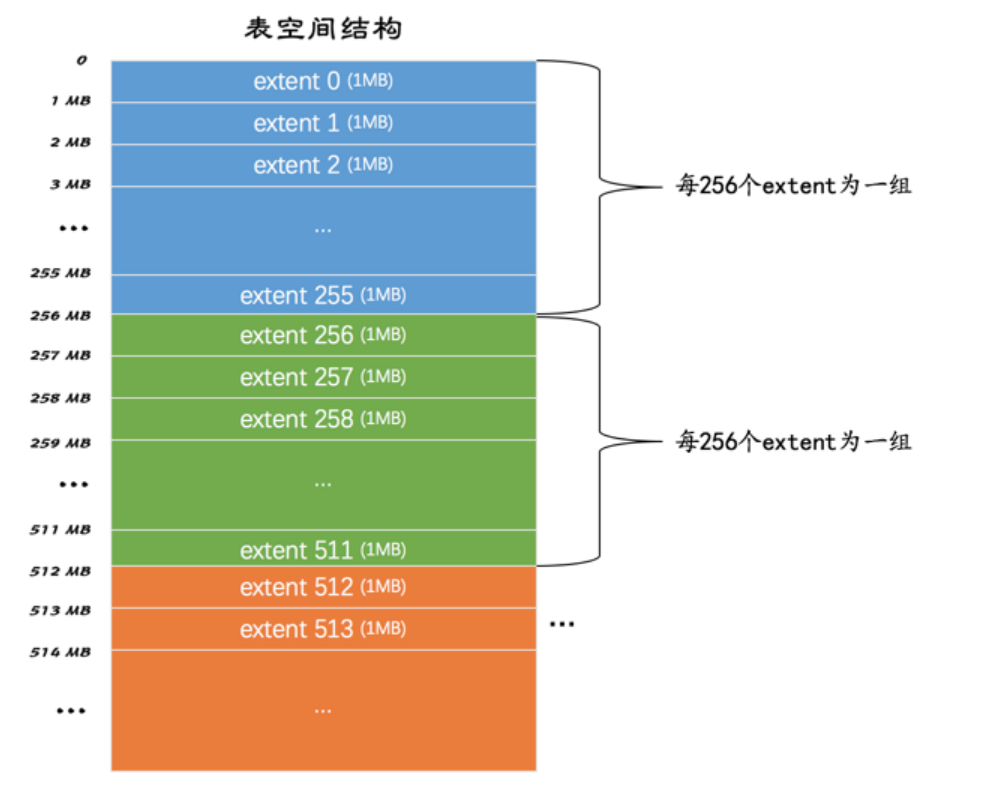

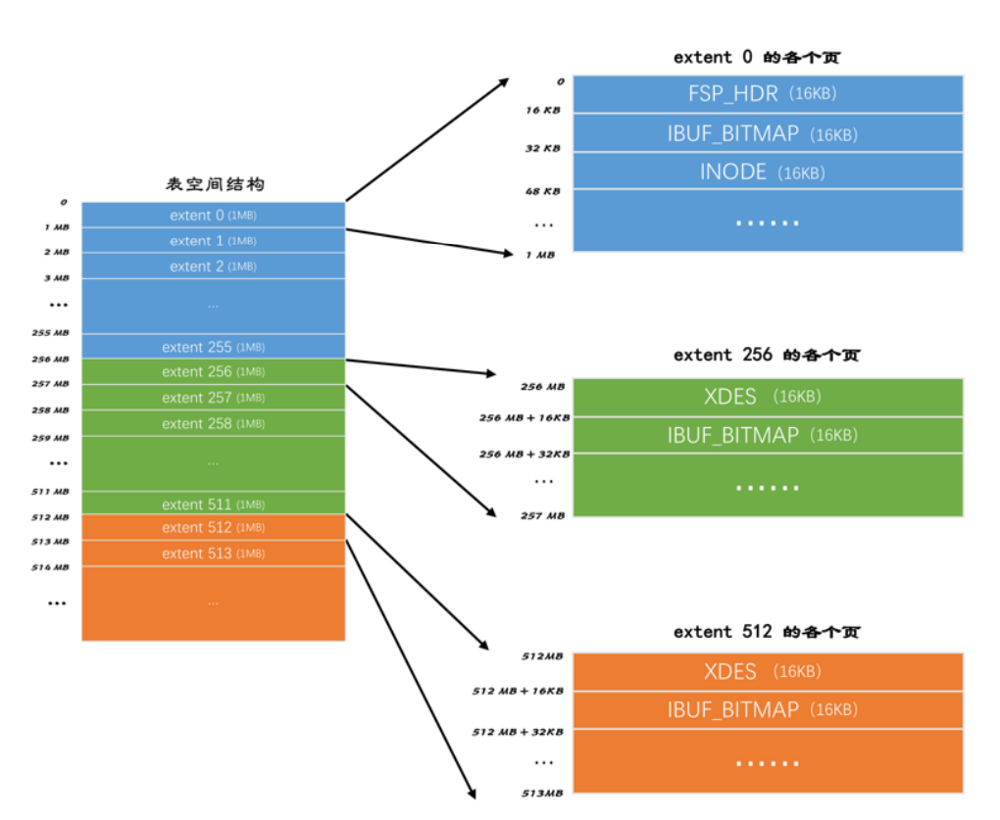

​		第一个组最开始的`3`个页面的类型是固定的，也就是说`extent 0`这个区最开始的3个页面的类型是固定的，分别是：

​				`FSP_HDR`类型：这个类型的页面是用来登记整个表空间的一些整体属性以及本组所有的区 ，也就是`extent 0 ~ extent 255`这`256`个区的属性。需要注

​		意的一点是，整个表空间只有一个`FSP_HDR`类型的页面。

​				`IBUF_BITMAP`类型：这个类型的页面是存储本组所有的区的所有页面关于`INSERT BUFFER`的信息。

​				`INODE`类型：这个类型的页面存储了许多称为`INODE`的数据结构。

​		其余各组最开始的2个页面的类型是固定的，也就是说`extent 256 、 extent512`这些区最开始的`2`个页面的类型是固定的，分别是：

​				`XDES`类型：用来登记本组`256`个区的属性，也就是说对于在`extent 256`区中的该类型页面存储的就是`extent 256 ~ extent 511`这些区的属性，对于在 

​		`extent 512`区中的该类型页面存储的就是`extent 512 ~ extent 767`这些区的属性。上边介绍的`FSP_HDR`类型的页面其实和`XDES`类型的页面的作用类似，只

​		不过`FSP_HDR`类型的页面还会额外存储一些表空间的属性。

​				`IBUF_BITMAP`类型。

​		一个区就是在物理位置上连续的`64`个页。在表中数据量大的时候，为某个索引分配空间的时候就不再按照页为单位分配了，而是按照区为单位分配，甚至在

表中的数据十分非常特别多的时候，可以一次性分配多个连续的区。虽然可能造成一点点空间的浪费，但是从性能角度看，可以消除很多的随机`I/O` ，功大于

过！

​		为了对`B+`树的叶子节点和非叶子节点进行了区别对待，即叶子节点有自己独有的区 ，非叶子节点也有自己独有的区 。存放叶子节点的区的集合就算是一个 

段，存放非叶子节点的区的集合也算是一个段。也就是说一个索引会生成`2`个段，一个叶子节点段，一个非叶子节点段。

​		为了考虑以完整的区为单位分配给某个段对于数据量较小的表太浪费存储空间的这种情况，提出了一个碎片区的概念，也就是在一个碎片区中，并不是所有的

页都是为了存储同一个段的数据而存在的，而是碎片区中的页可以用于不同的目的，碎片区直属于表空间，并不属于任何一个段。所以此后为某个段分配存储空间

的策略：

​				在刚开始向表中插入数据的时候，段是从某个碎片区以单个页面为单位来分配存储空间的。

​				当某个段已经占用了`32`个碎片区页面之后，就会以完整的区为单位来分配存储空间。

### 分类

​		空闲的区：现在还没有用到这个区中的任何页面。

​		有剩余空间的碎片区：表示碎片区中还有可用的页面。

​		没有剩余空间的碎片区：表示碎片区中的所有页面都被使用，没有空闲页面。

​		附属于某个段的区：每一个索引都可以分为叶子节点段和非叶子节点段，除此之外`InnoDB`还会另外定义一些特殊作用的段，在这些段中的数据量很大时将使

用区来作为基本的分配单位。

|  状态名   |         含义         |
| :-------: | :------------------: |
|   FREE    |       空闲的区       |
| FREE_FRAG |  有剩余空间的碎片区  |
| FULL_FRAG | 没有剩余空间的碎片区 |
|   FSEG    |   附属于某个段的区   |

​		处于`FREE、FREE_FRAG`以及`FULL_FRAG`这三种状态的区都是独立的，算是直属于表空间；而处于`FSEG`状态的区是附属于某个段的。

​		为了方便管理这些区，设计了一个称为`XDES Entry`的结构，每一个区都对应着一个`XDES Entry`结构，这个结构记录了对应的区的一些属性：

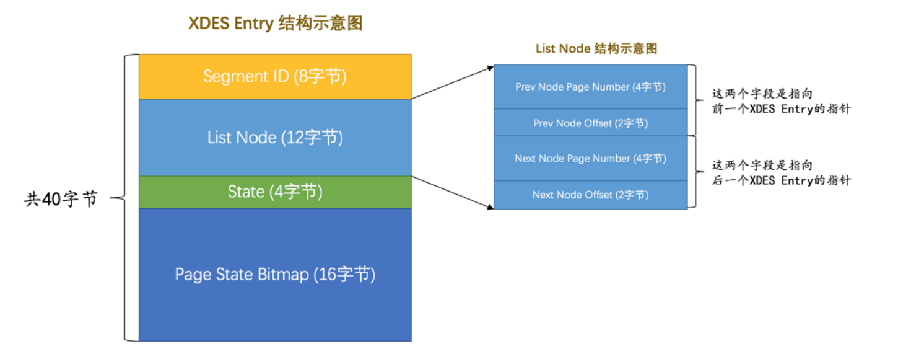

​		`Segment ID`：每一个段都有一个唯一的编号，用`ID`表示，此处的`Segment ID`字段表示就是该区所在的段。当然前提是该区已经被分配给某个段了，不然的

话该字段的值没啥意义。

​		`List Node`：这个部分可以将若干个`XDES Entry`结构串联成一个链表，想定位表空间内的某一个位置的话，只需指定页号以及该位置在指定页号中的页内偏

移量即可：

​				`Pre Node Page Number`和`Pre Node Offset`的组合就是指向前一个`XDES Entry`的指针。

​				`Next Node Page Number`和`Next Node Offset`的组合就是指向后一个`XDES Entry`的指针。

​				把状态为`FREE`的区对应的`XDES Entry`结构通过`List Node`来连接成一个链表，这个链表我们就称之为`FREE`链表。

​				把状态为`FREE_FRAG`的区对应的`XDES Entry`结构通过`List Node`来连接成一个链表，这个链表我们就称之为`FREE_FRAG`链表。

​				把状态为`FULL_FRAG`的区对应的`XDES Entry`结构通过`List Node`来连接成一个链表，这个链表我们就称之为`FULL_FRAG`链表。

​		`State`：这个字段表明区的状态。可选的值就是前边说过的那4个，分别是：`FREE 、 FREE_FRAG 、 FULL_FRAG`和`FSEG`。

​		`Page State Bitmap`：这个部分共占用`16`个字节，也就是`128`个比特位。一个区默认有`64`个页，这`128`个比特位被划分为`64`个部分，每个部分`2`个比特

位，对应区中的一个页。这两个比特位的第一个位表示对应的页是否是空闲的，第二个比特位还没有用。

​		为每个段中的区对应的`XDES Entry`结构建立了三个链表：

​				`FREE`链表：同一个段中，所有页面都是空闲的区对应的`XDES Entry`结构会被加入到这个链表。注意和直属于表空间的`FREE`链表区别开了，此处的

`FREE`链表是附属于某个段的。

​				`NOT_FULL`链表：同一个段中，仍有空闲空间的区对应的`XDES Entry`结构会被加入到这个链表。

​				`FULL`链表：同一个段中，已经没有空闲空间的区对应的`XDES Entry`结构会被加入到这个链表。


## 链表基节点

​		为了方便查找上述的链表，设计了一个叫`List Base Node`的结构，翻译成中文就是链表的基节点。这个结构中包含了链表的头节点和尾节点的指针以及这个

链表中包含了多少节点的信息：

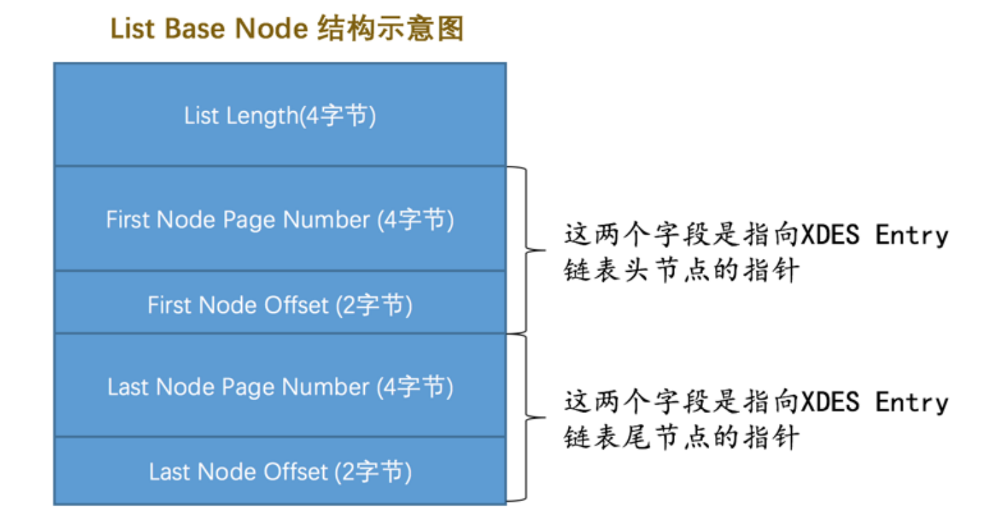

​		`List Length`表明该链表一共有多少节点。

​		`First Node Page Number`和`First Node Offset`表明该链表的头节点在表空间中的位置。

​		`Last Node Page Number`和`Last Node Offset`表明该链表的尾节点在表空间中的位置。

​		一般把某个链表对应的`List Base Node`结构放置在表空间中固定的位置，这样想找定位某个链表就变得非常容易了。


## 段的结构

​		段其实不对应表空间中某一个连续的物理区域，而是一个逻辑上的概念，由若干个零散的页面以及一些完整的区组成。为每个段都定义了一个`INODE Entry`结

构来记录一下段中的属性：

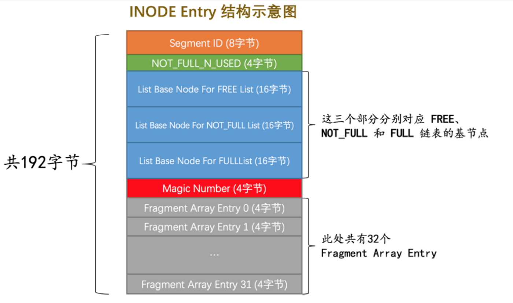

​		`Segment ID`：指这个`INODE Entry`结构对应的段的编号。

​		`NOT_FULL_N_USED`：指的是在`NOT_FULL`链表中已经使用了多少个页面。下次从`NOT_FULL`链表分配空闲页面时可以直接根据这个字段的值定位到。而不用从链

表中的第一个页面开始遍历着寻找空闲页面。

​		`3`个`List Base Node`：分别为段的`FREE`链表、`NOT_FULL`链表、`FULL`链表定义了基节点，这样想查找某个段的某个链表的头节点和尾节点的时候，就可以

直接到这个部分找到对应链表的基节点。

​		`Magic Number`：用来标记这个`INODE Entry`是否已经被初始化了`(`初始化的意思就是把各个字段的值都填进去 了`)`。如果这个数字是值的`97937874`，表明

该`INODE Entry`已经初始化，否则没有被初始化。

​		`Fragment Array Entry`：段是一些零散页面和一些完整的区的集合，每个`Fragment Array Entry`结构都对应着一个零散的页面，这个结构一共`4`个字节，表

示一个零散页面的页号。


## 页面类型

### FSP_HDR类型

​		其第一个组的第一个页面，当然也是表空间的第一个页面，页号为`0` 。这个页面的类型是`FSP_HDR`，它存储了表空间的一些整体属性以及第一个组内`256`个

区的对应的`XDES Entry`结构。

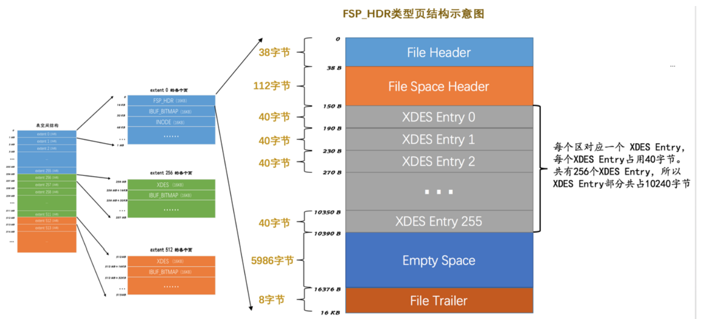

| 名称              | 中文名       | 占用空间大小 | 简单描述                       |
| ----------------- | ------------ | ------------ | ------------------------------ |
| File Header       | 文件头部     | 38 字节      | 页的一些通用信息               |
| File Space Header | 表空间头部   | 112 字节     | 表空间的一些整体属性信息       |
| XDES Entry        | 区描述信息   | 10240 字节   | 存储本组256个区对应的属性信息  |
| Empty Space       | 尚未使用空间 | 5986 字节    | 用于页结构的填充，没啥实际意义 |
| File Trailer      | 文件尾部     | 8 字节       | 校验页是否完整                 |


#### File Space Header

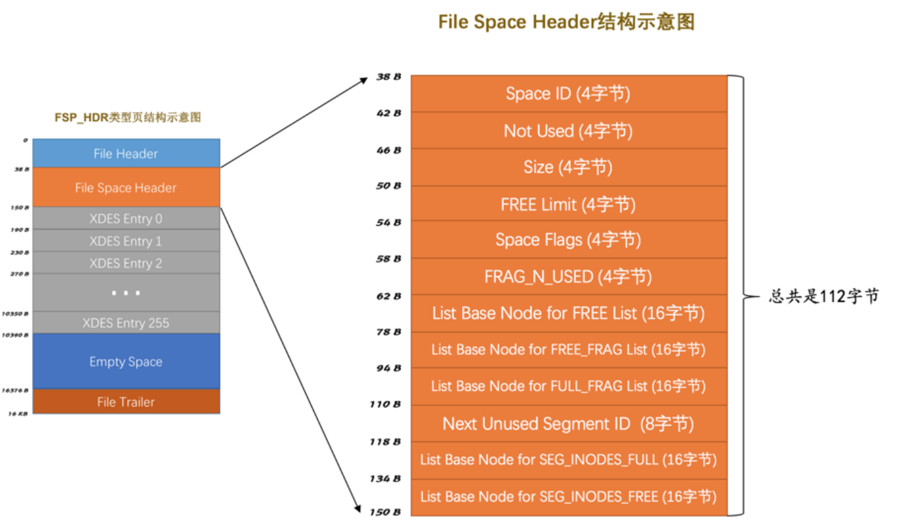

|                  名称                   | 占用空间 大小 |                             描述                             |
| :-------------------------------------: | :-----------: | :----------------------------------------------------------: |
|                Space ID                 |    4 字节     |                          表空间的ID                          |
|                Not Used                 |    4 字节     |                 这4个字节未被使用，可以忽略                  |
|                  Size                   |    4 字节     |                    当前表空间占有的页面数                    |
|               FREE Limit                |    4 字节     | 尚未被初始化的最小页号，大于或等于这个页号的区对应的XDES Entry结构都 没有被加入FREE链表 |
|               Space Flags               |    4 字节     |             表空间的一些占用存储空间比较小的属性             |
|               FRAG_N_USED               |    4 字节     |               FREE_FRAG链表中已使用的页面数量                |
|      List Base Node for FREE List       |    16 字节    |                       FREE链表的基节点                       |
|    List Base Node for FREE_FRAG List    |    16 字节    |                    FREE_FREG链表的基节点                     |
|    List Base Node for FULL_FRAG List    |    16 字节    |                    FULL_FREG链表的基节点                     |
|         Next Unused Segment ID          |    8 字节     |            当前表空间中下一个未使用的 Segment ID             |
| List Base Node for SEG_INODES_FULL List |    16 字节    |                 SEG_INODES_FULL链表的基节点                  |
| List Base Node for SEG_INODES_FREE List |    16 字节    |                 SEG_INODES_FREE链表的基节点                  |


#### XDES Entry

​		`XDES Entry`就是在表空间的第一个页面中保存的。一个`XDES Entry`结构的大小是`40`字节，但是一个页面的大小有限，只能存放有限个`XDES Entry`结构，所

以才把`256`个区划分成一组，在每组的第一个页面中存放`256`个`XDES Entry`结构。


### XDES类型

​		把表空间的区分为了若干个组，每组开头的一个页面记录着本组内所有的区对应的`XDES Entry`结构。 由于第一个组的第一个页面有些特殊，因为它也是整个

表空间的第一个页面，所以除了记录本组中的所有区对应的`XDES Entry`结构以外，还记录着表空间的一些整体属性，这个页面的类型就是`FSP_HDR`类型，整个表

空间里只有一个这个类型的页面。除去第一个分组以外，之后的每个分组的第一个页面只需要记录本组内所有的区对应的`XDES Entry`结构即可，不需要再记录表

空间的属性了，为了和`FSP_HDR`类型做区别，我们 把之后每个分组的第一个页面的类型定义为`XDES`，它的结构和`FSP_HDR`类型是非常相似的：

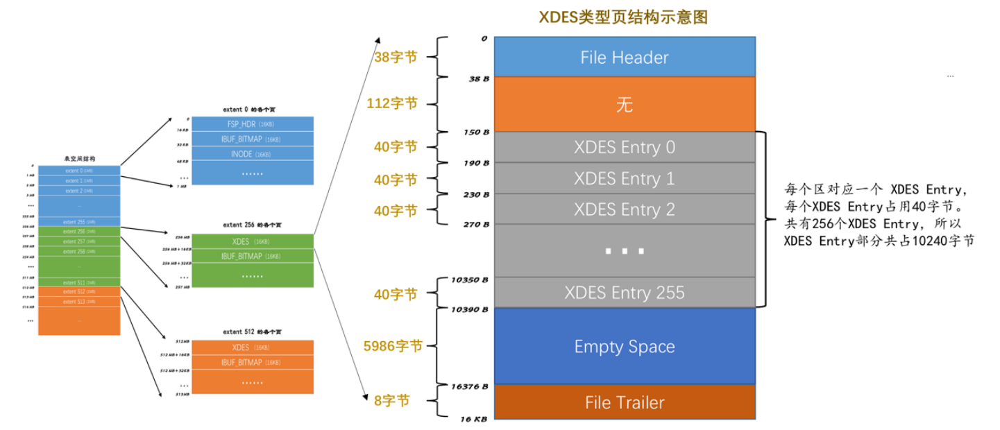


### IBUF_BITMAP类型

​		每个分组的第二个页面的类型都是`IBUF_BITMAP`，这种类型的页里边记录了一些有关`Change Buffer`的东西。


### INODE类型

​		第三个页面的类型是`INODE`。`InnoDB`为每个索引定义了两个段，而且为某些特殊功能定义了些特殊的段。为了方便管理，他们又为每个段设计了一个`INODE `

`Entry`结构，这个结构中记录了关于这个段的相关属性。`INODE`类型的页就是为了存储`INODE Entry`结构而存在的：

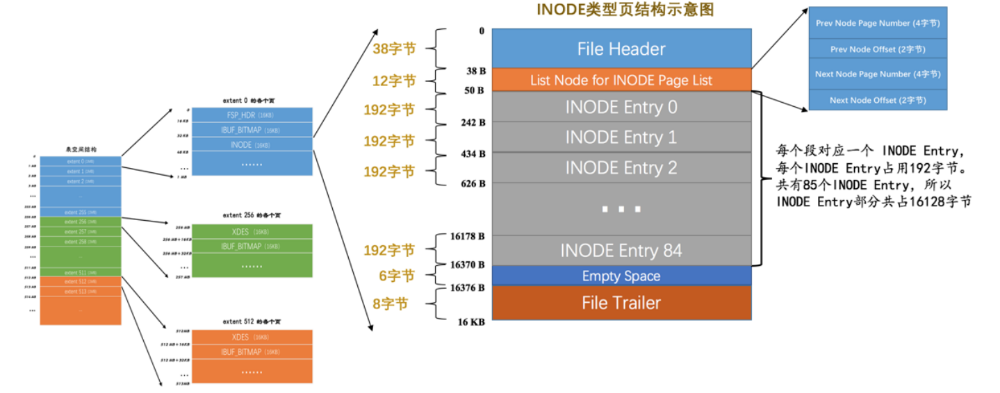

|             名称              |    中文名    | 占用空间大小 |                  简单描述                  |
| :---------------------------: | :----------: | :----------: | :----------------------------------------: |
|          File Header          |   文件头部   |   38 字节    |              页的一些通用信息              |
| List Node for INODE Page List | 通用链表节点 |   12 字节    | 存储上一个INODE页面和下一个INODE页面的指针 |
|          INODE Entry          |  段描述信息  |  16128 字节  |                                            |
|          Empty Space          | 尚未使用空间 |    6 字节    |       用于页结构的填充，没啥实际意义       |
|         File Trailer          |   文件尾部   |    8 字节    |               校验页是否完整               |

​		`INODE Entry`部分，主要包括对应的段内零散页面的地址以及附属于该段的`FREE`、`NOT_FULL`和`FULL`链表的基节点。每个`INODE Entry`结构占用`192`字节，

一个页面里可以存储`85`个这样的结构。

​		因为一个表空间中可能存在超过`85`个段，所以可能一 个`INODE`类型的页面不足以存储所有的段对应的`INODE Entry`结构，所以就需要额外的`INODE`类型的页

面来存储这些结构。还是为了方便管理这些`INODE`类型的页面，`InnoDB`将这些`INODE`类型的页面串联成两个不同的链表：

​				`SEG_INODES_FULL`链表：该链表中的`INODE`类型的页面中已经没有空闲空间来存储额外的`INODE Entry`结构了。

​				`SEG_INODES_FREE`链表：该链表中的`INODE`类型的页面中还有空闲空间来存储额外的`INODE Entry`结构了。

​		当新创建一个段`(`创建索引时就会创建段`)`时，都会创建一个`INODE Entry`结构与之对应，存储`INODE Entry`的大致过程：

​				先看看`SEG_INODES_FREE`链表是否为空，如果不为空，直接从该链表中获取一个节点，也就相当于获取到一个仍有空闲空间的`INODE`类型的页面，然后

​		把该`INODE Entry`结构防到该页面中。当该页面中无剩余空间 时，就把该页放到`SEG_INODES_FULL`链表中。

​				如果`SEG_INODES_FREE`链表为空，则需要从表空间的`FREE_FRAG`链表中申请一个页面，修改该页面的类型为`INODE`，把该页面放到`SEG_INODES_FREE`链表

​		中，与此同时把该`INODE Entry`结构放入该页面。


## Segment Header结构

​		`INDEX`类型的页时有一个`Page Header`部分，其中的`PAGE_BTR_SEG_LEAF`和`PAGE_BTR_SEG_TOP`都占用`10`个字节，它们其实对应一个叫`Segment Header`的结

构：

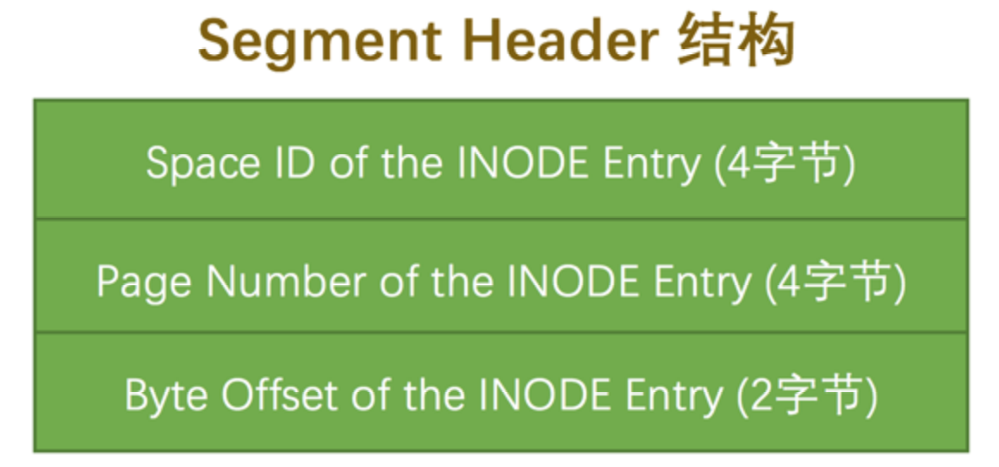

|              名称              | 占用字节数 |               描述                |
| :----------------------------: | :--------: | :-------------------------------: |
|  Space ID of the INODE Entry   |     4      |   INODE Entry结构所在的表空间ID   |
| Page Number of the INODE Entry |     4      |   INODE Entry结构所在的页面页号   |
|  Byte Offset of the INODE Ent  |     2      | INODE Entry结构在该页面中的偏移量 |


## 系统表空间

​		系统表空间的结构和独立表空间基本类似，只不过由于整个`MySQL`进程只有一个系统表空间，在系统表空间中会额外记录一些有关整个系统信息的页面，所

以会比独立表空间多出一些记录这些信息的页面。因为这个系统表空间最牛逼，相当于是表空间之首，所以它的表空间`ID`是`0`。

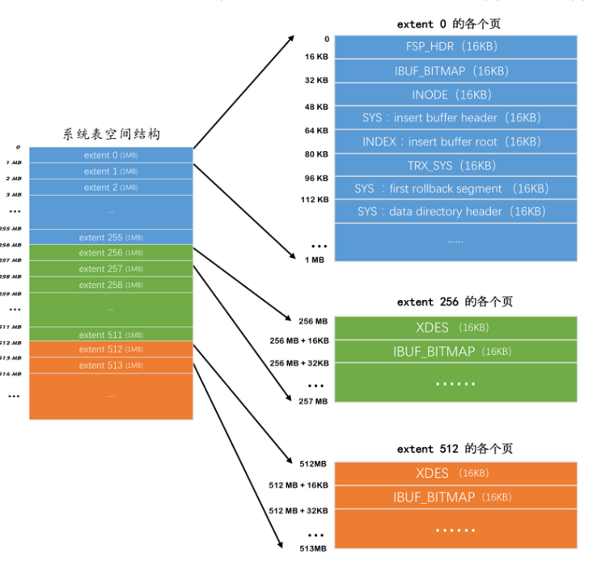

| 页号 | 页面类型 |        英文描述        |            描述             |
| :--: | :------: | :--------------------: | :-------------------------: |
|  3   |   SYS    |  Insert Buffer Header  | 存储Insert Buffer的头部信息 |
|  4   |  INDEX   |   Insert Buffer Root   |  存储Insert Buffer的根页面  |
|  5   | TRX_SYS  |   Transction System    |     事务系统的相关信息      |
|  6   |   SYS    | First Rollback Segment |     第一个回滚段的页面      |
|  7   |   SYS    | Data Dictionary Header |      数据字典头部信息       |

​		除了这几个记录系统属性的页面之外，系统表空间的`extent 1`和`extent 2`这两个区，也就是页号从`64 ~ 191`这`128`个页面被称为双写缓冲区。


##  InnoDB数据字典

​		为了更好的管理用户数据引入的一些额外数据，这些数据也称为元数据。`InnoDB`存储引擎特意定义了一些列的内部系统表来记录这些这些元数据 ：

|       表名       |                            描述                            |
| :--------------: | :--------------------------------------------------------: |
|    SYS_TABLES    |             整个InnoDB存储引擎中所有的表的信息             |
|   SYS_COLUMNS    |             整个InnoDB存储引擎中所有的列的信息             |
|   SYS_INDEXES    |            整个InnoDB存储引擎中所有的索引的信息            |
|    SYS_FIELDS    |        整个InnoDB存储引擎中所有的索引对应的列的信息        |
|   SYS_FOREIGN    |            整个InnoDB存储引擎中所有的外键的信息            |
| SYS_FOREIGN_COLS |         整个InnoDB存储引擎中所有的外键对应列的信息         |
| SYS_TABLESPACES  |            整个InnoDB存储引擎中所有的表空间信息            |
|  SYS_DATAFILES   | 整个InnoDB存储引擎中所有的表空间对应文件系统的文件路径信息 |
|   SYS_VIRTUAL    |         整个InnoDB存储引擎中所有的虚拟生成列的信息         |

​		这些系统表也被称为数据字典 ，它们都是以`B+`树的形式保存在系统表空间的某些页面中，其中`SYS_TABLES、SYS_COLUMNS、SYS_INDEXES 、 SYS_FIELDS`这四

个表尤其重要，称之为基本系统表。


### SYS_TABLES表

|    列名    |                       描述                       |
| :--------: | :----------------------------------------------: |
|    NAME    |                     表的名称                     |
|     ID     |      InnoDB存储引擎中每个表都有一个唯一的ID      |
|   N_COLS   |                 该表拥有列的个数                 |
|    TYPE    | 表的类型，记录了一些文件格式、行格式、压缩等信息 |
|   MIX_ID   |                   已过时，忽略                   |
|  MIX_LEN   |                表的一些额外的属性                |
| CLUSTER_ID |                   未使用，忽略                   |
|   SPACE    |                该表所属表空间的ID                |

​		`SYS_TABLES`表有两个索引：

​				以`NAME`列为主键的聚簇索引。

​				以`ID`列建立的二级索引。


### SYS_COLUMNS表

|   列名   |                             描述                             |
| :------: | :----------------------------------------------------------: |
| TABLE_ID |                      该列所属表对应的ID                      |
|   POS    |                      该列在表中是第几列                      |
|   NAME   |                          该列的名称                          |
|  MTYPE   | main data type，主数据类型，就是那堆INT、CHAR、VARCHAR、FLOAT、DOUBLE之类的东东 |
|  PRTYPE  | precise type，精确数据类型，就是修饰主数据类型的那堆东东，比如是否允许NULL值，是否允许负数啥的 |
|   LEN    |                 该列最多占用存储空间的字节数                 |
|   PREC   |       该列的精度，不过这列貌似都没有使用，默认值都是0        |

​		`SYS_COLUMNS`表只有一个聚集索引：

​				以`(TABLE_ID,POS)`列为主键的聚簇索引。


### SYS_INDEXES表

|      列名       |                             描述                             |
| :-------------: | :----------------------------------------------------------: |
|    TABLE_ID     |                     该索引所属表对应的ID                     |
|       ID        |           InnoDB存储引擎中每个索引都有一个唯一的ID           |
|      NAME       |                         该索引的名称                         |
|    N_FIELDS     |                      该索引包含列的个数                      |
|      TYPE       | 该索引的类型，比如聚簇索引、唯一索引、更改缓冲区的索引、全文索引、普通的二级索引等等各种类型 |
|      SPACE      |                  该索引根页面所在的表空间ID                  |
|     PAGE_NO     |                   该索引根页面所在的页面号                   |
| MERGE_THRESHOLD | 如果页面中的记录被删除到某个比例，就把该页面和相邻页面合并，这个值就是这个比例 |

​		`SYS_INEXES`表只有一个聚集索引：

​				以`(TABLE_ID,ID)`列为主键的聚簇索引。


### SYS_FIELDS表

|   列名   |             描述             |
| :------: | :--------------------------: |
| INDEX_ID |    该索引列所属的索引的ID    |
|   POS    | 该索引列在某个索引中是第几列 |
| COL_NAME |        该索引列的名称        |

​		`SYS_INEXES`表只有一个聚集索引：

​				以`(INDEX_ID,POS)`列为主键的聚簇索引。


## Data Dictionary Header页面

​		有了上述`4`个基本系统表，也就意味着可以获取其他系统表以及用户定义的表的所有元数据，即这`4`个表是表中之表。但只能把这`4`个表的元数据，就是它

们有哪些列、哪些索引等信息硬编码到代码中，然后`InnoDB`又拿出一个固定的页面来记录这`4`个表的聚簇索引和二级索引对应的`B+树`位置，这个页面就是页号为

`7`的页面，类型为`SYS`，记录了`Data Dictionary Header`，也就是数据字典的头部信息。

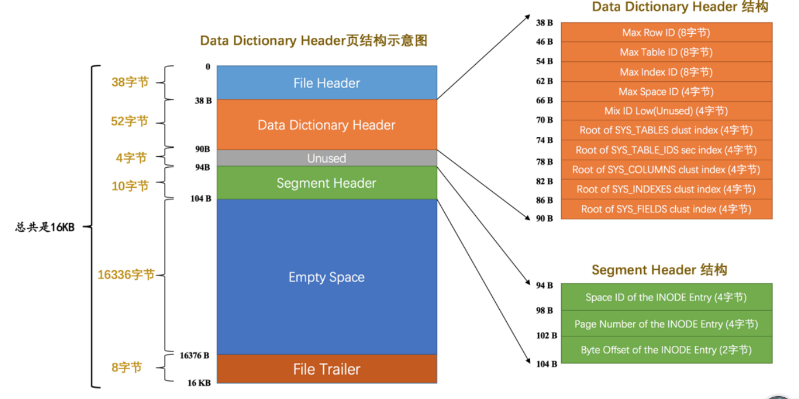

| 名称                   | 中文名           | 占用空间大小 | 简单描述                                                     |
| ---------------------- | ---------------- | ------------ | ------------------------------------------------------------ |
| File Header            | 文件头部         | 38 字节      | 页的一些通用信息                                             |
| Data Dictionary Header | 数据字典头部信息 | 56 字节      | 记录一些基本系统表的根页面位置以及InnoDB存储引擎的一些全局信息 |
| Segment Header         | 段头部信息       | 10 字节      | 记录本页面所在段对应的INODE Entry位置信息                    |
| Empty Space            | 尚未使用空间     | 16272 字节   | 用于页结构的填充，没啥实际意义                               |
| File Trailer           | 文件尾部         | 8 字节       | 校验页是否完整                                               |


## information_schema系统数据库

​		在`information_schema`数据库中的以`INNODB_SYS`开头的表并不是真正的内部系统表，而是在存储引擎启动时读取以`SYS`开头的系统表，然后填充到这些以

`INNODB_SYS`开头的表中。以`INNODB_SYS`开头的表和以`SYS`开头的表中的字段并不完全一样。

