## 	数据（data）

​		数据是数据库中存储的基本对象。数据的种类很多，例如：文本、图形、图像、音频、视频等，这些都是数

据。

​		定义：描述事务的符号记录称为数据。

​		数据的表现形式还不能完全表达其内容，需要经过解释，数据和关于数据的解释是不可分的。数据的解释是

指对数据含义的说明，数据的含义称为数据的语义，数据与其语义是不可分的。

​		计算机将实体的表示其特征的信息组织在一起，构成一个记录，记录是计算机中表示和存储数据的一种格式

或一种方法。

## 数据库(DB)

​		数据库：长期储存在计算机内、有组织、可共享的大量数据的集合。

​		数据库中的数据按一定的数据模型组织、描述和存储，具有较小的冗余度，较高的数据独立性和易扩展性，

并可为各种用户共享。

​		特点：永久存储，有组织和可共享

## 数据库管理系统（DBMS）

​		数据库管理系统是位于用户与操作系统之间的一层数据管理软件。数据库管理系统和操作系统一样是计算机

的基础软件，也是一个大型复杂的软件系统

​		主要功能：

### 			1、数据定义

​							数据库管理系统提供定义语言，用户通过它可以方便地对数据库中的数据对象的组成与结构进

​					行定义。

### 			2、数据组织、存储和管理

​							数据库管理系统要分类组织、存储和管理各种数据，包括数据字典、用户数据、数据的存取路径

​					等。要确定以何种文件结构和存取方式在存储级上组织这些数据，如何实现数据之间的联系。数据组

​					织和存储的基本目标是提供存储空间利用率和方便存取，提供多种存取方法来提供存取效率。		

### 			3、数据操纵功能	

​							数据库管理系统还提供数据操纵语言，用户可以使用它操纵数据，实现对数据库的基本操作，如

​					查询、插入、删除和修改等。

### 			4、数据库的事务管理和运行管理

​							数据库在建立、运用和维护时由数据库管理系统统一管理和控制，以保证事务的正确运行，保证

​					数据的安全性、完整性、多用户对数据的并发使用及发生故障后的系统恢复。

### 			5、数据库的建立和维护功能

​							数据库的建立和维护功能包括数据库初始数据的输入、转换功能，数据库的转储、恢复功能，数

​					据库的重组织功能和性能监视、分析功能等。这些功能通常是由一些实用程序或管理工具完成的。

### 			6、其他功能

​							其他功能包括数据库管理系统与网络中其他软件系统的通信功能，一个数据库管理系统与另一个

​					数据库管理系统或文件系统的数据转换功能，异构数据库之间的互访和互操作功能等。

## 数据库系统（DBS ）

​		数据库系统是由数据库、数据库管理系统（及其应用开发工具）、应用程序和数据库管理员（DBA）组成的

存储、管理、处理和维护数据的系统。应当指出的是，数据库的建立、使用和维护等工作只靠一个数据库管理系统

远远不够，还要有专门的人员来完成，这些人被称为数据库管理员。


​		数据库提供数据的存储功能，数据库管理系统提供数据的组织、存取、管理和维护等基础功能，数据库应用

系统根据应用需求使用数据库，数据库管理员负责全面管理数据库系统。


## 数据技术的管理阶段

​		数据管理是指对数据进行分类、组织、编码、存储、检索和维护，它是数据处理的中心问题。

​		数据的处理是指对各种数据进行收集、存储、加工和传播的一系列活动的总和。

### 人工管理阶段

​		特点：

​				1、数据不保存

​						由于当时计算机主要用于科学计算，一般不需要将数据长期保存，只是在计算某一-课

​				题时将数据输入，用完就撤走。不仅对用户数据如此处置，对系统软件有时也是这样。.


​				2、应用程序管理数据

​						数据需要由应用程序自己设计、说明(定义)和管理，没有相应的软件系统负责数据的管理工作。应用

​				程序中不仅要规定数据的逻辑结构，而且要设计物理结构，包括存储结构、存取方法、输入方式等。因

​				此程序员负担很重。


​				3、数据不共享

​						数据是面向应用程序的，一组数据只能对应一一个程序。 当多个应用程序涉及某些相同的数据时必

​				须各自定义，无法互相利用、互相参照，因此程序与程序之间有大量的冗余数据。


​				4、数据不具有独立性

​						数据的逻辑结构或物理结构发生变化后，必须对应用程序做相应的修改，数据完全依赖于应用程

​				序，称之为数据缺乏独立性，这就加重了程序员的负担。


### 文件系统阶段

​		特点：

​			1、数据可以长期保存

​					由于计算机大量用于数据处理，数据需要长期保留在外存上反复进行查询、修改、插入和删除等操

​			作。


​			2、由文件系统管理数据

​					由专门的软件即文件系统进行数据管理，文件系统把数据组织成相互独立的数据文件，利用“按文件名

​			访问，按记录进行存取”的管理技术，提供了对文件进行打开与关闭、对记录读取和写入等存取方式。文件

​			系统实现了记录内的结构性。


​		文件系统的缺点:

​			1、数据共享性差，冗余度大

​					在文件系统中，一个（或一组）文件基本上对应于一个应用程序，即文件仍然是面向应用的。当不同

​			的应用程序具有部分相同的数据时，也必须建立各自的文件，而不能共享相同的数据，因此数据的冗余度

​			大，浪费存储空间。同时由于相同数据的重复存储、各自管理，，容易造成数据的不一致性，给数据的修

​			改和维护带来了困难。


​			2、数据独立性差

​					文件系统中的文件是为某一特定应用服务的，文件的逻辑结构是针对具体的应用来设计和优化的，因

​			此要想对文件中的数据再增加一些新的应用会很困难。而且，当数据的逻辑结构改变时，应用程序中文

​			件结构的定义必须修改，应用程序中对数据的使用也要改变，因此数据依赖于应用程序，缺乏独立性。可

​			见，文件系统仍然是一一个不具有弹性的无整体结构的数据集合，即文件之间是孤立的，不能反映现实世

​			界事物之间的内在联系。


### 数据库系统阶段

​		特点：

​				1、数据结构化

​						数据库系统实现整体数据的结构化，这是数据库的主要特征之一，也是数据库系统与文件系统的本

​				质区别。

​						所谓**整体结构化**是指数据库中的数据不再仅仅针对某一个应用，而是面向整个组织或企业；不仅数

​				据内部是结构化的，而且整体是结构化的，数据之间是具有联系的。也就是说，不仅要考虑某个应用的

​				数据结构，还要考虑整个组织的数据结构。

​						在数据库系统中，不仅数据是整体结构化的，而且存取数据的方式也很灵活，可以存取数据库中的

​				某一一个或一组数据项、一-个记录或一-组记录:而在文件系统中，数据的存取单位是记录，粒度不能细

​				到数据项。


​				2、数据的共享性高、冗余度低且易扩充

​						数据库系统从整体角度看待和描述数据，数据不再面向某个应用而是面向整个系统，因此数据可以

​				被多个用户、多个应用共享使用。数据共享可以大大减少数据冗余，节约存储空间。数据共享还能够避

​				免数据之间的不相容性与不一致性。

​						所谓**数据的不一致性**是指同一数据不同副本的值不一样。采用人工管理或文件系统管理时，由于数

​				据被重复存储，当不同的应用使用和修改不同的副本时就很容易造成数据的不一致。在数据库中数据共

​				享减少了由于数据冗余造成的不一-致现象。


​				3、数据独立性高

​						数据独立性是借助数据库管理数据的一一个显著优点，它已成为数据库领域中一一个常用术语和重

​				要概念，包括数据的物理独立性和逻辑独立性。

​						物理独立性是指用户的应用程序与数据库中数据的物理存储是相互独立的。也就是说，数据在数据

​				库中怎样存储是由数据库管理系统管理的，用户程序不需要了解，应用程序要处理的只是数据的逻辑结

​				构，这样当数据的物理存储改变时应用程序不用改变。

​						逻辑独立性是指用户的应用程序与数据库的逻辑结构是相互独立的。也就是说，数据的逻辑结构改

​				变时用户程序也可以不变。

​						数据独立性是由数据库管理系统提供的二级映像功能来保证的。


​				4、数据由数据库管理系统统一管理和控制

​						数据库的共享将会带来数据库的安全隐患，而数据库的共享是并发的共享，即多个用户可以同时存

​				取数据库中的数据，甚至可以同时存取数据库中同一个数据，这又会带来不同用户间相互干扰的隐患。

​				另外，数据库中数据的正确与一致也必须得到保障。为此，数据库管理系统还必须提供以下几方面的数

​				据控制功能。

​						(1)、数据的安全性保护

​								数据的安全性是指保护数据以防止不合法使用造成的数据泄密和破坏。每个用户只能按规

​						定对某些数据以某些方式进行使用和处理。


​						(2)、数据的完整性检查

​								数据的完整性指数据的正确性、有效性和相容性。完整性检查将数据控制在有效的范围内，并

​						保证数据之间满足一定的关系。


​						(3)、并发控制

​								当多个用户的并发进程同时存取、修改数据库时，可能会发生相互干扰而得到错误的结果或使

​						得数据库的完整性遭到破坏，因此必须对多用户的并发操作加以控制和协调。


​						(4)、数据库恢复

​								计算机系统的硬件故障、软件故障、操作员的失误以及故意破坏也会影响数据库中数据的正确

​						性，甚至造成数据库部分或全部数据的丢失。数据库管理系统必须具有将数据库从错误状态恢复到

​						某一已知的正确状态(亦称为完整状态或一致状态) 的功能，这就是数

​						据库的恢复功能。


## 数据模型

​		模型是对现实世界中某个对象特征的模拟和抽象。

​		数据模型也是一种模型，它是对现实世界数据特征的抽象。也就是说数据模型是用来描述数据、组织数据和

对数据进行操作的。

​		三方面要求:

​				一、是能比较真实地模拟现实世界。

​				二、是容易为人所理解。

​				三、是便于在计算机上实现。

​		概念模型：第一类概念模型。也称信息模型，它是按用户的观点来对数据和信息建模，主要用于数据库设计。

​		逻辑模型主要包括层次模型、网状模型、关系模型、面向对象数据模型和对象关系数据模型、半结构化数据

模型等。它是按计算机系统的观点对数据建模，主要用于数据库管理系统的实现。

​		物理模型是对数据最底层的抽象，它描述数据在系统内部的表示方式和存取方法，或在磁盘或磁带上的存储

方式和存取方法，是面向计算机系统的。物理模型的具体实现是数据库管理系统的任务，数据库设计人员要了解和

选择物理模型，最终用户则不必考虑物理级的细节。


​		为了把现实世界中的具体事物抽象、组织为某一数据库管理系统支持的数据模型，人们常常首先将现实世界

抽象为信息世界，然后将信息世界转换为机器世界。也就是说，首先把现实世界中的客观对象抽象为某一种信 息

结构，这种信息结构并不依赖于具体的计算机系统，不是某一个数据库管理系统支持的数据模型，而是概念级的模

型；然后再把概念模型转换为计算机上某一数据库管理系统支持的数据模型。


### 概念模型

​		实体：客观存在并可相互区别的事物称为实体。实体可以是具体的人、事、物，也可以是抽象的概念或联系。

​		属性：实体所具有的某一特性称为属性。一个实体可以由若干个属性来刻画。

​		码：唯一标识实体的属性集称为码。

​		实体型：具有相同属性的实体必然具有共同的特征和性质。用实体名及其属性名集合来抽象和刻画同类实

体，称为实体型。

​		实体集：同一类型实体的集合称为实体集。

​		联系：在现实世界中，事物内部以及事物之间是有联系的，这些联系在信息世界中反映为实体(型)内部的联系

和实体(型)之间的联系。实体内部的联系通常是指组成实体的各属性之间的联系，实体之间的联系通常是指不同实

体集之间的联系。


​		实体之间的联系有一对一、一对 多和多对多等多种类型。

​				一对一：如果对于实体集A中的每一个实体，实体集B中至多有一个(也可以没有)实体与之联系，反之亦

​		然，则称实体集A与实体集B具有一对一联系。

​				一对多：如果对于实体集A中的每一个实体，实体集B中有n个实体(n≥0)与之联系，反之，对于实体集B

​		中的每一一个实体，实体集A中至多只有一个实体与之联系，则称实体集A与实体集B有一对多联系。

​				多对多：如果对于实体集A中的每一个实体，实体集B中有n个实体(n≥0)与之联系，反之，对于实体集B

​		中的每-一个实体，实体集A中也有m个实体(m≥0)与之联系，则称实体集A与实体集B具有多对多联系。

​		

​		表示方法：实体——联系方法

​				概念模型是对信息世界建模，所以概念模型应该能够方便、准确地表示出上述信息世界中的常用概念。

概念模型的表示方法很多，其中最为常用的是实体——联系方法。该方法用 E-R 图来描述现实世界的概念模型，E-

R方法也称为E-R模型。


### 组成要素

​		一般地讲， 数据模型是严格定义的一组概念的集合。 这些概念精确地描述了系统的静态特性、动态特性和完

整性约束条件。

​		三部分：

​				1、数据结构

​						数据结构描述数据库的组成对象以及对象之间的联系。也就是说，数据结构描述的内容有两类：一

​				类是与对象的类型、内容、性质有关的。一类是与数据之间联系有关的对象，如网状模型中的系型。

​						数据结构是刻画一个数据模型性质最重要的方面。因此在数据库系统中，人们通常按照其数据结构

​				的类型来命名数据模型。

​						总之，数据结构是所描述的对象类型的集合，是对系统静态特性的描述。

​				2、数据操作

​						数据操作是指对数据库中各种对象(型)的实例(值)允许执行的操作的集合，包括操作及有关的操作规

​				则。

​						数据库主要有查询和更新(包括插入、删除、修改)两大类操作。数据模型必须定义这些操作的确切含

​				义、操作符号、操作规则(如优先级)以及实现操作的语言。

​				3、数据的完整性约束条件

​						数据的完整性约束条件是一组完整性规则。完整性规则是给定的数据模型中数据及其联系所具有的

​				制约和依存规则，用以限定符合数据模型的数据库状态以及状态的变化，以保证数据的正确、有效和相

​				容。

​						数据模型应该反映和规定其必须遵守的基本的和通用的完整性约束条件。

​						此外，数据模型还应该提供定义完整性约束条件的机制，以反映具体应用所涉及的数据必须遵守的

​				特定的语义约束条件。

### 常用数据模型

​		主要逻辑数据模型：

​				1、层次模型。

​				2、网状模型。

​				3、关系模型。

​				4、面向对象数据模型。

​				5、对象关系数据模型

​				6、半结构化数据模型

### 层次模型

​		层次模型是数据库系统中最早出现的数据模型，层次数据库系统采用层次模型作为数据的组织方式。

​		层次模型用树形结构来表示各类实体以及实体间的联系。现实世界中许多实体之间的联系本来就呈现出一种

很自然的层次关系。

#### 数据结构

​		在数据库中定义满足下面两个条件的基本层次联系的集合为层次模型：

​				1、有且只有一个结点没有双亲结点，这个结点称为根结点。

​				2、根以外的其他结点有且只有一个双亲结点。

​		在层次模型中，每个结点表示一个记录 类型，记录类型之间的联系用结点之间的连线(有向边)表示，这种联系

是父子之间的一对多的联系。这就使得层次数据库系统只能处理一对 多的实体联系。

​		每个记录类型可包含若干个字段，这里记录类型描述的是实体，字段描述实体的属性。各个记录类型及其字

段都必须命名。各个记录类型、同一记录类型中各个字段不能同名。每个记录类型可以定义一个排序字段，也称为

码字段，如果定义该排序字段的值是唯一的，则它能唯一地标识-一个记录值。

​		在层次模型中，同一双亲的子女结点称为兄弟结点，没有子女结点的结点称为叶结点。


​		基本特点：任何一一个给定的记录值只能按其层次路径查看，没有-一个子女记录值能够脱离双亲记录值而独

立存在。

#### 数据操纵与完整性约束

​		层次模型的数据 操纵主要有查询、插入、删除和更新。 进行插入、删除、更新操作时要满足层次模型的完整

性约束条件。

​		进行插入操作时，如果没有相应的双亲结点值就不能插入它的子女结点值。

​		进行删除操作时，如果删除双亲结点值，则相应的子女结点值也将被同时删除。

#### 优缺点

​		优点：
​				1、层次模型的数据结构比较简单清晰。

​				2、层次数据库的查询效率高。因为层次模型中记录之间的联系用有向边表示，这种联系在DBMS中常常

​		用指针来实现。因此这种联系也就是记录之间的存取路径。当要存取某个结点的记录值，DBMS就沿着这-~条

​		路径很快找到该记录值，所以层次数据库的性能优于关系数据库，不低于网状数据库。

​				3、层次数据模型提供了良好的完整性支持。

​		缺点：
​				1、现实世界中很多联系是非层次性的，如结点之间具有多对多联系，不适合用层次模型表示。

​				2、 如果一个结点具有多个双亲结点等，用层次模型表示这类联系就很笨拙，只能通过引入冗余数据(易

​		产生不一致性)或创建非自然的数据结构(引入虚拟结点)来解决。对插入和删除操作的限制比较多，因此应用程

​		序的编写比较复杂。

​				3、查询子女结点必须通过双亲结点。

​				4、由于结构严密，层次命令趋于程序化。

### 网状模型

​		网状数据库系统采用网状模型作为数据的组织方式。

#### 数据结构

​		在数据库中，把满足以下两个条件的基本层次联系集合称为网状模型：

​				1、允许一个以上的结点无双亲。

​				2、一个结点可以有多于一个的双亲。

​		与层次模型一样，网状模型中每个结点表示一个记录类型(实体)，每个记录类型可包含若干个字段(实体的属

性)，结点间的连线表示记录类型(实体)之间一对多的父子联系。

​		从定义可以看出，层次模型中子女结点与双亲结点的联系是唯一的， 而在网状模型中这种联系可以不唯一。

因此要为每个联系命名，并指出与该联系有关的双亲记录和子女记录。


#### 数据操作与完整性约束

​		网状模型一般来说没有层次模型那样严格的完整性约束条件，但具体的网状数据库系统对数据操纵都加了一

些限制，提供了一定的完整性约束。
​		主要有:

​				1、支持记录码的概念，码即唯。标识记录的数据项的集合。

​				2、保证一个联系中双亲记录和子女记录之间是一对多的联系。

​				3、可以支持双亲记录和子女记录之间的某些约束条件。

#### 优缺点

​		优点：

​				1、能够更为直接地描述现实世界，如一个结点可以有多个双亲，结点之间可以有多种联系。

​				2、具有良好的性能，存取效率较高。

​		缺点：

​				1、结构比较复杂，而且随着应用环境的扩大，数据库的结构就变得越来越复杂，不利于最终用户掌握。

​				2、网状模型的DDL、DML复杂，并且要嵌入某一种高级语言(如COBOL、C)中。用户不容易掌握，不容

​		易使用。
​				3、由于记录之间的联系是通过存取路径实现的，应用程序在访问数据时必须选择适当的存取路径，因此

​		用户必须了解系统结构的细节，加重了编写应用程序的负担。


### 关系模型

#### 数据结构

​		关系模型与以往的模型不同，它是建立在严格的数学概念的基础上的。关系模型由一组关系组成。每个关系

的数据结构是一-张规范化的二维表。


#### 术语

​		关系： 一个关系对应通常说的一张表。

​		元组：表中的一行即为一个元组。

​		属性：表中的一列即为一个属性，给每一-个属性起一个名称即属性名。

​		码：也称为码键。表中的某个属性组，它可以唯一确定一个元组。

​		域：域是一组具有相同数据类型的值的集合。属性的取值范围来自某个域。

​		分量：元组中的一个属性值。

​		关系模式：对关系的描述，一.般表示为：关系名(属性1，属性2， .... ，属性n)。

​		关系模型要求关系必须是规范化的，即要求关系必须满足一定的规范条件， 这些规范条件中最基本的一条就

是，关系的每一个分 量必须是一个不可分的数据项，也就是说，不允许表中还有表。


#### 数据操作与完整性约束

​		关系模型的数据操纵主要包括查询、插入、删除和更新数据。这些操作必须满足关系的完整性约束条件。关

系的完整性约束条件包括三大类：**实体完整性、参照完整性和用户定义的完整性**。

#### 优缺点

​		优点：
​				1、关系模型与格式化模型不同，它是建立在严格的数学概念的基础上的。

​				2、关系模型的概念单一。无论实体还是实体之间的联系都用关系来表示。对数据的检索和更新结果也是

​		关系(即表)。所以其数据结构简单、清晰，用户易懂易用。

​				3、关系模型的存取路径对用户透明，从而具有更高的数据独立性、更好的安全保密性，也简化了程序员

​		的工作和数据库开发建立的工作。

​		缺点：

​				由于存取路径对用户是隐蔽的，查询效率往往不如格式化数据模型（层次，网状）。为了提高性能，数

​		据库管理系统必须对用户的查询请求进行优化，因此增加了开发数据库管理系统的难度。不过用户不必考虑

​		这些系统内部的优化技术细节。


## 数据库系统的结构

### 数据库系统模式

​		在数据模型中有 ”型” 和 “值" 的概念。型是指对某一类数据的结构和属性的说明，值是型的一个具体赋值。

​		模式是数据库中全体数据的逻辑结构和特征的描述，它仅仅涉及型的描述，不涉及具体的值。模式的一个具

体值称为模式的一一个实例。同一个模式可以有很多实例。

​		模式是相对稳定的，而实例是相对变动的，因为数据库中的数据是在不断更新的。模式反映的是数据的结构

及其联系，而实例反映的是数据库某一时刻的状态。

​		虽然实际的数据库管理系统产品种类很多，它们支持不同的数据模型，使用不同的数据库语言，建立在不同

的操作系统之上，数据的存储结构也各不相同，但它们在体系结构上通常都具有相同的特征，即采用三级模式结构

(早期微机上的小型数据库系统除外)并提供两级映像功能。

### 三级模式结构

​		

数据库系统的三级模式结构是指数据库系统是由外模式、模式和内模式三级构成。


​		1、模式

​				模式也称逻辑模式，是数据库中全体数据的逻辑结构和特征的描述，是所有用户的公共数据视图。它是

​		数据库系统模式结构的中间层，既不涉及数据的物理存储细节和硬件环境，又与具体的应用程序、所使用的

​		应用开发工具及高级程序设计语言无关。

​				模式实际上是数据库数据在逻辑级上的视图。一个数据库只有一个模式。数据库模式以某一种数据模型

​		为基础，统一综合地考虑了所有用户的需求，并将这些需求有机地结合成一个逻辑整体。定义模式时不仅要

​		定义数据的逻辑结构，例如数据记录由哪些数据项构成，数据项的名字、类型、取值范围等;而且要定义数据

​		之间的联系，定义与数据有关的安全性、完整性要求。

​		2、外模式

​				外模式也称子模式或用户模式，它是数据库用户(包括应用程序员和最终用户)能够看见和使用的局部数

​		据的逻辑结构和特征的描述，是数据库用户的数据视图，是与某一应用有关的数据的逻辑表示。

​				外模式通常是模式的子集。一个数据库可以有多个外模式。由于它是各个用户的数据视图，如果不同的

​		用户在应用需求、看待数据的方式、对数据保密的要求等方面存在差异，则其外模式描述就是不同的。即使

​		对模式中同一数据，在外模式中的结构、类型、长度、保密级别等都可以不同。另一方面，同一外模式也可

​		以为某一用户的多个应用系统所使用，但一个应用程序只能使用一个外模式。

​				外模式是保证数据库安全性的一个有力措施。每个用户只能看见和访问所对应的外模式中的数据，数据

​		库中的其余数据是不可见的。

​		3、内模式

​				内模式也称存储模式，一个 数据库只有一 一个内模式。它是数据物理结构和存储方式的描述，是数据在

​		数据库内部的组织方式。

### 二级映像功能与数据独立性

​		数据库系统的三级模式是数据的三个抽象级别，它把数据的具体组织留给数据库管理系统管理，使用户能逻

辑地、抽象地处理数据，而不必关心数据在计算机中的具体表示方式与存储方式。为了能够在系统内部实现这三个

抽象层次的联系和转换，数据库管理系统在这三级模式之间提供了两层映像：**外模式/模式映像**和**模式/内模式**映、

像。
​		正是这两层映像保证了数据库系统中的数据能够具有较高的**逻辑独立性和物理独立性**。

#### 外模式/模式映像

​		模式描述的是数据的全局逻辑结构，外模式描述的是数据的局部逻辑结构。对应于同一个模式可以有任意多

个外模式。对于每-个外模式，数据库系统都有一个外模式/模式映像，它定义了该外模式与模式之间的对应关系。

这些映像定义通常包含在各自外模式的描述中。

​		当模式改变时( 例如增加新的关系、新的属性、改变属性的数据类型等)，由数据库管理员对各个外模式/模式

的映像作相应改变，可以使外模式保持不变。应用程序是依据数据的外模式编写的，从而应用程序不必修改，保证

了数据与程序的逻辑独立性，简称**数据的逻辑独立性**。

#### 模式/内模式映像

​		数据库中只有一个模式，也只有一个内模式，所以模式/内模式映像是唯一的，它定义了数据全局逻辑结构与

存储结构之间的对应关系。该映像定义通常包含在模式描述中。当数据库的存储结构改变时(例如选用了另一种存

储结构)，由数据库管理员对模式/内模式映像作相应改变，可以使模式保持不变，从而应用程序也不必改变。保证

了数据与程序的物理独立性，简称**数据的物理独立性**。


​		在数据库的三级模式结构中，数据库模式即全局逻辑结构是数据库的中心与关键，它独立于数据库的其他层

次。因此设计数据库模式结构时应首先确定数据库的逻辑模式。

​		数据库的内模式依赖于它的全局逻辑结构，但独立于数据库的用户视图，即外模式，也独立于具体的存储设

备。它是将全局逻辑结构中所定义的数据结构及其联系按照一定的物理存储策略进行组织，以达到较好的时间与空

间效率。

​		数据库的外模式面向具体的应用程序，它定义在逻辑模式之上，但独立于存储模式和存储设备。当应用需求

发生较大变化，相应的外模式不能满足其视图要求时，该外模式就得做相应改动，所以设计外模式时应充分考虑到

应用的扩充性。

​		数据与程序之间的独立性使得数据的定义和描述可以从应用程序中分离出去。另外，由于数据的存取由数据

库管理系统管理，从而简化了应用程序的编制，大大减少了应用程序的维护和修改。

# 关系数据库

## 关系数据结构及形式化定义

### 关系

​		关系模型的数据结构非常简单，只包含单一的数据结构一关系。 在用户看来，关系模型中数据的逻辑结构是

一张扁平的二维表。

​		关系模型的数据结构虽然简单却能够表达丰富的语义，描述出现实世界的实体以及实体间的各种联系。也就

是说，在关系模型中，现实世界的实体以及实体间的各种联系均用单一-的结构类型，即关系来表示。

#### 域

​		域：一组具有相同数据类型的值的集合。

#### 笛卡尔积

​		给定一 组域D1，D2，... ，Dn，允许其中某些域是相同的，D1，D2，... ，Dn的笛卡儿积为：


​		其中，每一个元素（d1，d2，... ，dn）叫作一个n元组，或简称元组。 元素中的每一个值 di；叫做一个分、

量。
		一个域允许的不同取值个数称为这个域的基数。


#### 关系

​		D1 x D2 x ... x Dn 的子集叫做在域D1，D2，... ，Dn上的关系，表示为R(D1，D2，... ， Dn)。这里R表示

关系的名字，n是关系的目或度。

​		关系中的每个元素是关系中的元组，通常用 t 表示。

​				当n=1时，称该关系为单元关系，或一元关系。

​				当n=2时，称该关系为二元关系。

​		关系是笛卡儿积的有限子集，所以关系也是一张二维表，表的每行对应一个元组，表的每列对应一个域。由

于域可以相同，为了加以区分，必须对每列起一个名字，称为属性。n目关系必有n个属性。

​		若关系中的某一属性组的值能唯地标识-一个元组，而其子集不能，则称该属性组为候选码。

​		若一个关系有多个候选码，则选定其中-一个为主码。

​		候选码的诸属性称为主属性。不包含在任何候选码中的属性称为非主属性或非码属性。

​		在最简单的情况下，候选码只包含一个属性。在最极端的情况下，关系模式的所有属性是这个关系模式的候

选码，称为全码。

​		关系可以有三种类型：

​				基本表：实际存在的表，它是实际存储数据的逻辑表示。

​				查询表：查询结果对应的表。

​				视图表：由基本表或其他视图表导出的表，是虚表，不对应实际存储的数据。

​		基本关系具有的性质：

​				1、列是同质的，即每一列中的分量是同一类型的数据，来自同一个域。

​				2、不同的列可出自同一个域，称其中的每一列为一个属性，不同的属性要给予不同的属性名。

​				3、列的顺序无所谓，即列的次序可以任意交换。由于列顺序是无关紧要的，因此在许多实际关系数据库

​		产品中增加新属性时，永远是插至最后一列。

​				4、任意两个元组的候选码不能取相同的值。

​				5、行的顺序无所谓，即行的次序可以任意交换。

​				6、分量必须取原子值，即每一一个 分量都必须是不可分的数据项。

### 关系模式

​		关系是元组的集合，因此关系模式必须指出这个元组集合的结构，即它由哪些属性构成，这些属性来自哪些

域，以及属性与域之间的映像关系。

​		关系模式描述：


​		R 为关系名，U为组成该关系的属性名集合，D为U中属性所来自的域，DOM为属性向域的映像集合，F为属

性间数据的依赖关系集合。

## 关系操作

​		关系模型中常用的关系操作包括查询操作和插入、 删除、修改(update) 操作两大部分。

​		关系的查询表达能力很强，是关系操作中最主要的部分。查询操作又可以分为选择、投影、连接、除、并、

差、交、笛卡儿积等。其中选择、投影、并、差、笛卡儿积是5种基本操作，其他操作可以用基本操作来定义和导

出。

## 关系的完整性

### 实体完整性

​		关系数据库中每个元组应该是可区分的，是唯一的。这样的约束条件用实体完整性来保证。

​		实体完整性：若属性 (指一个或一组属性) A是基本关系 R的主属性，则A不能取空值(null value)。所谓空值就

是“不知道”或“不存在”或“无意义”的值。

​		按照实体完整性规则的规定，如果主码由若干属性组成，则所有这些主属性都不能取空值。

​		说明：

​				1、实体完整性规则是针对基本关系而言的。一个基本表通常对应现实世界的一-个实体集。

​				2、现实世界中的实体是可区分的，即它们具有某种唯一性标识。

​				3、相应地，关系模型中以主码作为唯一性标识。

​				4、主码中的属性即主属性不能取空值。如果主属性取空值， 就说明存在某个不可标识的实体，即存在不

​		可区分的实体，这与第(2)点相矛盾，因此这个规则称为实体完整性。

### 参照完整性

​		设 F 是基本关系 R 的一个或一组属性，但不是关系 R 的码，Ks 是基本关系 S 的主码。如果 F 与 Ks 相对应，

则称 F 是 R 的外码，并称基本关系 R 为参照关系，基本关系 S 为被参照关系或目标关系。

​		显然，目标关系 S 的主码 Ks 和参照关系 R 的外码 F 必须定义在同一个（或同一组）域上。

​		参照完整性：若属性（或属性组） F 是基本关系 R 的外码，它与基本关系 S 的主码 Ks 相对应（基本关系 R 

和 S 不一定是不同的关系），则对于 R 中每个元组在 F 的值必须：

​				1、或者取空值（F 的每个属性均为空值）。

​				2、或者等于 S 中某个元组的主码值。

### 用户定义的完整性

​		用户定义的完整性：针对某一个具体关系数据库的约束条件，它反映某一具体应用所设计的数据必须满足的

语义要求。

## 关系代数

​		关系代数的运算对象是关系，运算结果也是关系。关系代数用到的运算符包含两类：集合运算符和专门的关

系运算符。


​		传统的集合运算符将关系看成元组的集合，其运算是从关系的“水平”方向，即行的角度来进行；而专门的关系

运算不仅涉及行，而且设计列。比较运算符和逻辑运算符是用来辅助专门的关系运算符进行操作的。

### 传统的集合运算


### 专门的关系运算

​		选择：在一个关系的所有元组中选出符合条件的元组。选择操作是从行的角度进行的运算。

​		投影：从一个关系中选择出若干属性组成新的关系。投影操作是从列的角度进行的运算。

​		连接：从两个关系的笛卡尔积中选取属性间满足一定条件的元组。

#### 等值连接

​		等值连接：从两个关系的笛卡尔积中选择两个关系对应的某些属性值相等的那些元组。

​		自然连接：特殊的等值连接。要求两个关系中进行比较的分量必须是同名的属性组，并且在结果中把重复的

属性列去掉。


​		两个关系在做自然连接时，选择两个关系在公共属性上值相等的元组构成新的关系，此时，两个关系中都可

能存在在另一个关系的公共属性上找不到相等的值得元组，这些元组在操作时被舍弃，这些被舍弃的元组称为悬浮

元组。

​		如果把悬浮元组也保存在结果中，而在其他属性上填空值，那么这种连接叫外连接。

​		如果只保留左边关系中的悬浮元组叫左外连接。

​		如果只保留右边关系中的悬浮元组叫右外连接。


​		除运算：关系 R 除以关系 S 的结果为关系 T ，则 T 包含所有在 R 但不在 S 中的属性及其值，并且 T 的元组与 S 的元组的所有组合都在 R 中。


# 关系数据库标准语言SQL

​		结构化查询语言是关系数据库的标准语言，也是一个通用的、功能极强的关系数据库语言。其功能不仅仅是

查询，而是包括数据库模式创建、数据库数据的插入与修改、数据库安全性完整性定义与控制等一系列功能。

​		SQL 之所以能够为用户和业界所接受并成为国际标准，是因为它是一个综合的、功能极强同时又简洁易学

的语言。SQL集数据查询、数据操纵、数据定义和数据控制功能于一体。

​		特点：

​				1、综合统一。

​						数据库系统的主要功能是通过数据库支持的数据语言来实现的。

​						SQL 集数据定义语言、数据操纵语言、数据控制语言的功能于一-体，语言风格统一，可以独立完成

​				数据库生命周期中的全部活动。

​								（1）定义和修改、删除关系模式，定义和删除视图，插入数据，建立数据库。

​								（2）对数据库中的数据进行查询和更新。

​								（3）数据库重构和维护。

​								（4）数据库安全性、 完整性控制，以及事务控制。

​								（5）嵌入式 SQL 和动态 SQL 定义。

​				2、高度非过程化

​						非关系数据模型的数据操纵语言是“面向过程”的语言，用“过程化”语言完成某项请求必须指定存取路

​				径。而用SQL进行数据操作时，只要提出“做什么”，而无须指明“怎么做”，因此无须了解存取路径。存取

​				路径的选择以及SQL的操作过程由系统自动完成。这不但大大减轻了用户负担，而且有利于提高数据独

​				立性。

​				3、面向集合的额操作方式

​						非关系数据模型采用的是面向记录的操作方式，操作对象是一条记录。而SQL采用集合操作方式，

​				不仅操作对象、查找结果可以是元组的集合，而且一次插入、删除、更新操作的对象也可以是元组的集

​				合。

​				4、以同一种语法结构提供多种使用方式

​						SQL 既是独立的语言，又是嵌入式语言。作为独立的语言，它能够独立地用于联机交互的使用方

​				式，用户可以在终端键盘上直接键入SQL命令对数据库进行操作;作为嵌入式语言，SQL语句能够嵌入到

​				高级语言程序中，供程序员设计程序时使用。而在两种不同的使用方式下，SQL 的语法结构基本上是一

​				致的。这种以统一的语法结构提供多种不同使用方式的做法，提供了极大的灵活性与方便性。

​				5、语言简洁、易学易用

### 数据定义

​		SQL 的数据定义功能包括模式定义、表定义、视图和索引的定义：

| 操作对象       | 创建          | 删除        | 修改        |
| -------------- | ------------- | ----------- | ----------- |
| 模式（数据库） | create schema | drop schema |             |
| 表             | create table  | drop table  | alter table |
| 视图           | create view   | drop view   |             |
| 索引           | create index  | drop index  | alter index |

​		SQL标准不提供修改模式定义和修改视图定义的操作。用户如果想修改这些对象，只能先将它们删除然后再重

建。

#### 模式的定义域删除

​		定义模式：

```sql
create schema <模式名> authorization <用户名>;
```

​		如果没有指定模式名，那么模式名隐含为用户名。

​		定义模式实际上定义了一个命名空间，在这个空间中可以进一步定义该模式所包含的数据库对象。

​		删除模式：

```sql
drop schema <模式名> <cascade | restrict>
```

​		其中 cascade 和 restrict 两者必选其一。选择了 cascade （级联），表示在删除模式的同时把该模式中所有

的数据库对象全部删除；选择了 restrict （限制），表示如果该模式中已经定义了下属的数据库对象(如表、视图

等)，则拒绝该删除语句的执行。只有当该模式中没有任何下属的对象时才能执行DROP SCHEMA语句。

#### 表的定义、删除与修改

​		创建了一个模式就建立了一个数据库的命名空间（对应 MSQL 中的一个数据库），一个框架。在这个空间中

首先要定义的是该模式包含的数据库基本表。

​		SQL语言定义基本表，其基本格式如下：

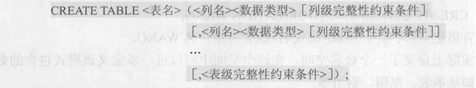

```sql
create table student
(
    sno int primary key,   	// 主码
    sname char(20) unique,	// 唯一性
    ssex char(2),
    sage smallint,
    sdept char(20)
);
```


​		建表的同时通常还可以定义与该表有关的完整性约束条件，这些完整性约束条件被存入系统的数据字典中，

当用户操作表中数据时由关系数据库管理系统自动检查该操作是否违背这些完整性约束条件。如果完整性约束条件

涉及该表的多个属性列，则必须定义在表级上，否则既可以定义在列级也可以定义在表级。

##### 数据类型

​		关系模型中一个很重要的概念是域。每一个属性来自一个域，它的取值必须是域中的值。在SQL中域的概念用

数据类型来实现。定义表的各个属性时需要指明其数据类型及长度。


​		每一个基本表都属于某一一个模式，一个模式包含多个基本表。当定义基本表时一般可以有三种方法定义它

所属的模式。

​				1、在表明中显示地给出模式名。

​				2、在创建模式语句中同时创建表。

​				3、设置所属的模式，这样在创建表时表明中不必给出模式名。

修改表：

​		SQL 语言修改表，格式为：


​		其中<表名>是要修改的基本表，ADD子句用于增加新列、新的列级完整性约束条件和新的表级完整性约束条

件。DROP COLUMN子句用于删除表中的列，如果指定了CASCADE短语，则自动删除引用了该列的其他对象。

DROP CONSTRAINT子句用于删除指定的完整性约束条件。ALTER COLUMN子句用于修改原有的列定义，包括修

改列名和数据类型。

删除表：

​		SQL 语言删除表，格式为：


​		若选择RESTRICT,则该表的删除是有限制条件的。欲删除的基本表不能被其他表的约束所引用（如CHECK,

 FOREIGN KEY等约束)，不能有视图，不能有触发器，不能有存储过程或函数等。如果存在这些依赖该表的对象，

则此表不能被删除。

​		若选择CASCADE，则该表的删除没有限制条件。在删除基本表的同时，相关的依赖对象，例如视图，都将被

一起删除。

#### 索引的建立与删除

​		当表的数据量比较大时，查询操作会比较耗时。建立索引是加快查询速度的有效手段。数据库索引类似于图

书后面的索引，能快速定位到需要查询的内容。用户可以根据应用环境的需要在基本表上建立一个或多个索引，以

提供多种存取路径，加快查找速度。

​		数据库索引有多种类型，常见索引包括顺序文件上的索引、B+树索引、散列索引、位图索引等。顺序文件上

的索引是针对按指定属性值升序或降序存储的关系，在该属性上建立一个顺序索引文件，索引文件由属性值和相应

的元组指针组成。B+树索引是将索引属性组织成B+树形式，B+树的叶结点为属性值和相应的元组指针。B+树索引

具有动态平衡的优点。散列索引是建立若干个桶，将索引属性按照其散列函数值映射到相应桶中，桶中存放索引属

性值和相应的元组指针。散列索引具有查找速度快的特点。位图索引是用位向量记录索引属性中可能出现的值，每

个位向量对应一- 个可能值。

建立索引：

​		SQL 语言建立索引，格式为：

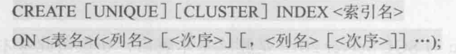

​		其中，<表名>是要建索引的基本表的名字。索引可以建立在该表的一.列或多列上，各列名之间用逗号分隔。

每个<列名>后面还可以用<次序>指定索引值的排列次序，可选ASC (升序)或DESC (降序)，默认值为ASC。

​		UNIQUE表明此索引的每个索引值只对应唯一的数据记录。

​		CLUSTER表示要建立的索引是聚簇索引。

删除索引：

​		对于已经建立的索引，如果需要对其重新命名：


删除索引：

​		SQL 语言删除索引，格式为：


### 数据字典

​		数据字典是关系数据库管理系统内部的一-组 系统表，它记录了数据库中所有的定义信息，包括关系模式定

义、视图定义、索引定义、完整性约束定义、各类用户对数据库的操作权限、统计信息等。关系数据库管理系统在

执行SQL的数据定义语句时，实际上就是在更新数据字典表中的相应信息。在进行查询优化和查询处理时，数据字

典中的信息是其重要依据。

### 数据查询

​		SQL提供了 select 语句进行数据查询：


​		整个 select 语句的含义是，根据 where 子句的条件表达式从 from 子句指定的基本表、视图或派生表中找出

满足条件的元组，再按SELECT子句中的目标列表达式选出元组中的属性值形成结果表。

​		如果有 group by 子句，则将结果按 <列名1> 的值进行分组，该属性列值相等的元组为一个组。通常会在每组

中作用聚集函数。如果GROUP BY子句带HAVING短语，则只有满足指定条件的组才予以输出。

​		如果有 order by 子句，则结果表还要按<列名2>的值的升序或降序排序。

​		select 语句既可以完成简单的单表查询，也可以完成复杂的连接查询和嵌套查询。

#### 单表查询

​		单表查询是指仅涉及一个表的查询。

##### 选择表中的若干列：

​		通过在 select 子句的<目标列表达式>中指定要查询的属性列。<目标列表达式>中各个列的先后顺序可以与表

中的顺序不一致。

选择表中的全部列：

​		将表中的所有属性列都选出来有两种方法：

​				1、在 select 关键字后列出所有列名。

​				2、如果列的显示顺序与其在基表中的顺序相同，也可以简单地将<目标列表达式>指定为*。

查询经过计算的值：

​		select 子句的<目标列表达式>不仅可以是表中的属性列，也可以是表达式。<目标列表达式>不仅可以是算术

表达式，还可以是字符串常量、函数等。

​		可以通过指定别名来改变查询结果的列标题，这对于含算术表达式、常量、函数名的目标列表达式尤为有

用。

##### 选择表中的若干元组

消除取值重复的行：

​		两个本来并不完全相同的元组在投影到指定的某些列上后，可能会变成相同的行。可以用 distinct 消除它

们。

```sql
select distinct ... from ...
```

查询满足条件的元组：

​		查询满足指定条件的元组可以通过 where 子句实现。where 子句常用的查询条件：


字符匹配：

​		谓词 like 可以用来进行字符串的匹配。语法格式：


​		其含义是查找指定的属性列值与<匹配串>相匹配的元组。<匹配串>可以是一个完整的字符串，也可以含有通

配符 % 和 _ 。 其中:

​				%（百分号）：代表任意长度(长度可以为0)的字符串。
​				_ （下横线）：代表任意单个字符。

​		如果用户要查询的字符串本身就含有通配符%或， 这时就要使用 escape '<换码字符>'短语对通配符进行转义

了。

多重条件查询

​		逻辑运算符 and 和 or 可用来连接多个查询条件。and 的优先级高于 or ，但可以用括号改变优先级。

##### 聚集函数

​		为了，增强检索功能，SQL提供了许多聚集函数：


​		当聚集函数遇到空值时，除 count( all )外，都跳过空值而只处理非空值。count ( all )是对元组进行计数，某

个元组的一个或部分列取空值不影响COUNT的统计结果。

​		where 子句中是不能用聚集函数作为条件表达式的。聚集函数只能用于 select 子句和 group by 中的 having

子句。

分组：

​		group by 子句将查询结果按某一列或多列的值分组，值相等的为一组。

​		对查询结果分组的目的是为了细化聚集函数的作用对象。如果未对查询结果分组，聚集函数将作用于整个查

询结果。

​		如果分组后还要求按一定的条件对这些组进行筛选，最终只输出满足指定条件的组，则可以使用 having 短语

指定筛选条件。

​		where 子句与 having 短语的区别在于作用对象不同。where 子句作用于基本表或视图，从中选择满足条件

的元组。having 短语作用于组，从中选择满足条件的组。

#### 连接查询

​		若一个查询同时涉及两个以上的表，则称之为连接查询。连接查询是关系数据库中最主要的查询，包括等值

连接查询、自然连接查询、非等值连接查询、自身连接查询、外连接查询和复合条件连接查询等。

##### 等值与非等值连接查询

​		连接查询的 where 子句中用来连接两个表的条件称为连接条件或连接谓词，其一般格式为：


​		其中比较运算符主要有=、>、<、>=、、<=、!= (或<>)等。

​		当连接运算符为 = 时，称为等值连接。使用其他运算符称为非等值连接。

​		连接谓词中的列名称为连接字段。连接条件中的各连接字段类型必须是可比的，但名字不必相同。

​		若在等值连接中把目标列中重复的属性列去掉则为自然连接。

#####  自身连接

​		连接操作不仅可以在两个表之间进行，也可以是一个表与其自己进行连接，称为表的自身连接。

##### 外连接

​		左外连接列出左边关系中所有的元组，右外连接列出右边关系中所有的元组。

#### 嵌套查询

​		在SQL语言中，一个 select - from - where 语句称为一个查询块。将一个查询块嵌套在另一个查询块的

where 子句或 having 短语的条件中的查询称为嵌套查询。

​		SQL语言允许多层嵌套查询，即一个子查询中还可以嵌套其他子查询。需要特别指出的是，子查询的 select 

语句中不能使用 order by 子句，order by 子句只能对最终查询结果排序。

​		子查询的查询条件不依赖于父查询，这类于查询称为不相关子查询。不相关子查询是较简单的一类子查询。

​		如果子查询的查询条件依赖于父查询，这类子查询称为相关子查询，整个查询语句称为相关嵌套查询语句。

​		带有比较运算符的子查询是指父查询与子查询之间用比较运算符进行连接。当确切知道内层查询返回的是单

个值时，可以用>、<、=、>=、<=、!=或< >等比较运算符。

​		子查询返回单值时可以用比较运算符，但返回多值时要用 any (有的系统用 some )或 all 谓词修饰符。而使用

any 或 all 谓词时则必须同时使用比较运算符。其语义如：

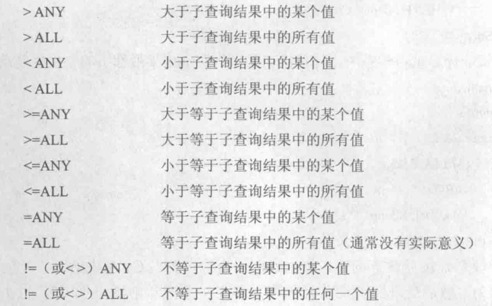


#### 集合查询

​		select 语句的查询结果是元组的集合，所以多个 select 语句的结果可进行集合操作。集合操作主要包括并操

作 union、交操作 intersect 和差操作 except。

​		子查询不仅可以出现在 where 子句中，还可以出现在 from 子句中，这时子查询生成的临时派生表成为主查

询的查询对象。

​		需要说明的是，通过 from 子句生成派生表时，as 关键字可以省略，但必须为派生关系指定一个别名。 而对

于基本表，别名是可选择项。

### 数据更新

​		更新操作有三种：

​				1、向表中添加若干行数据。

​				2、修改表中的数据。

​				3、删除表中的若干行数据。

#### 插入数据

​		SQL 的数据插入语句 insert 通常有两种形式，一种是插入一个元组， 另-种是插入子查询结果。后者可以一次

插入多个元组。

##### 插入元组

​		插入元组的 insert 语句的格式为：

```sql
 insert into <表名>[(属性列)] values(常量值)
```

​		其功能是将新元组插入指定表中。其中新元组的属性列1的值为常量1，属性列2的值为常量2，一次类推。

into 子句中没有出现的属性列，新元组在这些列上将取空值。但必须注意的是，在表定义时说明了 not null 的属

性列不能取空值，否则会出错。

​		如果 into 子句中没有指明任何属性列名，则新插入的元组必须在每个属性列上均有值。并且插入值得顺序与

属性的顺序一一对应。

##### 插入子查询结果

​		插入子查询结果的 insert 语句格式为


#### 修改数据

​		修改操作又称为更新操作，其语句的一般格式为：


​		其功能是修改指定表中满足 where 子句条件的元组。其中 set 子句给出<表达式>的值用于取代相应的属性列

值。如果省略 where 子句，则表示要修改表中的所有元组。

#### 删除数据

​		删除语句的一般格式为：

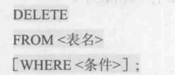

​		delete 语句的功能是从指定表中删除满足 where 子句条件的所有元组。如果省略 where 子句则表示删除表

中全部元组，但表的定义仍在字典中。也就是说，delete 语句删除的是表中的数据，而不是关于表的定义。

### 视图

​		视图是从一个或几个基本表（或视图）导出的表。它与基本表不同，是一个虚表。数据库中只存放视图的定

义，而不存放视图对应的数据，这些数据仍存放在原来的基本表中。所以一旦基本表中的数据发生变化，从视图中

查询出的数据也就随之改变了。

#### 建立视图

​		SQL语言用 create view 命令建立视图，其一般格式为：

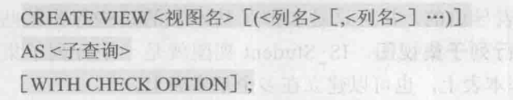

​		其中，子查询可以是任意的 select 语句，是否可以含有 order by 子句和 distinct 短语，则取决于具体系统的

实现。

​		with check option 表示对视图进行 update、insert 和 delete 操作时要保证更新、插入或删除的行满足视图

定义中的谓词条件（即子查询中的条件表达式）。

​		组成视图的属性列名或者全部省略或者全部指定，没有第三种选择。如果省略了视图的各个属性列名，则隐

含该视图由子查询中 select 子句目标列中的诸字段组成。

​		必须明确指定：

​				1、某个目标列不是单纯的属性名，而是聚集函数或列表达式。

​				2、多表连接时选出了几个同名列作为视图的字段。

​				3、需要在视图中为某个列启用新的更合适的名字。

​		若一个视图是从单个基本表导出的，并且只是去掉了基本表的某些行和某些列，但保留了主码，则称这类视

图为行列子集视图。

​		视图不仅可以建立在单个基本表上，也可以建立在多个基本表上。还可以建立在一个或多个已定义好的视图

上，或建立在基本表与视图上。

​		带有聚集函数和 group by 子句的查询来定义视图，这种视图称为分组视图。

#### 删除视图

​		语句的格式为：


​		视图删除后视图的定义将从数据字典中删除。如果该视图上还导出了其他视图，则使用 cascade 级联删除语

句把该视图和由它导出的所有视图起删除。

​		基本表删除后，由该基本表导出的所有视图均无法使用了，但是视图的定义没有从字典中清除。删除这些视

图定义需要显式地使用 drop view 语句。

#### 查询视图

​		关系数据库管理系统执行对视图的查询时，首先进行有效性检查，检查查询中涉及的表、视图等是否存在。

如果存在，则从数据字典中取出视图的定义，把定义中的子查询和用户的查询结合起来，转换成等价的对基本表的

查询，然后再执行修正了的查询。这一转换过程称为视图消解。

#### 更新视图

​		更新视图是指通过视图来插入、删除和修改数据。

​		由于视图是不实际存储数据的虚表，因此对视图的更新最终要转换为对基本表的更新。像查询视图那样，对

视图的更新操作也是通过视图消解，转换为对基本表的更新操作。

​		为防止用户通过视图对数据进行增加、删除、修改时，有意无意地对不属于视图范围内的基本表数据进行操

作，可在定义视图时加上 with check options 子句。这样在视图上增、删、改数据时，关系数据库管理系统会检

查视图定义中的条件，若不满足条件则拒绝执行该操作。

​		规定：

​				1、若视图是由两个以上基本表导出的，则此视图不允许更新。

​				2、若视图的字段来自字段表达式或常数，则不允许对此视图执行 insert 和 update 操作，但允许执行

​		delete 操作。
​				3、若视图的字段来自聚集函数，则此视图不允许更新。

​				4、若视图定义中含有 group by 子句，则此视图不允许更新。		

​				5、若视图定义中含有 distinct 短语，则此视图不允许更新。

​				6、若视图定义中有嵌套查询，并且内层查询的 from 子句中涉及的表也是导出该视图的基本表，则此视

​		图不允许更新。

​				7、一个不允许更新的视图上定义的视图也不允许更新。

#### 视图的作用

​		1、视图能够简化用户的操作。

​		2、视图使用户能以多种角度看待同一数据。

​		3、视图对重构数据库提供了一定程度的逻辑独立性。

​		4、视图能够对机密数据提供安全保护。

​		5、适当利用视图可以更清晰地表达查询。

# 数据库安全性

​		数据库的安全性是指保护数据库以防止不合法使用所造成的数据泄露、更改或破坏。

​		不安全因素：

​				1、非授权用户对数据库的恶意存取和破坏。

​				2、数据库中重要或敏感的数据被泄露。

​				3、安全环境的脆弱性。

## 数据库安全性控制


### 用户身份鉴别

​		用户身份鉴别是数据库管理系统提供的最外层安全保护措施。每个用户在系统中都有一个用户标识。每个用

户标识由用户名和用户标识号（UID）两部分组成。UID 在系统的整个生命周期内是唯--的。系统内部记录着所有

合法用户的标识，系统鉴别是指由系统提供一-定的方式让用户标识自己的名字或身份。每次用户要求进入系统

时，由系统进行核对，通过鉴定后才提供使用数据库管理系统的权限。

#### 方法

​		1、静态口令鉴别。

​		2、动态口令鉴别。

​		3、生物特征鉴别。

​		4、智能卡鉴别。

### 存取控制

​		数据库安全最重要的一点就是确保只授权给有资格的用户访问数据库的权限，同时令所有未被授权的人员无

法接近数据，这主要通过数据库系统的存取控制机制实现。

​		存取控制机制主要包括**定义用户权限**和**合法权限检查**两部分。

#### 自主存取控制

​		用户对于不同的数据库对象有不同的存取权限，不同的用户对同一对象也有不同的权限，而且用户还可将其

拥有的存取权限转授给其他用户。因此自主存取控制非常灵活。

​		用户权限是由两个要素组成的：数据库对象和操作类型。定义一个用户的存取权限就是要定义这个用户可以

在哪些数据库对象上进行哪些类型的操作。在数据库系统中，定义存取权限称为授权。

​		在非关系系统中，用户只能对数据进行操作，存取控制的数据库对象也仅限于数据本身。

​		在关系数据库系统中，存取控制的对象不仅有数据本身（基本表中的数据、属性列上的数据），还有数据库

模式（包括数据库、基本表、视图和索引的创建等）。

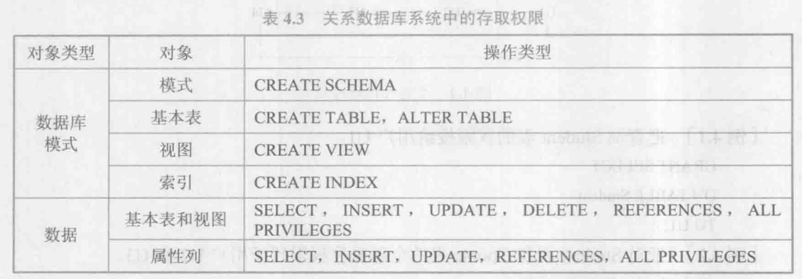

#### 强制存取控制

​		每一个数据库对象被标以一-定 的密级，每一个用户也被授予某一个级别的许可证。对于任意一一个对象， 只

有具有合法许可证的用户才可以存取。强制存取控制因此相对比较严格。

​		在强制存取控制中，数据库管理系统所管理的全部实体被分为主体和客体两大类。

​		主体：系统中的活动实体，既包括数据库管理系统所管理的实际用户，也包括代表用户的各进程。

​		客体：系统中的被动实体，是受主体操纵的，包括文件、基本表、索引、视图等。对于主体和客体，数据库

管理系统为它们每个实例(值)指派一个敏感度标记。

​		强制存取控制机制就是通过对比主体的敏感度标记和客体的敏感度标记，最终确定主体是否能够存取客体。

​		强制存取控制是对数据本身进行密级标记，无论数据如何复制，标记与数据是一个不可分的整体，只有符合

密级标记要求的用户才可以操纵数据，从而提供了更高级别的安全性。

### 授权：授予与收回

​		SQL中使用 grant 和 revoke 语句向用户授予或收回对数据的操作权限。grant 语句向用户授予权限，revoke

语句收回已经授予用户的权限。

​		grant 的格式：


​		将对指定操作对象的指定操作权限授予指定的用户。发出该 grant 语句的可以是数据库管理员，也可以是该

数据库对象创建者，还可以是已经拥有该权限的用户。接受权限的用户可以是一个或多个具体用户，也可以是

public ，即全体用户。

​		如果指定了 with grant option 子句，则获得某种权限的用户还可以把这种权限再授予其他的用户。如果没有

指定 with grant option 子句，则获得某种权限的用户只能使用该权限，不能传播该权限。

​		SQL 标准允许具有 with grant option 的用户把相应权限或其子集传递授予其他用户，但不允许循环授权，即

被授权者不能把权限再授回给授权者或其祖先。


​		revoke 的格式：

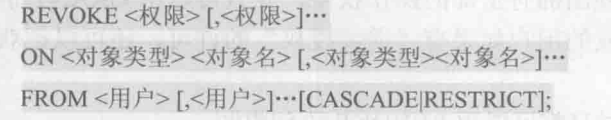

​		SQL 提供了非常灵活的授权机制。数据库管理员拥有对数据库中所有对象的所有权限，并可以根据实际情况

将不同的权限授予不同的用户。

​		用户对自己建立的基本表和视图拥有全部的操作权限，并且可以用GRANT语句把其中某些权限授予其他用

户。被授权的用户如果有“继续授权”的许可，还可以把获得的权限再授予其他用户。


​		对创建数据库模式一类的数据库对象的授权则由数据库管理员在创建用户时实现。

​		创建用户的格式：


​		只有系统的超级用户才有权创建一个新的数据库用户。

​		新创建的数据库用户有三种权限：connect、resource 和 DBA。

​		create user 命令中如果没有指定创建的新用户的权限，默认该用户拥有 connect 权限。拥有 connect 权限的

用户不能创建新用户，不能创建模式，也不能创建基本表，只能登录数据库。由数据库管理员或其他用户授予他应

有的权限，根据获得的授权情况他可以对数据库对象进行权限范围内的操作。

​		拥有 resource  权限的用户能创建基本表和视图，成为所创建对象的属主，但不能创建模式，不能创建新的用

户。数据库对象的属主可以使用 grant 语句把该对象上的存取权限授予其他用户。

​		拥有 DBA 权限的用户是系统中的超级用户，可以创建新的用户、创建模式、创建基本表和视图等；DBA拥有

对所有数据库对象的存取权限，还可以把这些权限授予一-般用户。

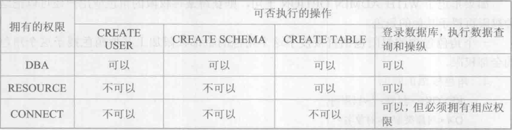

### 数据库角色

​		数据库角色是被命名的一组与数据库操作相关的权限，角色是权限的集合。

创建角色

​		SQL 格式：


给角色授权

​		SQL 格式：


将一个角色授予其他的用户或角色

​		SQL 格式：


​		如果指定了 with admin option 子句，则获得某种权限的角色或用户还可以把这种权限再授予其他的角色。

​		一个角色包含的权限包括直接授予这个角色的全部权限加上其他角色授予这个角色的全部权限。

角色权限的收回

​		SQL 格式：

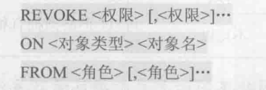


## 审计

​		审计功能：把用户对数据库的所有操作自动记录下来放入审计日志中。审计员可以利用审计日志监控数据库

中的各种行为，重现导致数据库现有状况的一系列事件，找出非法存取数据的人、时间和内容等。还可以通过对审

计日志分析，对潜在的威胁提前采取措施加以防范。

### 审计事件

​		服务器事件：审计数据库服务器发生的事件，包含数据库服务器的启动、停止、数据库服务器配置文件的重

新加载。
		系统权限：对系统拥有的结构或模式对象进行操作的审计，要求该操作的权限是通过系统权限获得的。

​		语句事件：对 SQL 语句以及 DCL 语句的审计。

​		模式对象事件：对特定模式对象上进行的 select 或 DML 操作的审计。模式对象包括表、视图、存储过程、函

数等。模式对象不包括依附于表的索引、约束、触发器、分区表等。

### 审计功能

​		基本功能，提供多种审计查阅方式:基本的、可选的、有限的，等等。

​		提供多套审计规则，审计规则一般在数据库初始化时设定，以方便审计员管理。

​		提供审计分析和报表功能。

​		审计日志管理功能，包括为防止审计员误删审计记录，审计日志必须先转储后删除；对转储的审计记录文件

提供完整性和保密性保护:只允许审计员查阅和转储审计记录，不允许任何用户新增和修改审计记录:等等。

​		系统提供查询审计设置及审计记录信息的专门视图。对于系统权限级别、语句级别及模式对象级别的审计记

录也可通过相关的系统表直接查看。

​		audit 语句用来设置审计功能，noaudit 语句则取消审计功能。

​		审计一般可以分为用户级审计和系统级审计。

​				用户级审计：任何用户可设置的审计，主要是用户针对自己创建的数据库表或视图进行审计，记录所有

​		用户对这些表或视图的一切成功和(或)不成功的访问要求以及各种类型的SQL操作。

​				系统级审计：只能由数据库管理员设置，用以监测成功或失败的登录要求、监测授权和收回操作以及其

​		他数据库级权限下的操作。

## 数据加密

### 存储加密

​		透明存储加密是数据在写到磁盘时对数据进行加密，授权用户读取数据时再对其进行解密。由于数据加密对

用户透明，数据库的应用程序不需要做任何修改，只需在创建表语句中说明需加密的字段即可。当对加密数据进行

增、删、改、查询操作时，数据库管理系统将自动对数据进行加、解密工作。基于数据库内核的数据存储加密、解

密方法性能较好，安全完备性较高。

### 传输加密

​		常用的传输加密方式：链路加密和端到端加密。

​		链路加密：对传输数据在链路层进行加密，它的传输信息由报头和报文两部分组成，前者是路由选择信息，

而后者是传送的数据信息。这种方式对报文和报头均加密。

​		端到端加密：对传输数据在发送端加密，接收端解密。它只加密报文，不加密报头。与链路加密相比，它只

在发送端和接收端需要密码设备，而中间节点不需要密码设备，因此它所需密码设备数量相对较少。但这种方式不

加密报头，从而容易被非法监听者发现并从中获取敏感信息。

# 数据库完整性

​		数据库的完整性是指**数据的正确性和相容性**。

​		数据的正确性：指数据是符合现实世界语义、反映当前实际状况的。

​		数据的相容性：指数据库同一对象在不同关系表中的数据是符合逻辑的。

​		为维护数据库的完整性，数据库管理系统必须实现的功能：

​				1、提供定义完整性约束条件的机制。

​				2、提供完整性检查的方法。

​				3、进行违约处理。

## 实体完整性

​		关系模型的实体完整性在 create table 中用 primary key 定义。对单属性构成的码有两种说明方法，一种是

定义为列级约束条件，另一种是定义为表级约束条件。对多个属性构成的码只有一一种说明方法，即定义为表级约

束条件。

​		定义主码后，定义为主码的属性或属性组强制拥有**非空和唯一性**这两个约束，并且在插入数据时，由于

要判断主码是否唯一，通常默认会在该属性或属性组上加上聚集索引，来提高效率。

## 参照完整性

​		关系模型的参照完整性在 create table 中用 foreign key 短语定义哪些列为外码，用 references 短语指明这

些外码参照哪些表的主码。

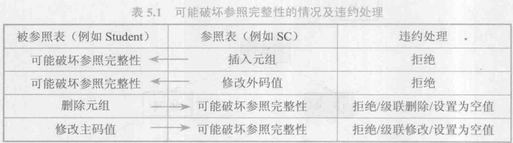

​		当出现上述情况时，解决策略：

​				1、拒绝执行。默认策略。

​				2、级联操作。当删除或修改被参照表的一个元组导致与参照表的不一致时，删除或修改参照表中的所有

​		导致不一致的元组。

​				3、设置为空值。当删除或修改被参照表的一个元组时造成了不一致， 则将参照表中的所有造成不一致

​		的元组的对应属性设置为空值。

​		一般地， 当对参照表和被参照表的操作违反了参照完整性时，系统选用默认策略，即拒绝执行。如果想让系

统采用其他策略则必须在创建参照表时显式地加以说明。

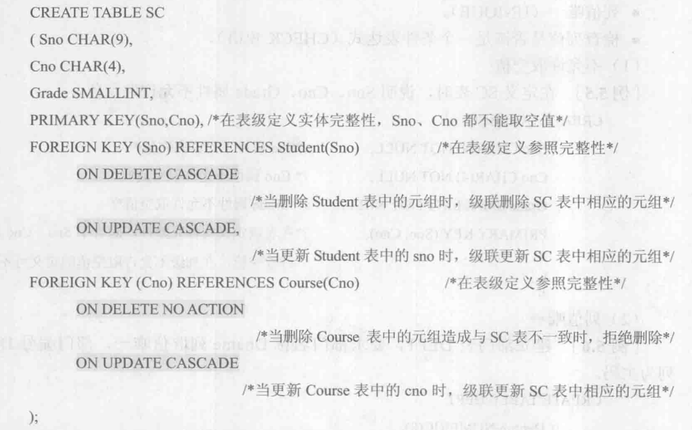

## 用户定义的完整性

### 属性上的约束条件

​		在 create table 中定义属性的同时，可以根据应用要求定义属性上的约束条件，即属性值限制，包括：

​				1、列值非空（not null ）。
​				2、列值唯一（unique）。
​				3、检查列值是否满足一个条件表达式（check短语）。

### 元组上的约束条件

​		在 create table 语句中可以用 check 短语定义元组上的约束条件，即元组级的限制。同属性值限制相比，元

组级的限制可以设置不同属性之间的取值的相互约束条件。

## 完整性约束命名子句

​		SQL 格式：


​		<完整性约束条件>包括not null 、unique、primary key、foreign key、check 短语等。

### 修改表中的完整性限制

​		可以使用 alter table 语句修改表中的完整性限制。

​		如果要删除以命名的完整性约束：alter table 表名 drop constraint 约束名。

## 域中的完整性限制

​		域是一组具有相同数据类型的值的集合。SQL 支持域的概念，并可以用 create domain 语句建立-一个域以及

该域应该满足的完整性约束条件，然后就可以用域来定义属性。这样定义的优点是，数据库中不同的属性可以来自

同一个域，当域上的完整性约束条件改变时只要修改域的定义即可，而不必一一修改域上的各个属性。

## 断言

​		在 SQL 中可以使用数据定义语言中的 create assertion 语句，通过声明性断言来指定更具一般性的约束。可

以定义涉及多个表或聚集操作的比较复杂的完整性约束。

​		SQL 格式：

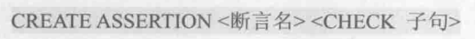

​		每个断言都被赋予一个名字，< check 子句>中的约束条件与 where 子句的条件表达式类似。

​		删除：


## 触发器

​		触发器是用户定义在关系表上的一类由事件驱动的特殊过程。一旦定义，触发器将被保存在数据库服务器

中。任何用户对表的增、删、改操作均由服务器自动激活相应的触发器，在关系数据库管理系统核心层进行集中的

完整性控制。触发器类似于约束，但是比约束更加灵活，可以实施更为复杂的检查和操作，具有更精细和更强大的

数据控制能力。

​		触发器又叫做事件 - 条件 - 动作规则。当特定的系统事件(如对一个表的增、删、改操作，事务的结束等)发生

时，对规则的条件进行检查，如果条件成立则执行规则中的动作，否则不执行该动作。

​		SQL 格式：

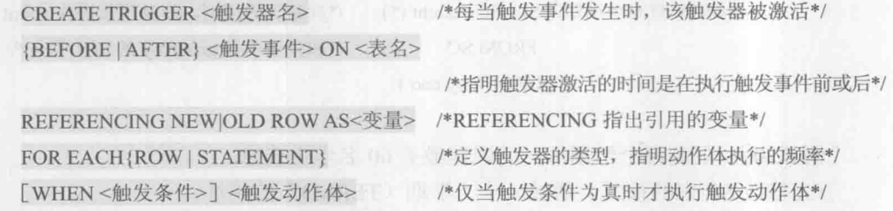

​		1、只有表的拥有者，即创建表的用户才可以在表上创建触发器，并且一个表上只能创建一定数量的触发器。

触发器的具体数量由具体的关系数据库管理系统在设计时确定。

​		2、触发器名可以包含模式名，也可以不包含模式名。同一模式下，触发器名必须是唯一的，并且触发器名和

表名必须在同一模式下。

​		3、触发器只能定义在基本表上，不能定义在视图上。当基本表的数据发生变化时，将激活定义在该表上相应

触发事件的触发器，因此该表也称为触发器的目标表。

​		4、触发事件可以是 insert 、delete 或 update ,也可以是这几个事件的组合，如 insert or delete 等，还可

以是 update of <触发列，...>，即进一步指明修改哪些列时激活触发器。after / before 是触发的时机。after 表

示在触发事件的操作执行之后激活触发器；before 表示在触发事件的操作执行之前激活触发器。

​		5、触发器按照所触发动作的间隔尺寸可以分为行级触发器（for each row ）和语句级触发器（for each 

statement）。

​		6、触发器被激活时，只有当触发条件为真时触发动作体才执行，否则触发动作体不执行。如果省略 when 触

发条件，则触发动作体在触发器激活后立即执行。

​		7、触发动作体既可以是一个匿名 PL / SQL 过程块，也可以是对已创建存储过程的调用。如果是行级触发

器，可以在过程体中使用 new 和 old 引用 update / insert 事件之后的新值和 update / delete 事件之前的旧

值；如果是语句级触发器，则不能在触发动作体中使用 new 或 old 进行引用。

​		如果触发动作体执行失败，激活触发器的事件(即对数据库的增、删、改操作)就会终止执行，触发器的目标表

或触发器可能影响的其他对象不发生任何变化。

### 激活触发器

​		触发器的执行是由触发事件激活，并由数据库服务器自动执行的。定义了多个触发器激活时遵循如下的执行

顺序：

​				1、执行该表上的 before 触发器。
​				2、激活触发器的 SQL 语句。
​				3、执行该表上的 alter 触发器。

​		对于同一个表上的多个 before（alter）触发器，遵循“谁先创建谁先执行”的原则，即按照触发器创建的时间

先后顺序执行。有些关系数据库管理系统是按照触发器名称的字母排序顺序执行触发器。

### 删除

​		SQL 格式：


# 关系数据理论

​		数据依赖：一个关系内部属性与属性之间的一种约束关系。这种约束关系是通过属性间值的相等与否体现出

来的数据间相关联系。它是现实世界属性间相互联系的抽象，是数据内在的性质，是语义的体现。

​		最主要的数据依赖：函数依赖与多值依赖。

​		函数依赖：属性间的这种依赖关系类似于数学中的函数y=f(x)，自变量x确定之后，相应的函数值y也就唯一地

确定了。设 R(U) 是属性集 U 上的关系模式，X, Y 是 U 的子集。若对于 R(U) 的任意一个可能的关系 r ， r 中不可

能存在两个元组在 X 上的属性值相等，而在 Y 上的属性值不等，则称 X 函数确定 Y 或 Y 函数依赖于 X ,记作X→Y。


​		范式：关系数据库中的关系是要满足要求的级别。

​		一个低一级范式的关系模式通过模式分解可以转换为若干个高级范式的关系模式的集合，这种过程就叫规范

化。

​		1NF：即第一范式。作为一个二维表，关系要符合一个最基本的条件：每一个分量必须是不可分的数据项。

​		2NF：若一个关系满足 1NF，且每一个非主属性完全函数依赖于任何一个候选码，则称关系满足2NF。

​		3NF：若一个关系满足 2NF，并且每一个非主属性不传递依赖于码，，则称关系满足 3NF。

​		BCNF：所有非主属性对每一个码都是完全函数依赖。所有主属性对每一个不包含它的码也是完全函数依赖。

没有任何属性完全函数依赖于非码的任何一组属性。也被称为扩充的 3NF。


# 数据库设计

​		数据库设计是指对于一个给定的应用环境，构造(设计)优化的数据库逻辑模式和物理结构，并据此建立数据库

及其应用系统，使之能够有效地存储和管理数据，满足各种用户的应用需求，包括信息管理要求和数据操作要求。

## 基本步骤


### 需求分析

​		需求分析简单地说就是分析用户的要求。

​		需求分析的任务是通过详细调查现实世界要处理的对象，充分了解原系统的工作概况，明确用户的各种求，

然后在此基础上确定新系统的功能。新系统必须充分考虑今后可能的扩充和改变，不能仅仅按当前应用需求来设计

数据库。

​		通过调查、收集与分析，获得用户对数据库的要求：

​				1、信息要求。指用户需要从数据库中获得信息的内容与性质。由信息要求可以导出数据要求，即在数据

​		库中需要存储哪些数据。

​				2、处理要求。指用户要完成的数据处理功能，对处理性能的要求。

​				3、安全性与完整性要求。

#### 数据字典

​		数据字典是进行详细的数据收集和数据分析所获得的主要成果。它是关于数据库中数据的描述，即元数据，

而不是数据本身。数据字典是在需求分析阶段建立，在数据库设计过程中不断修改、充实、完善的。

​		数据字典通常包括数据项、数据结构、数据流、数据存储和处理过程几部分。其中数据项是数据的最小组成

单位，若干个数据项可以组成一个数据结构。数据字典通过对数据项和数据结构的定义来描述数据流、数据存

储的逻辑内容。

##### 数据项

​		数据项是不可再分的数据单位。对数据项的描述通常包括以下内容：

​				数据项描述= {数据项名，数据项含义说明，别名，数据类型，长度，取值范围,取值含义，与其他数据项

​		的逻辑关系，数据项之间的联系}

​		其中，"取值范围”、“与其他数据项的逻辑关系”(如该数据项等于其他几个数据项的和、该数据项值等于另一数

据项的值等)定义了数据的完整性约束条件，是设计数据检验功能的依据。

##### 数据结构

​		数据结构反映了数据之间的组合关系。一个数据结构可以由若干个数据项组成，也可以由若干个数据结构组

成，或由若干个数据项和数据结构混合组成。

​		对数据结构的描述通常包括以下内容：

​				数据结构描述= {数据结构名，含义说明，组成: {数据项或数据结构}}

##### 数据流

​		数据流是数据结构在系统内传输的路径。对数据流的描述通常包括以下内容：

​				数据流描述= {数据流名，说明，数据流来源，数据流去向，组成: {数据结构}，平均流量，高峰期流量}

​		其中，“数据流来源"是说明该数据流来自哪个过程；“数据流去向”是说明该数据流将到哪个过程去；“平均流

量”是指在单位时间(每天、每周、每月等)里的传输次数；“高峰期流量”则是指在高峰时期的数据流量。

##### 数据存储

​		数据存储是数据结构停留或保存的地方，也是数据流的来源和去向之一。它可以是手工文档或手工凭单，也

可以是计算机文档。

​		对数据存储的描述通常包括以下内容:：

​				数据存储描述={数据存储名，说明，编号，输入的数据流，输出的数据流，组成: {数据结构}，数据量，

​		存取频度，存取方式}

​		其中，“存取频度”指每小时、每天或每周存取次数及每次存取的数据量等信息；“存取方式”指是批处理还是联

机处理、是检索还是更新、是顺序检索还是随机检索等；另外，“输入的数据流”要指出其来源；“输出的数据流”要

指出其去向。，

##### 处理过程

​		处理过程的具体处理逻辑一般用判定表或判定树来描述。数据字典中只需要描述处理过程的说明性信息即

可，通常包括以下内容：

​				处理过程描述= {处理过程名，说明，输入: {数据流}，输出: {数据流}，处理: {简要说明}}

​		其中，“简要说明”主要说明该处理过程的功能及处理要求。功能是指该处理过程用来做什么(而不是怎么做)，

处理要求指处理频度要求，如单位时间里处理多少事务、多少数据量、响应时间要求等。这些处理要求是后面物理

设计的输入及性能评价的标准。

### 概念结构设计

#### 概念模型

​		主要特点是：

​				1、能真实、充分地反映现实世界，包括事物和事物之间的联系，能满足用户对数据的处理要求，是现实

​		世界的一个真实模型。

​				2、易于理解，可以用它和不熟悉计算机的用户交换意见。用户的积极参与是数据库设计成功的关键。

​				3、 易于更改，当应用环境和应用要求改变时容易对概念模型修改和扩充。

​				4、易于向关系、网状、层次等各种数据模型转换。

​		概念模型是各种数据模型的共同基础，它比数据模型更独立于机器、更抽象，从而更加稳定。描述概念模型

的有力工具是E-R模型。

#### E-R模型

​		E-R图提供了表示实体型、属性和联系的方法：

​				1、实体型用矩形表示，矩形框内写明实体名。

​				2、属性用椭圆形表示，并用无向边将其与相应的实体型连接起来。

​				3、联系用菱形表示，菱形框内写明联系名，并用无向边分别与有关实体型连接起来，同时在无向边旁标

​		上联系的类型（1:1、 1:n 、m:n）。需要注意的是，如果一个联系具有属性，则这些属性也要用无向边与该

​		联系连接起来。

​		用E-R方法构建一个项目的模型时，经常会遇到某些实体型是某个实体型的子类型。这种父类-子类联系称为

ISA联系，表示 “ is a ” 的语义。ISA联系用三角形来表示。

​		ISA联系一个重要的性质是子类继承了父类的所有属性，当然子类也可以有自己的属性。

​		ISA联系描述了对一个实体型中实体的分类方法：

​				1、分类属性：根据分类属性的值把父实体型中的实体分派到子实体型中。

​				2、不相交约束与可重叠约束。不相交约束描述父类中的一个实体不能同时属于多个子类中的实体集，即

​		一个父类中的实体最多属于一个子类实体集，用ISA联系三角形符号内加一个叉号“X”来表示。如果父类中的一

​		个实体能同时属于多个子类中的实体集，则称为可重叠约束，子类符号中没有叉号表示是可重叠的。

​				3、完备性约束：描述父类中的一一个实体是否必须是某一个 子类中的实体， 如果是，则叫做完全特

​		化， 否则叫做部分特化。完全特化用父类到子类的双线连接来表示，单线连接则表示部分特化。

​		基数约束：对实体之间一-对一、一对多和多对多联系的细化。

​		Part-of 联系：即部分联系，它表明某个实体型是另外一个实体型的一部分 。两种情况，一种是整体实体如果

被破坏，部分实体仍然可以独立存在，称为非独占的 Part - of 联系。与非独占联系相反，还有一种Part-of 联系是

独占联系。即整体实体如果被破坏，部分实体不能存在，在E-R图中用弱实体类型和识别联系来表示独占联系。如

果一个实体型的存在依赖于其他实体型的存在，则这个实体型叫做弱实体型，否则叫做强实体型。在E-R图中用双

矩形表示弱实体型，用双菱形表示识别联系。

#### UML

​		统一建模语言UML是对象管理组织的一个标准，它不是专门针对数据建模的，而是为软件开发的所有阶段提

供模型化和可视化支持的规范语言，从需求规格描述到系统完成后的测试和维护都可以用到UML。UML可以用于

数据建模、业务建模、对象建模、组件建模等，它提供了多种类型的模型描述图， 借助这些图可以使得计算机应

用系统开发中的应用程序更易理解。

​		UML中的类大致对应E-R图中的实体：

​				实体型：用类表示，矩形框中实体名放在上部，下面列出属性名。

​				实体的码：在类图中在属性后面加 “ PK " 来表示码属性。

​				联系：用类图之间的“关联”来表示。用菱形框表示关联，框内写联系名，用无向边分别与关联的类连接起

​		来。


​		概念结构设计的第t步就是对需求分析阶段收集到的数据进行分类、组织，确定实体、实体的属性、实体之间

的联系类型，形成E-R图。

​		为了简化E-R图的处置，现实世界的事物能作为属性对待的尽量作为属性对待。

​				1、作为属性，不能再具有需要描述的性质，即属性必须是不可分的数据项，不能包含其他属性。

​				2、属性不能与其他实体具有联系，即E-R图中所表示的联系是实体之间的联系。

​		E-R图的集成一-般需要分两步走：

​				1、合并。解决各分E R图之间的冲突，将分E-R图合并起来生成初步E-R图。

​				2、修改和重构。消除不必要的冗余，生成基本E-R图。

​		冲突主要有三类：**属性冲突、命名冲突和结构冲突**。

​		属性冲突包含两类冲突：

​				1、属性域冲突，即属性值的类型、取值范围或取值集合不同。

​				2、属性取值单位冲突。

​		命名冲突包含两类冲突：

​				1、同名异义，即不同意义的对象在不同的局部应用中具有相同的名字。

​				2、异名同义(一义多名)，即同意义的对象在不同的局部应用中具有不同的名字。

​		命名冲突可能发生在实体、联系-级上，也可能发生在属性一-级上。其中属性的命名冲突更为常见。

​		结构冲突包含三类冲突：

​				1、同一对象在不同应用中具有不同的抽象。解决方法通常是把属性变换为实体或把实体变换为属

​		性，使同一对象具有相同的抽象。

​				2、同一实体在不同子系统的E-R图中所包含的属性个数和属性排列次序不完全相同。解决方法是使该实

体的属性取各子系统的E-R图中属性的并集，再适当调整属性的次序。

​				3、实体间的联系在不同的 E-R 图中为不同的类型。


​		在初步E -R图中可能存在一些冗余的数据 和实体间冗余的联系。所谓冗余的数据是指可由基本数据导出的数

据，冗余的联系是指可由其他联系导出的联系。冗余数据和冗余联系容易破坏数据库的完整性，给数据库维护增加

困难，应当予以消除。消除了冗余后的初步E-R图称为基本E-R图。


### 逻辑结构设计

​		逻辑结构设计的任务就是把概念结构设计阶段设计好的基本E-R图转换为与选用数据库管理系统产品所支持的

数据模型相符合的逻辑结构。

​		一 个实体型转换为一个关系模式，关系的属性就是实体的属性，关系的码就是实体的码。

### 物理结构设计

​		为一个给定的逻辑数据模型选取一个最适合应用要求的物理结构的过程，就是数据库的物理设计。

​		两步：

​				1、确定数据库的物理结构，在关系数据库中主要指存取方法和存储结构。

​				2、对物理结构进行评价，评价的重点是时间和空间效率。

#### 存取方法选择

​		存取方法是快速存取数据库中数据的技术。数据库管理系统一般提供多 种存取方法。常用的存取方法为索引

方法和聚簇方法（一个关系只能加入一个聚簇）。


# 数据库编程

## 嵌入式SQL

​		嵌入式SQL是将SQL语句嵌入程序设计语言中，被嵌入的程序设计语言称为宿主语言，简称主语言。


​		数据库工作单元与源程序工作单元之间的通信主要包括：

​				1、向主语言传递SQL语句的执行状态信息，使主语言能够据此信息控制程序流程，主要用SQL通信区

​		实现。

​				2、 主语言向SQL语句提供参数，主要用主变量实现。

​				3、将SQL语句查询数据库的结果交主语言处理，主要用主变量和游标实现。

​		游标是系统为用户开设的一个数据缓冲区，存放SQL语句的执行结果，每个游标区都有一个名字。用户可以通

过游标逐一获取记录并赋给变量。

## 过程化SQL

​		过程化SQL程序的基本结构是块。所有的过程化SQL程序都是由块组成的。这些块之间可以互相嵌套，每个块

完成一个逻辑操作。

### 变量定义：


常量：


赋值语句：


### 条件控制语

​		三种：


### 循环控制语句

​		三种：


## 存储过程

​		存储过程是由过程化SQL语句书写的过程，这个过程经编译和优化后存储在数据库服务器中，因此称它为存储

过程，使用时只要调用即可。

​		优点：

​				1、由于存储过程不像解释执行的SQL语句那样在提出操作请求时才进行语法分析和优化工作，因而运行

​		效率高，它提供了在服务器端快速执行SQL语句的有效途径。

​				2、存储过程降低了客户机和服务器之间的通信量。客户机上的应用程序只要通过网络向服务器发出调用

​		存储过程的名字和参数，就可以让关系数据库管理系统执行其中的多条SQL语句并进行数据处理。只有最终的

​		处理结果才返回客户端。

​				3、方便实施企业规则。可以把企业规则的运算程序写成存储过程放入数据库服务器中，由关系数据库管

​		理系统管理，既有利于集中控制，又能够方便地进行维护。当企业规则发生变化时只要修改存储过程即可，

​		无须修改其他应用程序。

### 创建

​		SQL 语法：

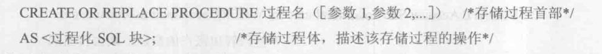

### 执行

​		SQL 语法：


### 修改

​		SQL 语法：

​				重命名：


​				重新编译：


### 删除

​		SQL 语法：


## 函数

​		此节的函数也称为自定义函数，因为是用户自已使用过程化SQL设计定义的。函数和存储过程类似，都是持久

性存储模块。函数的定义和存储过程也类似，不同之处是函数必须指定返回的类型。

### 创建


### 执行


### 修改

​		重命名：


​		重新编译：

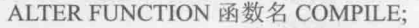


